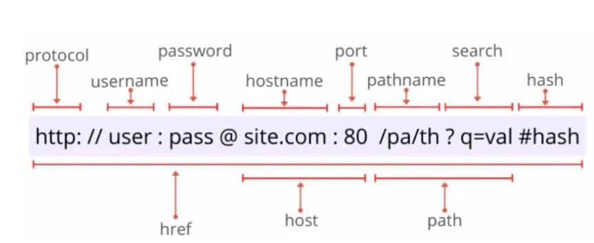
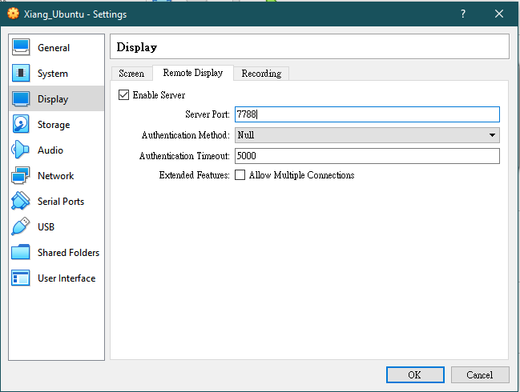
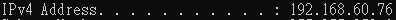
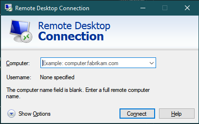
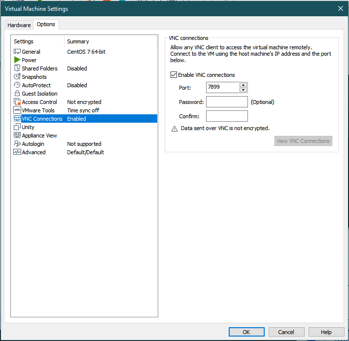
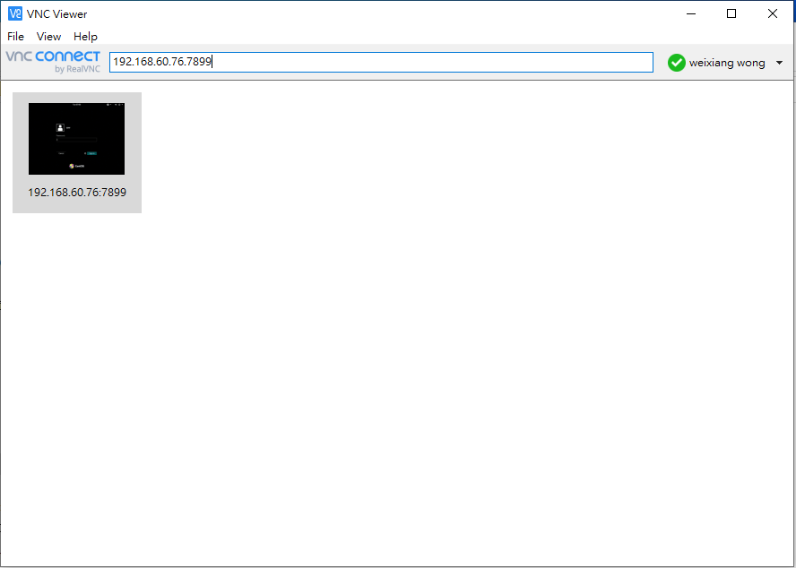

## **Protocol**
### **Definition**
* A standard/rules that people agreed with, on Internet.
* Ex: http, ftp, ip, tcp, https, etc...
* Internet uses TCP/IP protocol suite
    - protocol suite is a group that combined by many protocols.
    - use TCP/IP to represent because the 2 protocol is the most important in it.

## **Internet model**
### **Client/Server model**
* Client ask for service and Server provide service
* Easy to manage the network but higher cost
* Centralized control system
### **Peer to Peer model**
* Every node can be come client or server
* lower cost but more complicate to manage the network
* Decentralized control system

## **IP address & Domain name**
* Computer use IP address to communicate, domain name is for human convenient uses.
### **DNS**
* Domain Name Service, use to convert IP address with domain name
    - Domain name to IP address called forward parsing (正向解析)
    - IP address to domain name called reverse parsing (反向解析)
* Some commonly use: 8.8.8.8 / 4.4.4.4 / 9.9.9.9 / 8.8.4.4
### **Example**
* 120.125.96.120 / csie.nqu.edu.tw
    - `csie.nqu.edu.tw` is domain name of the ip address `120.125.96.120`

## **Address on Internet**
### **Physical address**
* MAC address, on Network Interface Card(NIC).
* Use command in cmd `ipconfig/all` to check, on Windows

* First 3 bytes use to identify the manufacturer, last 3 bytes is the "card number"
### **Logical address**
* Public ip address
    - Unique on Internet, cannot same with other computer on Internet
    - NAT(Network Address Translation), use to translate private ip address to public ip address
    - Use on Internet
* Private ip address
    - Is unique and only use in LAN network
    - Need to convert to public ip address before connect to Internet(using router)
### **Port number**
* Some default port number
    - http --- 80, ftp --- 21, https --- 443. If the port using is equal to default port then can be omited
* Server's port number have to fixed
* Client's port number can be random but cannot same with others
* Use to differential the application
### **Virtual host**
* For special situations, use if the first 3 address run out

_Computer in LAN can access data from Internet through router, but cannot access others' LAN network through their router_

## _**Homework**_
* Remote control virtual machine on Windows
### **With Virtual Box**
#### **Step 1**
* Install a virtual machine on the computer

* Go to virual machine --> Settings --> Display --> Remote Display --> Enable Server and set the Server Port --> Start the virtual machine
#### **Step 2**
* Open cmd and type in `ipconfig` remember the IPv4 

#### **Step 3**
* Use any computer and go to search and type in `mstsc` and enter, you will see 
* Now enter the IPv4 address with Server port number like `192.168.60.76:7788` and there you go!!!
### **With VMware Workstation pro**
#### **Step 1**
* Install a virtual machine on the computer

* Go to virtual machine --> Edit virtual machine settings --> Options --> VNC Connections --> Enable VNC connections and set port number --> Start the virtual machine
#### **Step 2**
* Open cmd and type in `ipconfig` remember the IPv4 

#### **Step 3**
* Use any computer go to [https://www.realvnc.com/en/connect/download/viewer/](https://www.realvnc.com/en/connect/download/viewer/) and download and install VNC Viewer
#### **Step 4**

* Open VNC Viewer enter `192.168.60.76:7899` and there you go!!!