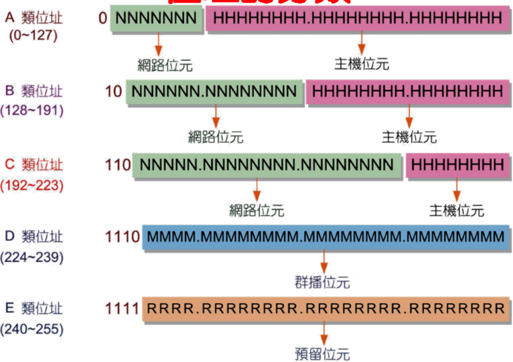
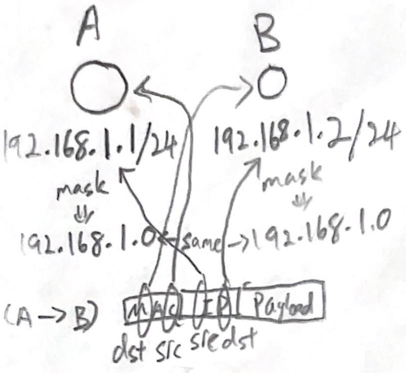
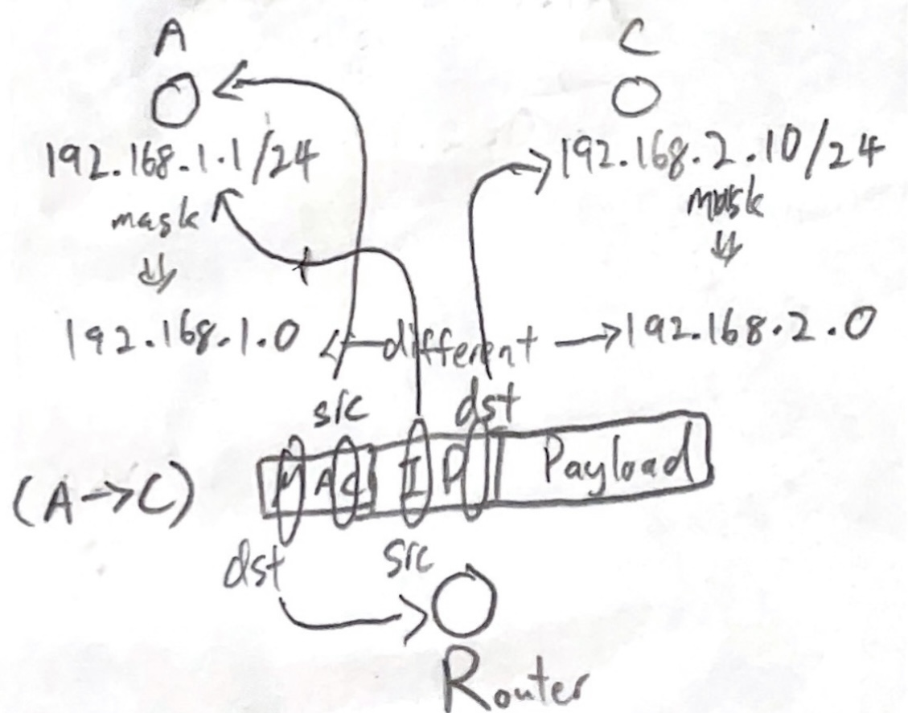
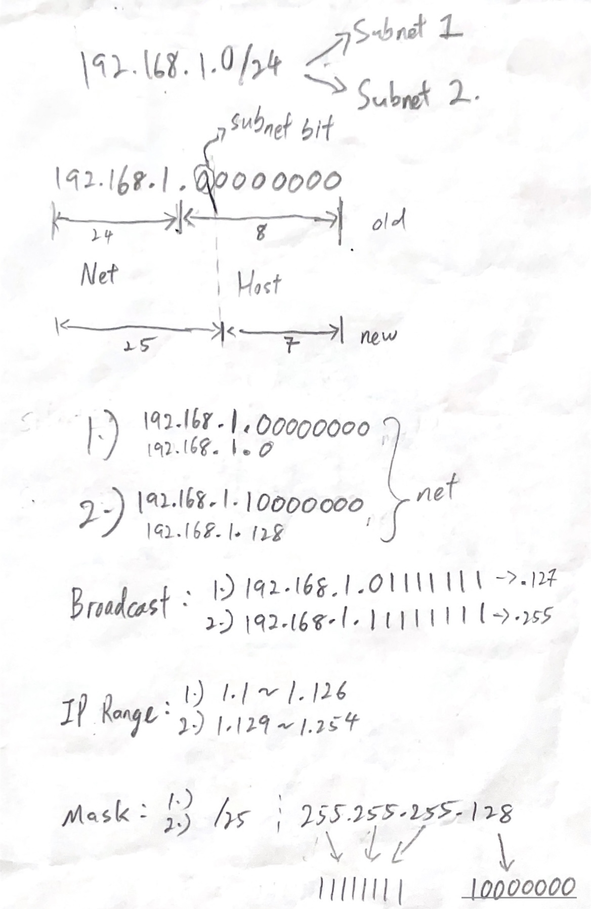
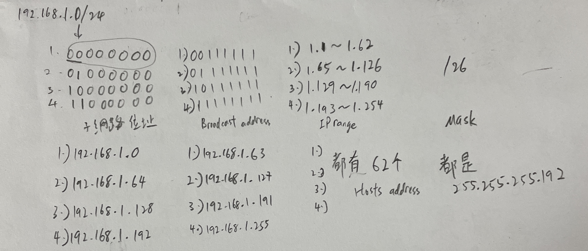
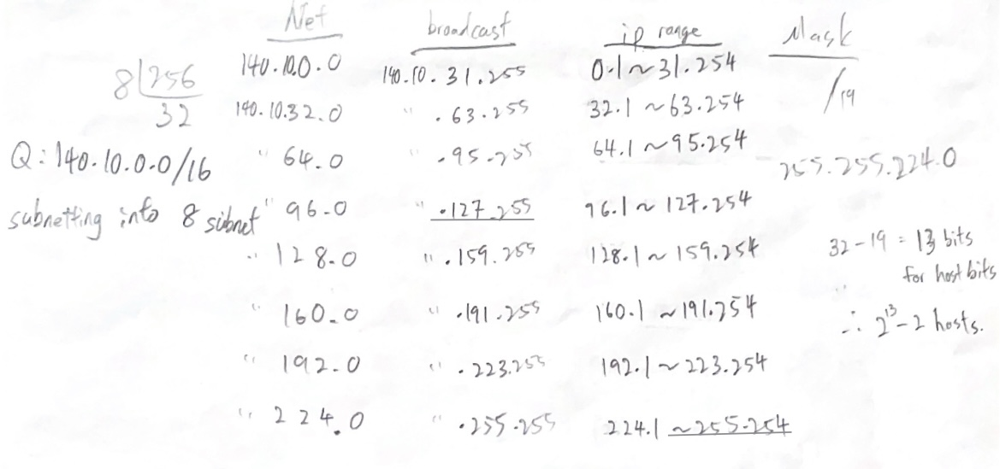
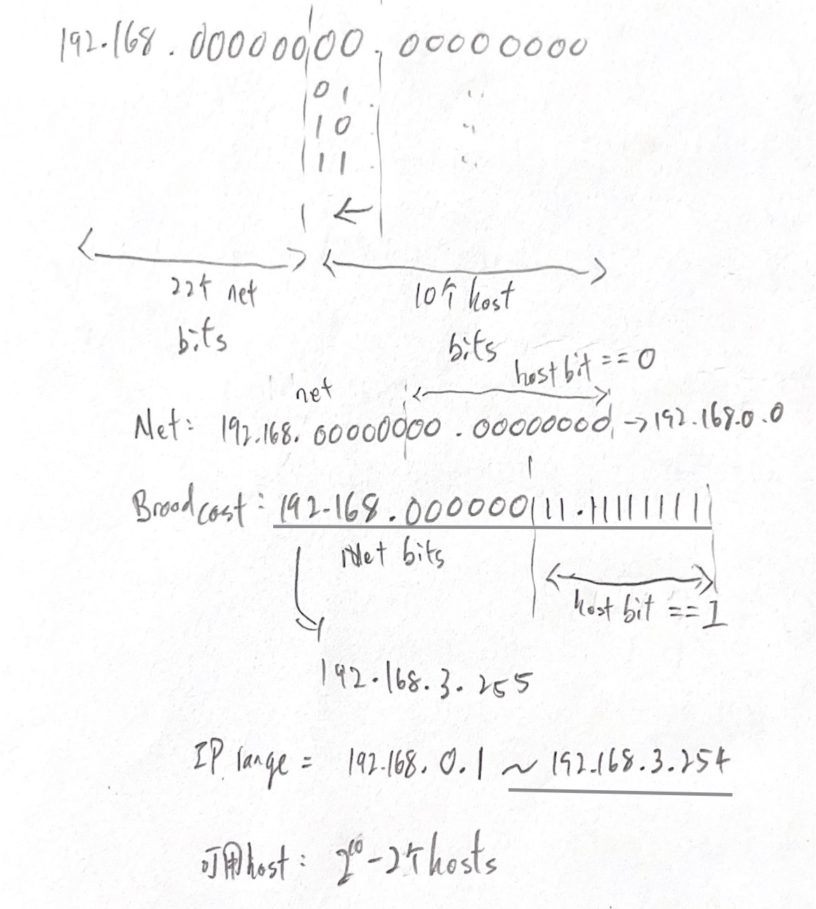
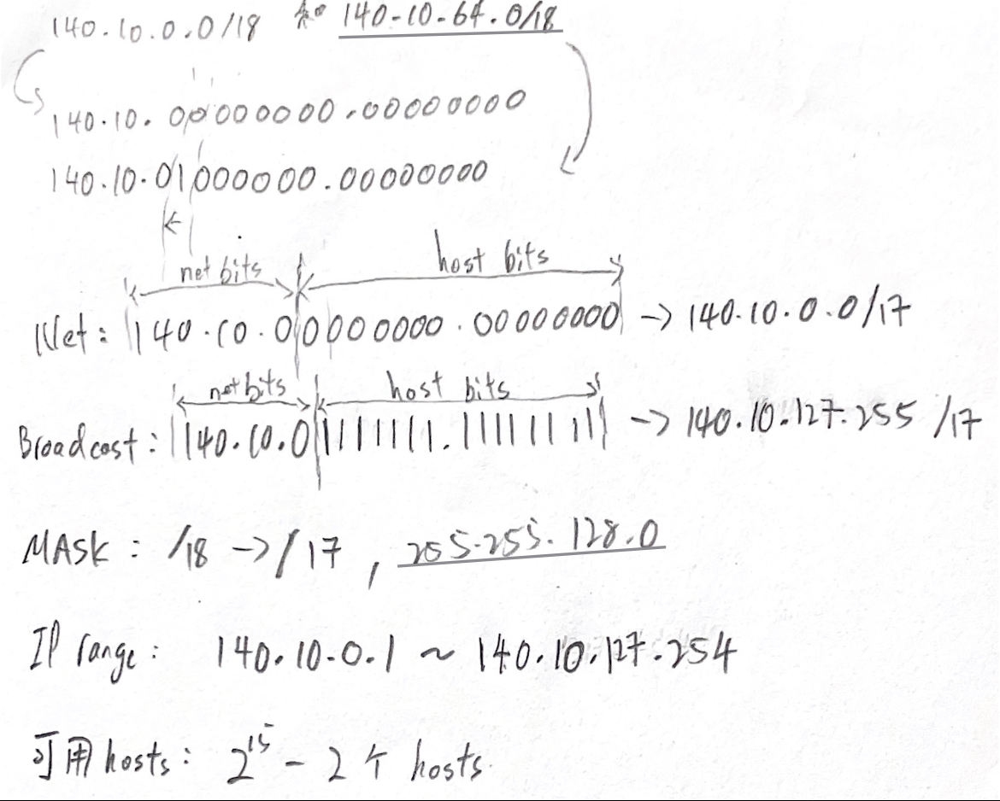
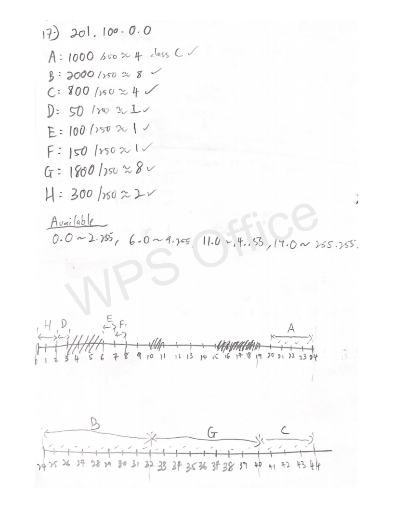
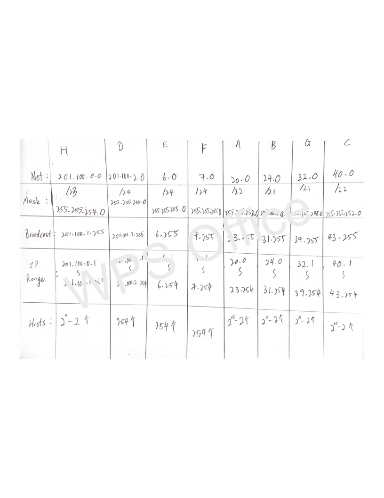

# **Chap 8**
## **IP**
### **IPv4**
* Best Effort Service 
* Connectionless-Oriented: Don't have to build connection before transmission, just send the data to it. EX: Like sending email, just write the receiver name,address... then send to it.
* Consists of 32 bits, can have 2^32 ip address
    - Divided into 4 parts, each part consists of 8 bits. EX: `x.x.x.x` , range of each `x` is **0~255**
* Assigned by ICANN
    - _Internet Corporation for Assigned Names and Numbers_
    - Each ipv4 address assigned into `Network bits` and `Host bits` 
        - EX: `192.168.1.1` and `192.168.1.2` , this 2 ip address have the same Network bits `192.168.1.0`, but difference Host bits `.1`,`.2`
* A,B,C,D,E Class 
    - 
    - A class: First 8 bits from `00000000`~`01111111`(0~127), can have (2^24 - 2) of nodes(1 for network address,1 for broadcast address)
    - B class: First 8 bits from `10000000`~`10111111`(128~191), can have (2^16 - 2) of nodes
    - C class: First 8 bits from `11000000`~`11011111`(192~223), can have (2^8 - 2) of nodes
    - D class: First 8 bits from `11100000`~`11101111`(224~239), for multicast use
    - E class: First 8 bits from `11110000`~`11111111`(240~255), reserved for lab/research use
    - _When Host bits are all `0` is for Network address, all `1` is for broadcast address, ex: `1.0.0.0` is a network address, `1.255.255.255` is a broadcast address_
* MASK
    - Use to check whether 2 node is in same LAN or not, do mask on both ip address, if get the **same network address** then is in same LAN can do **direct transmission**, if get **different network address** then need to do **indirect transmission**(transmit with router).
    - EX: Same
     
    - Different
     
    - Use MASK do AND with ip address, the result is the network address of the ip address, ex: `192.168.10.5/24`,the number after `/` is the "MASK", 24 means have 24 bits of "1", in this case do MAST`255.255.255.0`(11111111.11111111.11111111.0) with `192.168.10.5` will get `192.168.10.0` which is the network address
    - `192.168.10.90/26` will get network address `192.168.10.64`(64 == 01000000)(Tips: Do AND with `11111111.11111111.11111111.11000000`).
* Subnetting
    - `192.168.1.0/24` make into 2 subnet
    
    - `192.168.1.0/24` make into 4 subnet
    
    - `140.10.0.0/16` make into 8subnet
    
* Supernetting
    - Rules:
        1) Address have to be continuous, ex: `192.168.0.0 and 192.168.1.0`
        2) Number of "subnet" wanted to supernetting have to be x power of 2 (x is 1~n), ex: 2 subnets, 4 subnets, 8 subnets....
        3) The first "subnet" must be divisible by the number of "subnet". EX1: `192.168.2.0 and 192.168.3.0`, **2 is divisible by 2**. EX2: `192.168.1.0 , 192.168.2.0 , 192.168.3.0 , 192.168.4.0`, **1 is not divisible by 4**.
    - Supernetting `192.168.0.0/24`,`192.168.1.0/24`,`192.168.2.0/24`,`192.168.3.0/24`
    
    - Supernetting `140.10.0.0/18`,`140.10.64.0/18`
    
* Example of Network address integration planning:
    - From textbook, Pg 8-66 (Q17)
    - 
    - 

* Extra
    - IGMP : Internet Group Message Protocol
    - MRouter : Router support Multicast function called MRouter
### **IPv5**
    - For Research Lab use
    - Connection-Oriented: Need to build connection before transmission. EX: Like phone call, if you call someone then need the other side "answer" first, and the channel will 100% be both of you.
    - Stream Protocol
### **IPv6**
    - Consists of 128 bits, can have 2^128 ip address

## **Extra**
* In Linux:
    - `~` is home directory
	- `~-` is previous directory
    - `echo ~+` == `pwd` , is means current directory