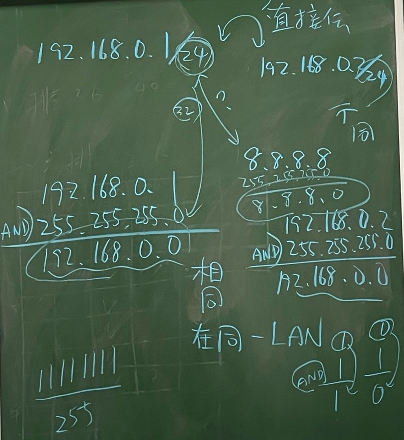

## **Google hacking**
* `intitle:"WIFI"` , this will show any things that web page's title contain "WIFI"
* `wifi inurl:github` , this will show any things about "wifi" in the web page that domain name contain "github"
* 
## **IP address setting**
* DHCP
    - Dynamic Host Configuration Protocol
    - Computer will automatically send ip address request to DHCP server(normally contain in router), and DHCP server find any available ip address and send to computer
* Manually
    - Set the ip address with your own hands
## **Internet access requirements**
### **IP address**
* Private ip address use in LAN
* Public ip address use on Internet
### **MASK**

* For computers to decide directly communicate or by router
    - Ex: `192.168.0.1/24` with `192.168.0.67/24` and `8.8.8.8/24` , after "mask" with "24" `192.168.0.1` and `192.168.0.67` get the same `192.168.0.0` so they can directly communicate, but `8.8.8.8` get `8.8.8.0` is not `192.168.0.0` so need to use router to communicate.
    - _"MASK" is doing "AND" operation in binary_
    - _"24" means 24's "1" in binary, "MASK" have 32 bits, every 8 bits is a group, `11111111` equal to "255" and 8*3=24, so "24" --> "255.255.255.0"_
### **Default Gateway**
* Default Gateway is router, different from Gateway
    - Default Gateway is like the "gate" of LAN(local area network) and Internet(public network)
    - Gateway is used to connect different network system
### **DNS Server**
* Used to parsing ip address and domain name
    - If don't have then only can connect using ip address, if got can use domain name to connect

### **Virtual IP**
* Used to test is TCP/IP working normally
* 127.0.0.1 is a loopback interface of virtual ip

### **Physical NIC**
* Can configure more than one ip address
    - To access different service (a is not vip, b is vip, bandwidth provide differently)
* 1 ip address also can be shared by many NIC, called "bounding"
    - Performance, 1 NIC is 100mb/s if combined 4 NIC will have 400mb/s
    - Load balance, 4 NIC can take turns to do the work
    - Fault tolerance, if 1 of the NIC paralyzed, still got others to cover

### **FTP**
* No encryption, if lost connection when trasnfering file, can continue to transfer from where you stop when connection back.