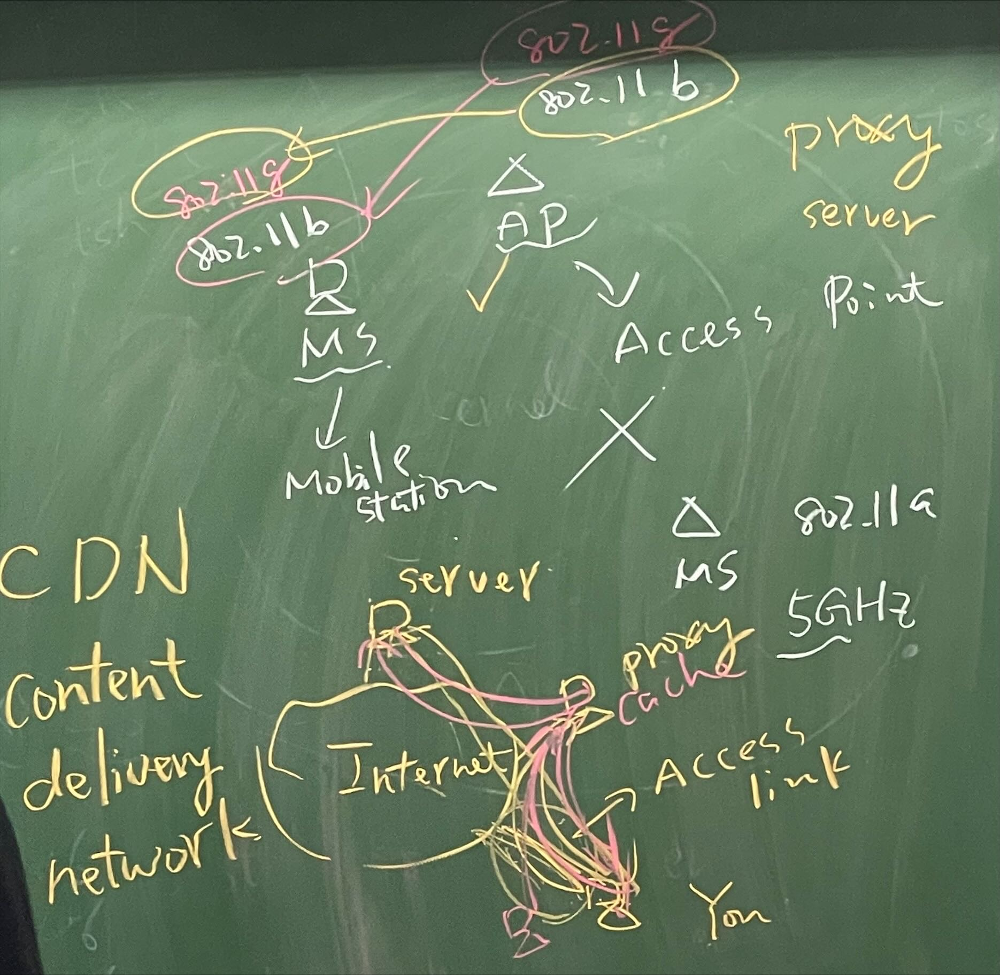

# **Chap 1**
## **Network Type**
### **PAN**
* Personal Area Network, 10m, short distance
* Airdrop, Bluetooth(IEEE 802.15.1), ZigBee(IEEE 802.15.4), Infrared
    - Bluetooth : create network between 2 devices, then transfer with wifi to reach 24 Mbps
* BAN(Body Area Network)
    - Shorter distance than PAN
    - More to human body devices, ex: VR, watch, and medical usages
### **LAN**
* Local Area Network, wired(Ethernet) and wireless(WLAN), 100-200 meter, ex: classroom, factory...
* Wired
    - Ethernet
        - IEEE 802.3, CSMA/CD
    - DC - Data Center
* Wireless
    - Wi-Fi
        - IEEE 802.11, CSMA/CA
        - Transmission speed of every node is not fixed(moving,obstacle), to avoid errors. (When bad signal(connection), too fast will cause to transmission failed)
        - 802.11 ax wifi 6
        - 802.11 ac wifi 5 (Gbps)
        - 802.11 n wifi 4 (MIMO, max 600 Mbps : 2.4Ghz n 5Ghz)
        - 802.11 g (SISO, max 54 Mbps : 2.4Ghz) , compatible to 802.11 b 
        - 802.11 a (SISO, max 54 Mbps : 5Ghz)
        - 802.11 b(SISO, 1,2,5.5,11 Mbps(speed) : 2.4Ghz)
        - SISO: single input single output, MIMO: Multiple in/output, AP: Access Point, MS: Mobile Station
        - Compatible -- 802.11 g and 802.11 b is compatible means when AP can connected with MS even AP use g and MS use b, vice versa. Using same 2.4Ghz, not compatible with 802.11 a cause a using 5Ghz.
### **MAN**
* Metropolitan Area Network, kilometers, but death nowadays
### **WAN**
* Wide Area Network, 10km++, cross states/countries
* Leased line, xDSL, LTE, WiMax
* Ex: TANET(Taiwan Academic Network), HiNet(中華電信)
* WWAN(Wireless WAN)
    - 2G
        - 2nd generation, GSM, mostlly in audio,SMS(short message)
    - 2.5G
        - GPRS introduced
    - 3G (2000)
        - 3rd generation, 384kbps, video call available 
        - CDMA2000 , WCDMA , SCDMA(china)
    - 3.5G 
        - HSDPA
        - 1.8 , 3.6 , 7.2 , 14.4 Mbps
        - Advance download speed
    - 3.75G
        - HSUPA
        - Advance upload speed
    - 4G (2010)
        - LTE_A , 1 Gbps in theory
        - Support high speed movement (In a 100km/h, watching movie with 3G will lag but with 4G will be fine)
    - 5G (2020)
        - 5G tunnel cut into 3 parts, for resources allocation
        - Enhanced Mobile Broadband
            - For Higher Speed (10 Gbps)
        - Ultra reliable and Low Latency communications
            - For medical(remote control), auto driving(decision making: break, turn, etc...)
        - Massive Machine Type communications 
            - Allow massive devices connect to server at the same time
    - 6G
        - Wider(cover sea) and Higher(cover sky/space) of 5G
### **Extra**

* Proxy Server
    - Help the server to deliver required contents to client, if the cache(content) exit in proxy server
* CDN (Content Delivery Network)
    - Youtube : Server at US, if everyone connect to server will be too busy. Youtube store content at different CDN at Asia, US, Africa, etc… Then people at Asia can connect to Asia CDN to watch video.
* Datacom
    - Video games companies
    - WiMax : Loss 4G to LTE
* Telecom
    - Mobile network companies
    - LTE_A(4G) -- LTE_Advanced

## **Topology**
* Connection styles of network nodes
### **Star Network**
* Every node connect to the central node, and transmission had to pass through central node. Ex: Hub, Server as central device
* Contension base, fight to transmit data. Except full-duplex device
* Advantages
    - Maintenance is easy 
    - Easy structure(easy to configure)
* Disadvantages
    - If central node paralyzed will cause the network down
### **Bus Network**
* Every node connected to a common link called a bus, transmission is from node to 2 end terminators
* Contension base
* Advantages
    - Extesion is easy
    - Broadcast characteristic
* Disadvantages
    - Not secure
    - If middle of the link broke will cause the network down
### **Ring Network**
* Each node connects to 2 other nodes, forming a ring
* Advantages
    - Contensionn free, only token owner can transmit and token will pass 1 by 1
* Disadvantages
    - More difficult to configure than star
    - Communication delay is directly proportional to the number of nodes
### **Tree Network**
* Combined by several centralized control structure, only 1 path from 1 node to another node
* Advantage
    - Low maintenance cost
* Disadvantage
    - Low fault-tolerance, the node paralyzed the path gone
### **Hybrid Network**
* Combined by different networks

### **Extra**
* mesh
    - Has more than 2 paths from a node to another node, have better fault-tolerance in theory
    - Easy to occur broadcasat storm in practically, broadcast storm will use all resource and others packets cannot transmit.
        - broadcast storm is the packet keep trasmitting in a loop
* STP
    - Spanning Tree Protocol
    - Is not ring network usually, but if the path broke then become ring network

## **OSI reference model**
### **Physical Layer**
* Define transmission media, ex: material properties, connector's pin number, definition of signal "0" and "1"
* Devices: network cable, Hub, Repeater
### **Data Link Layer**
* Maintain 1 hop transfer quality, work on transmission of 2 nodes in LAN
* LLC - Logical Link Control
    - error detection, ex: frame loss then retransmit
* MAC - Medium Access Control
    - encapsulates the frame, and MAC address use to identify and verify the address of source station and destination
    - CSMA/CA , 802.11 , Wi-Fi
    - CSMA/CD , 802.3 , Ethernet
* Devices: NIC, Switch, Bridge, Switched Hub
### **Network Layer**
* Addressing
    - Identify the correct location of destination
* Routing
    - Find the path for transmission
    - RIP(Routing Information Protocol) , choose path by number of hop
    - OSPF(Open Shortest Path First) , choose path by bandwidth
    - Modern way, use software to determine, more dynamic
### **Transport Layer**
* To have reliable service for end to end transmission
* By giving sequence numbers to packet will solve
    - Out of order --> In order 
    - Packet loss --> retransmit
    - Will fix when packet error, packet duplicated situation occur
### **Session Layer**
* Record the progression of transmission, ex: If connection error when downloading, it dose not need to download from beginning(can start from when it stop) after connection is back.
* Responsible for connection build, control, rebuild, end.
### **Presentation Layer**
* Encoding / Decoding
* Compression / Decompression 
* Encryption / Decryption
### **Application Layer**
* Interface between user and computer, ex: Chrome, Firefox...
* To ensures application can effectively communicate with others applications on different computer systems and networks.