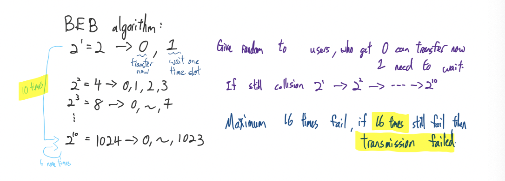
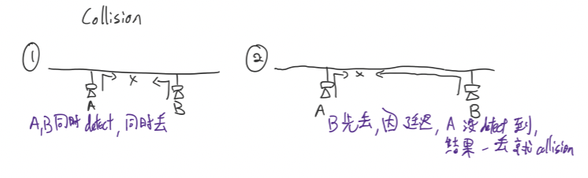
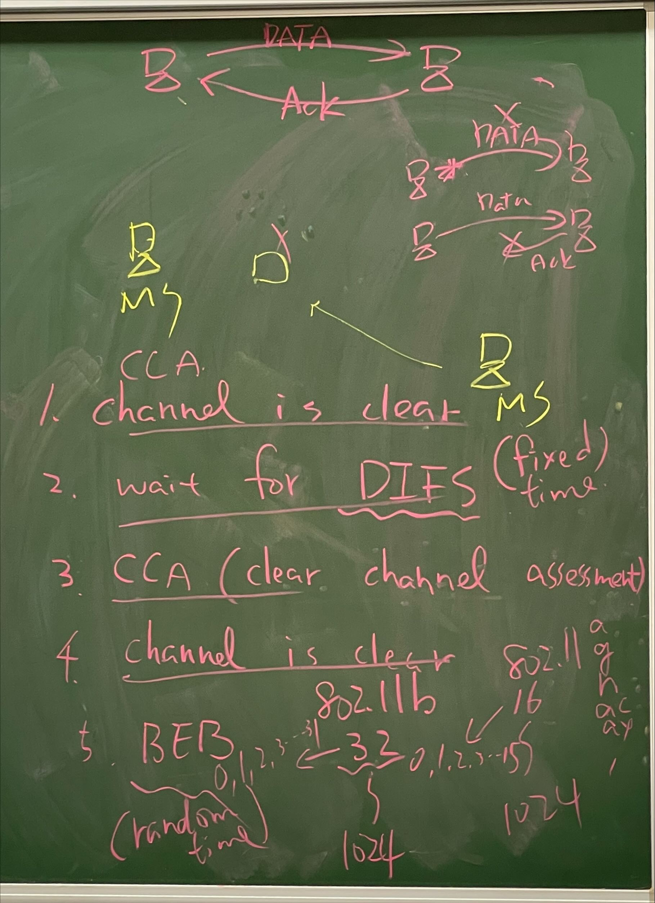
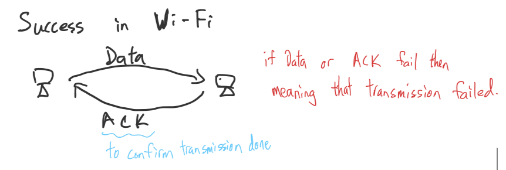
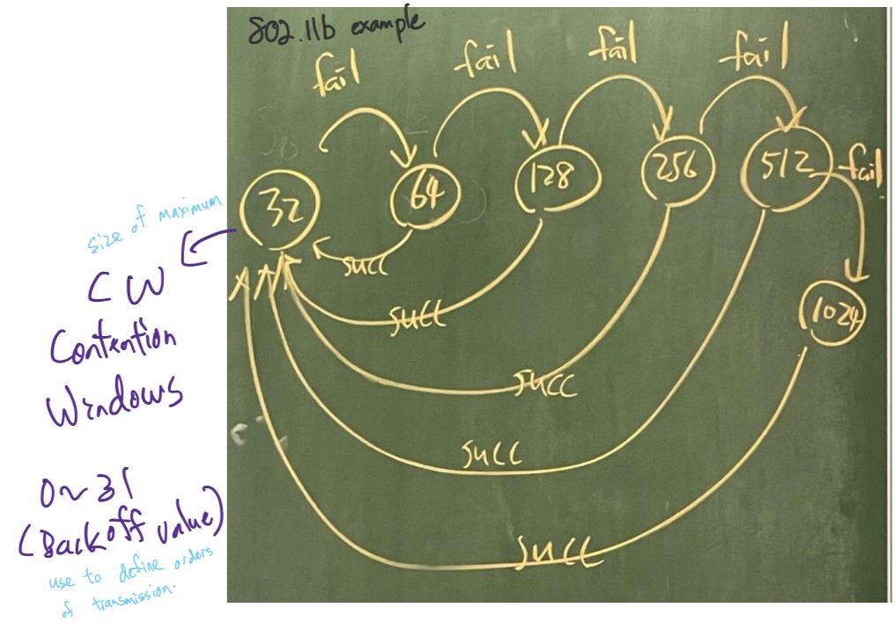
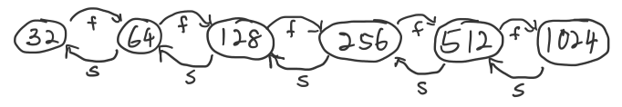
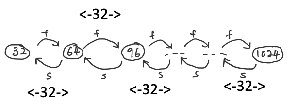
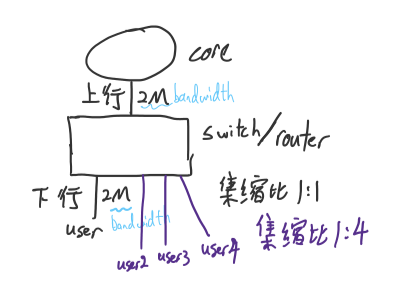
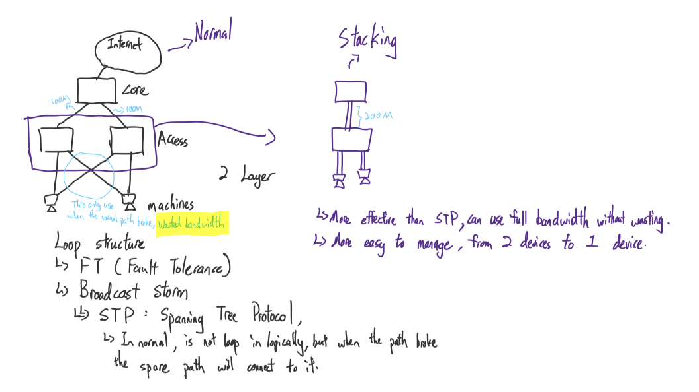

# **Chap 7**

## **Some Tips**
* Data Link Layer
    - LLC
        - To have better quality service
    - MAC
        - CSMA/CA
        - CSMA/CD
* Standards for Ethernet
    - Ethernet 2.0
        - First/Original ethernet standard, by DIX(DEC-Intel-Xerox)
    - 802.3
        - Modify/Change from `Ethernet 2.0`, by IEEE
* If specifications indicate _**Power over Ethernet**_ means can supply power and data transmission at the same time

## **BEB**
* Binary Exponential Backoff, is a algorithm for solve/avoid collision

* If no one transferring then can count down _**time slot**_(backoff value), if someone transferring then others have to freeze the count down 
* If not lucky enough, 5 nodes can go to 1014 CW also~XD
## **IEEE 802.3 : Ethernet : CSMA/CD**
* Carrier Sense Multiple Access / Collision Detection
* Run BEB algorithm _**after collision**_
    - Carrier Sense: Detect did the tunnel have data transferring? If got then cannot transfer, if not then can transfer. (check have nodes doing transmission?)
    - Multiple Access: Everyone have the same priority, same permission, and same ability
    - Collision Dectection: Monitor when the transmission processing, if no collision happens then happy ending, if collision happens, it will stop the transmission and send a jamming signal to everyone(node)

_**Collision: Happens when at least 2 or more users(nodes) want to transfer data**_

1. First situation is because 2 nodes do carrier sense at the same time, and both send data to the empty tunnel at the same time
2. Second situation is because of _**Propagation Delay**_
    - Transmission speed on Twisted pair cable is around _**2/3 of light speed**_

## **IEEE 802.11 : Wi-Fi : CSMA/CA**
* Carrier Sense Multiple Access / Collision Avoidance
* Run BEB algorithm _**before transmission**_
    1. Channel is clear
    2. Wait for DIFS
    3. CCA(Clear Channel Assessment)
    4. Channel is clear
    5. BEB
        - 802.11b start from 32(0~31) to 1024(0~1023)
        - 802.11(a,g,n,ac,ax) start from 16(0~15) to 1024(0~1023)

### **Example of BEB algorithm for 802.11b**

* Wastes time if many nodes need to transfer data, because of CW go back to 32 and need to wait CW(contention window) "grow" until the suitable size
* To solve wasting time for increasing amounts of CW when too much nodes want to transfer:
    - EIED : Exponential Increase Exponential Decrease
    
        - Use at many nodes network
    - LILD : Linear Increase Linear Decrease, increase and decrease with constant CW size
    
        - Use at less nodes network

## **Extra**
* Certificate 
    - CCNA , CCNP , CCIE
    - CCNA 10k+NTD, most easy, CCIE is the hardest
* Amount Ratio (集縮比)

    
    - 1:5 can use the bandwidth more effectively than 1:1
    - User won't use the network all day, so if 1:1 will wasted some bandwidth, if 1:5 can use the bandwidth more effectively and provider can earn more money...

* PT test
    - Penetration test, the process of testing the system vulnerability/bug...
    - White hat is the hacker that help to solve the system vulnerability, Black hat will use the system vulnerability to attack/steal the information,etc... Gray hat is the hacker that sometime black sometime white
    - Kali Linux is one of the tool for do PT test
* Stacking
    - The method of combining devices into devide
    
* HA
    - High availability, have cluster to cover if something happens
    - Cluster: Several devices combined into a group, the master device will work if nothing happen, but if the master device paralyzed then another device in the group will cover the work of the master device and become the new master device
* https://www.ptt.cc/bbs/MobileComm/M.1546461998.A.A14.html , a method to block advertisement