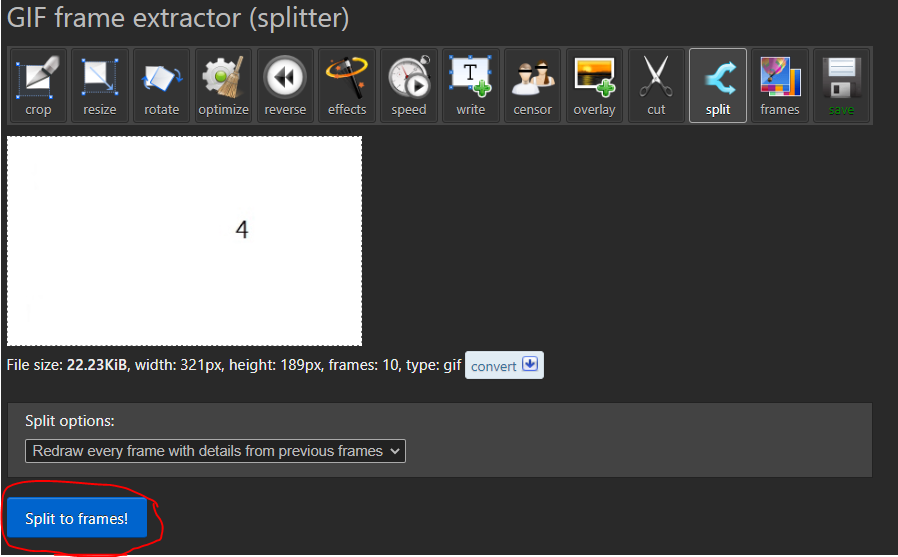

## **test.gif**
### **Step 1**
* For convert gif into frames we can use the online converter to help us.
* Go to `https://ezgif.com/split/ezgif-1-c3b9564a3a.gif` 
### **Step 2**
* Upload the target gif file and click "Split to frames!"

### **Step 3**
* Now move down and you will see the output, which contains 9 frames as below:
