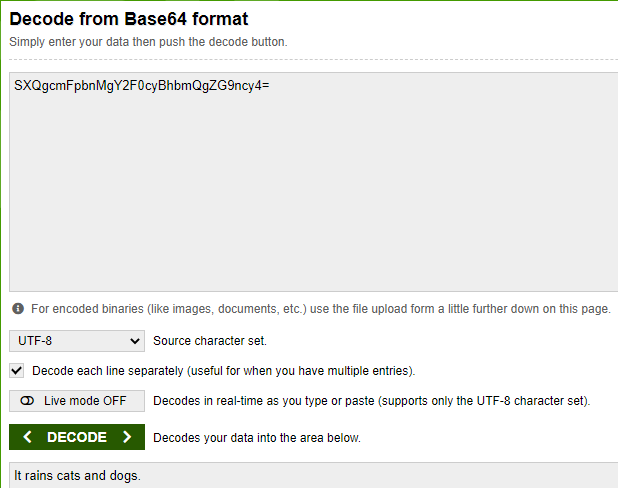
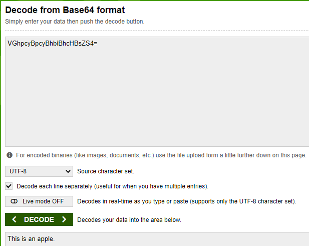
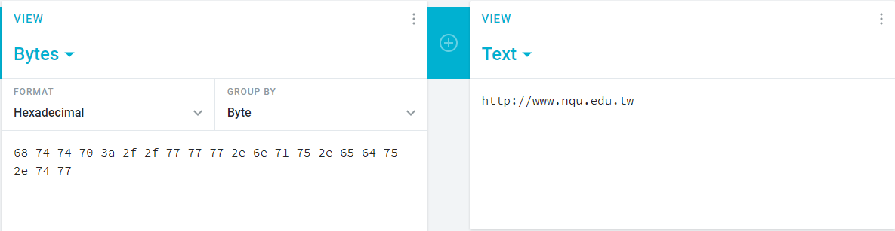

## **c.txt**
`SXQgcmFpbnMgY2F0cyBhbmQgZG9ncy4=`

### **Step 1**
* Go to `https://www.base64decode.org/` and put the content of c.txt and press decode, then you got the output like the picture below:

* `It rains cats and dogs.`

## **b.txt**
`VkdocGN5QnBjeUJoYmlCaGNIQnNaUzQ9`

### **Step 1**
* Go to `https://www.base64decode.org/` and put the content in and press decode and you will get this `VGhpcyBpcyBhbiBhcHBsZS4=` , which is also the base64 format.

### **Step 2**
* Decode again with the same website and you will get the output `This is an apple`

## **a.txt**
`JTY4JTc0JTc0JTcwJTNhJTJmJTJmJTc3JTc3JTc3JTJlJTZlJTcxJTc1JTJlJTY1JTY0JTc1JTJlJTc0JTc3`
### **Step 1**
* Go to `https://www.base64decode.org/`, put the content and press decode
* You will get something like this `%68%74%74%70%3a%2f%2f%77%77%77%2e%6e%71%75%2e%65%64%75%2e%74%77`
### **Step 2**
* It looks like the hexadecimal encoding with ASCII code.
* So we can do it manually or we can use the online converter like: `https://cryptii.com/pipes/hex-to-text`
* Take off the `%` --> `68 74 74 70 3a 2f 2f 77 77 77 2e 6e 71 75 2e 65 64 75 2e 74 77` and put it in, and now you will get `http://www.nqu.edu.tw`
