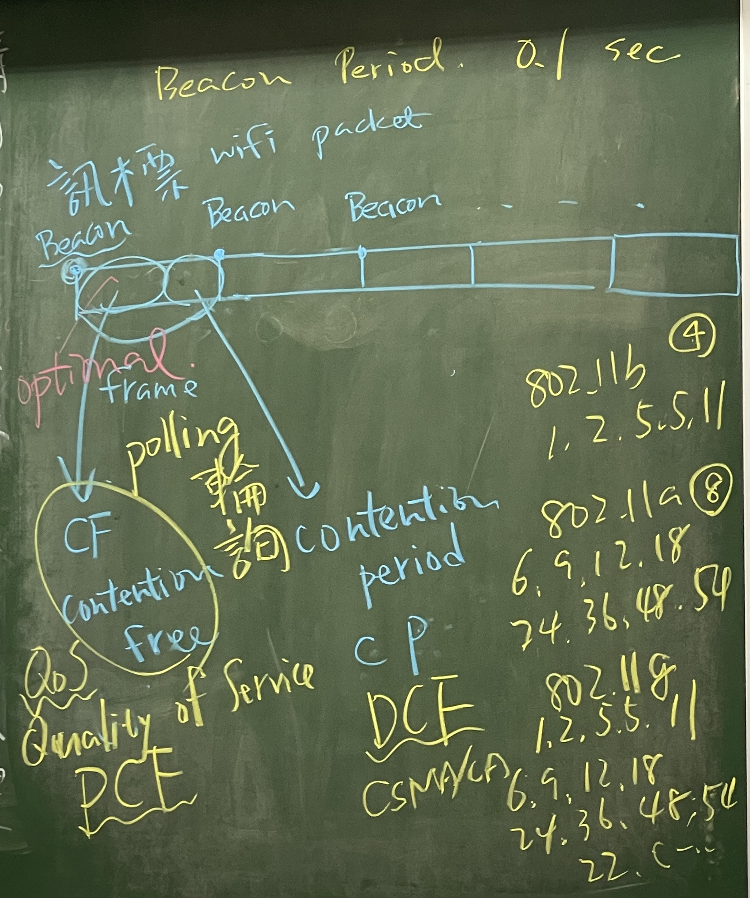
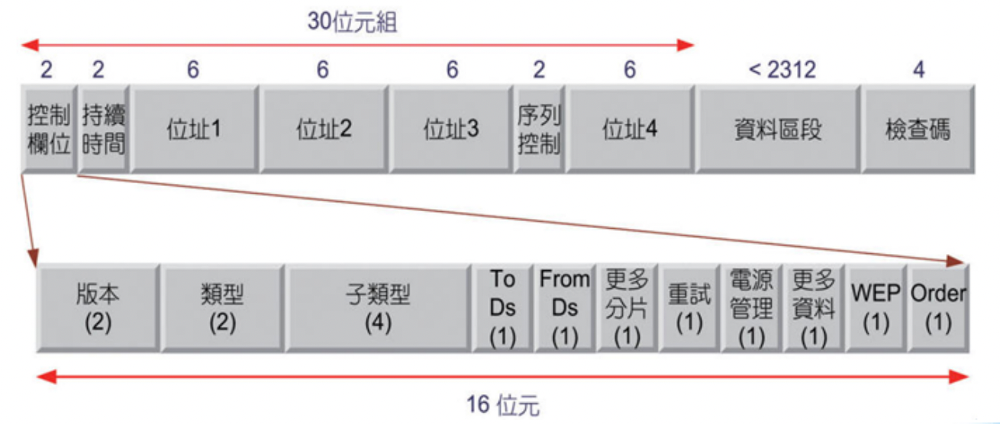
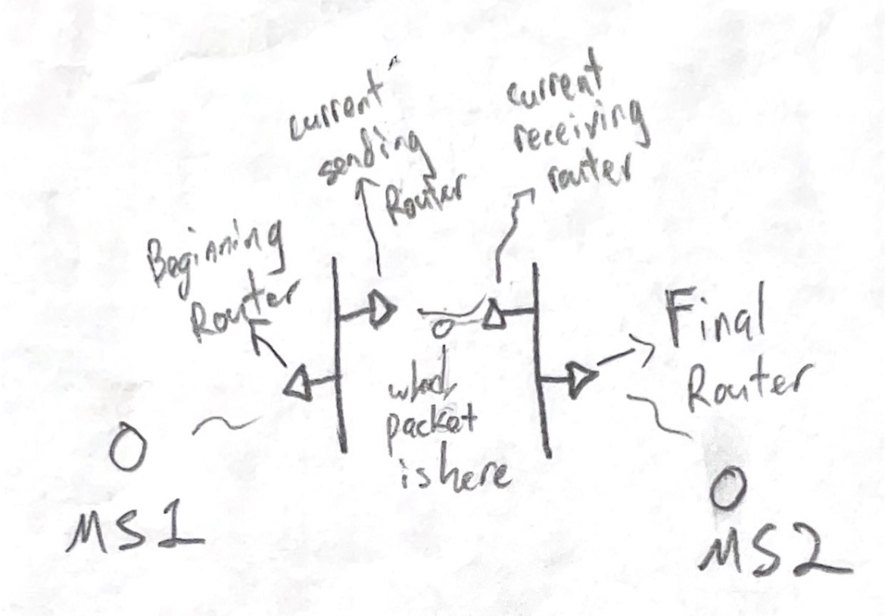

# **Chap 7**
## **WireLess LAN**
### **PCF/DCF**

* PCF(Point Coordination Function)
    - Is **contention free**, use **polling**, suitable in **Infrastructure** 
    - Pooling: AP will ask the node 1 by 1, only the one who been ask can transmit data
* DCF(Distributed Coordination Function)
    - Is `Contention-base`, using CSMA/CA
* Point Coordinator(AP)
    - Use to supervise the changing between PCF and DCF
    - `Beacon` will be sent to start PCF, after time up or finish polling, it will send `CF-End`
* Super Frame
    - a cycle of PCF and DCF
### **CSMA/CA**
* IFS: Inter-Frame Space
* SIFS(Short IFS)
    - Highest priority, use at RTS,CTS,ACK(time after data transfer finish, before send back ACK)
* PIFS(PCF IFS)
    - Second high priority, use at PCF method, the time need to wait before transmission
* DIFS(DCF IFS)
    - Third high prioritym use at DCF method, the time need to wait before transmission
* EIFS(Extended IFS)
    - The time need to wait after collision

* Step:
    1. CCA, if no -> Step 2 , if yes -> `Wait`
    2. DIFS -> CCA , if no -> Step 3 , if yes -> `Wait`
    3. Random Time/Backoff Time -> CCA, if no -> get to send data , if yes -> `Wait`
    - _CCA(Clear Channel Assessment)_

#### **Threshold Value**
* If _DATA size_ is **less than** _Threshold Value_, then the transmission process are `DATA/ACK`
* If _DATA size_ is **greater than** _Threshold Value_, then the transmission process are `RTS/CTS/DATA/ACK` 
    - RTS(Request To Send)
        - _Sender node_ send a **RTS** to the _Receiver node_ before sending data, to make sure there is no others node doing transmission
    - CTS(Clear To Send)
        - When _Receiver node_ received **RTS** and after a _SIFS_ it will send(respond) **CTS** to all node.
        - _Sender node_ received **CTS** then start to transmit data, and others node received **CTS** then will knew there is someone(node) doing transmission
    - **RTS** and **CTS** both include a _Duration_ information. 
        - It give others node know how much time needed, others node will record this information in their **NAV**(Net Allocation Vector).
        - This can avoid _**Collision**_ and the _**Hidden Node**_ problem

    _**Hidden Node Problem:** Node_B connected to Node_A and Node_C, but Node_A and Node_C don't know each other(Not connected).In this situation Node_A is hidden node of Node_C, and also Node_C is hidden node of Node_A_

### **Packet field**

* Address
    - 1: Beginning Router
    - 2: Final Router
    - 3: Current Sending Router
    - 4: Current Receiving Router
    - 
* Type
    - `00` : Management Frame
    - `01` : Control Frame
    - `10` : Data Frame
    - `11` : Reserved
* To Ds , From Ds
    - 
    - 10 : To Ds=1, From Ds=0
    - 01 : To Ds=0, From Ds=1
    - 00 => MS1 -> MS2
    - 11 => Ds1 -> Ds2
* 檢查嗎
    - Use **CRC-32** to do data detection

### **Extra**
* Beacon
    - Default beacon period is 0.1 seconds
    - Include base station's name, channel, transmission rate