## **Example of IEEE 802.11b**

## **Chap 7**
### **Ethernet Frames format**
* Ethernet head
    - Physical address
    - Desination MAC address(6 bytes) first, follow by Source MAC address(6 bytes), and follow by Type(2 bytes)
    - Will change on every _**hop**_
* IP head
    - Logical address, protocol type value is _**0800**_
    - Source IP address first, follow by Destination IP address
    - Fixed for end-to-end
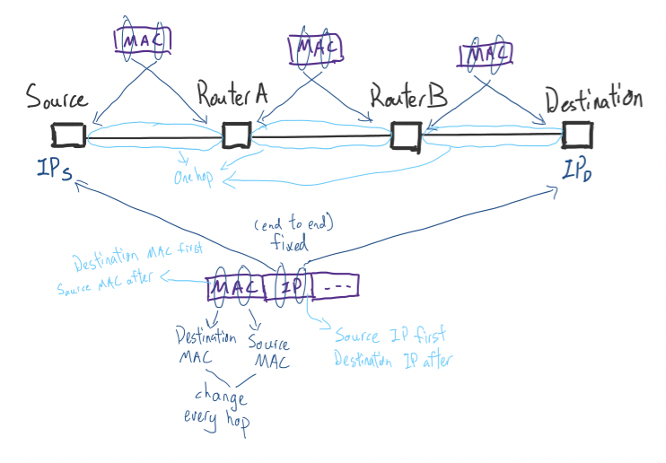
* TCP head
    - Port Number
* Data
    - Segment(Data(Message))
* Trailer
    - To check whether there is any error or not
* (Extra) , Datagram
    - UDP and Payload
### **Differences of Ethernet 2.0 and IEEE 802.3**
* Ethernet 2.0
    - `|Preamble|Destination MAC Address|Source MAC Address|Etype|Data|FCS`
    - Preamble : _**8**_ bytes, for synchronization of destination clock and source clock
    - Des MAC: 6 bytes, first 3 bytes is for manufactures ID, last 3 bytes is for Card serial number. If `FF-FF-FF-FF-FF-FF` then is for `Broadcast Address`
        - `Broadcast Address` only used for Destination address, in this case source address only can be a node MAC address. Only use in LAN network, router will throw it
    - Source MAC: 6 bytes
    - Etype : 2 bytes, if `0800` data = IP, if `0806` data = ARP, `0800` and `0806` both are hexadecimal
    - Data: 46~1500 bytes. If data not reach 46 bytes, will do `padding`(fill up with "0") to reach minimum(46 bytes)
    - FCD: 4 bytes. Frame Check Sequence, used to check whether the data in fram is correct or not, if not then it will throw the packet._(Wifi will auto resend again but Ethernet will not do resend in Data Link Layer)_

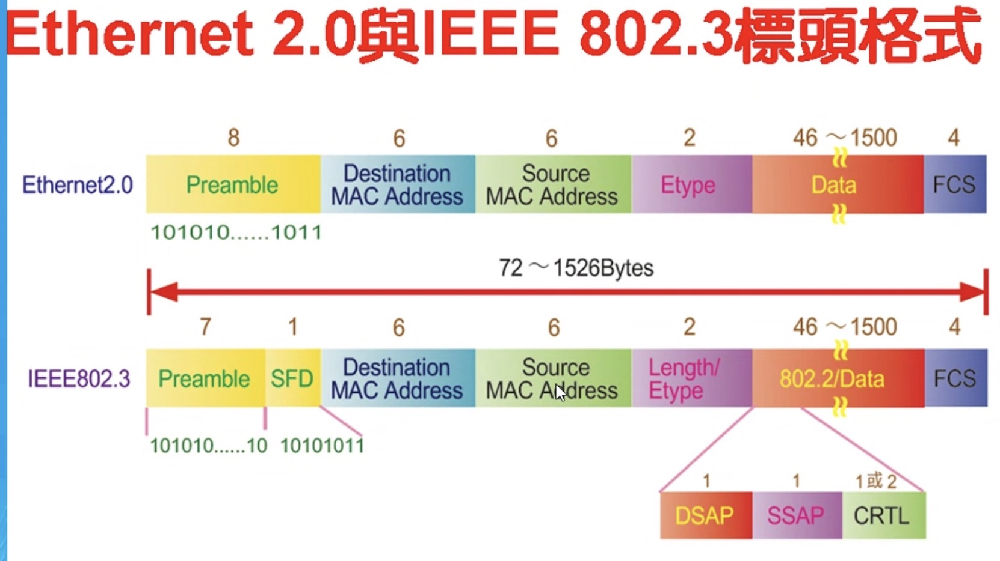
* IEEE 802.3
    - `|Preamble|SFD|Destination MAC Address|Source MAC Address|(Length/Etype)|(802.2/Data)|FCS`
    - Preamble : _**7**_ bytes, for synchronization of destination clock and source clock
    - _**SPD**_: 1 byte, mean preamble ended and start the layer 2
    - Des MAC: 6 bytes 
    - Source MAC: 6 bytes
    - _**Length/Etype**_ : 2 bytes, if `0800` data = IP, if `0806` data = ARP, `0800` and `0806` both are hexadecimal. If `...<= 1518` is Length(a length), if `...>1518` is Etype(a type)
    - Data: 46~1500 bytes
    - FCD: 4 bytes
* MAC address Example: 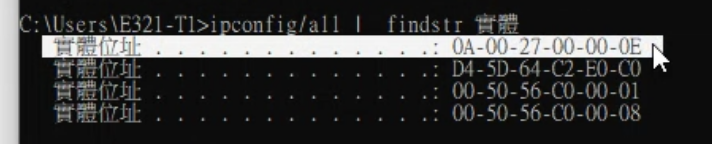

_Only keep packet that `Destination MAC address == My MAC address` or `Destination MAC address == Broadcast Address`_

### **Switched Ethernet**
* **Broadcast Domain and Collision Domain**
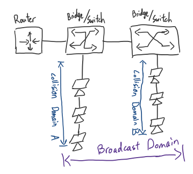
* **Address Learning**
     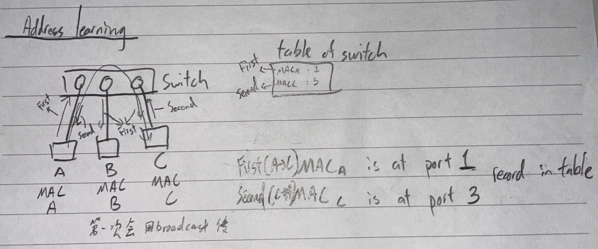
    - First packet(A->C): `A` send packet to switch(_`MAC A` will record in `table`_), switch use broadcast way send packet to every port
    - Second packet(C->A): `C` send packet to switch(_`MAC C` will record in `table`_), switch send to `A` directly cause `MAC A` address is in the table
    1. Need to renew in certain period to make sure it is the newest data recorded in the table
    2. If power off then the data will been clear
### **Extra**
* In windows, `netstat -an`: 

    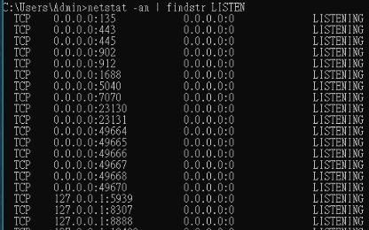
    - `0.0.0.0` means any interface on this computer, EX: 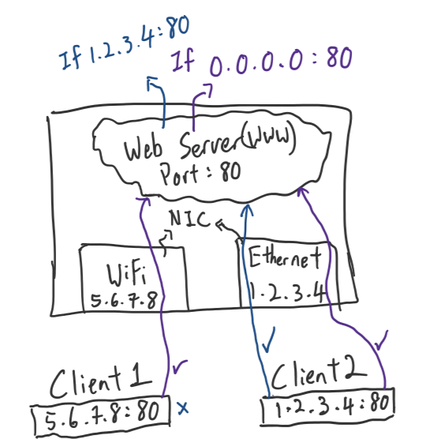
        - We can use [TCP/UDP端口列表](https://zh.wikipedia.org/zh-tw/TCP/UDP端口列表) to check whether got weird port number(maybe got hacked?)

* In Linux 
    - `ifconfig ens33 promisc`
        - Open `PROMISC(monitor mode)`, will keep every packet
    - `ifconfig ens33 -promisc`
        - Close `PROMISC`, only keep the packet that `Destination MAC address == My MAC address` or `Destination MAC address == Broadcast Address`

* ARP
    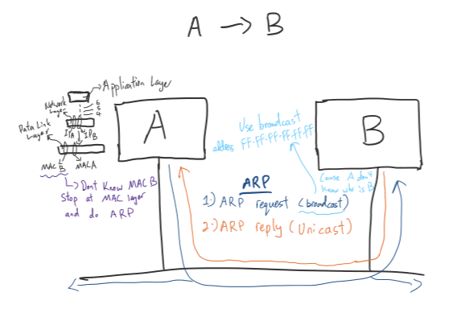
    - Do ARP before transmission/ping, use IP(B) to get MAC(B)
    - Ping a computer need at least 4 packets, arp request, arp reply, send ping packet, receive ping packet
    - When ARP reply come back will keep `IP B : MAC B` in `cache`, if next time A->B then don't need to do ARP again
    - To check ARP cache in windows:
    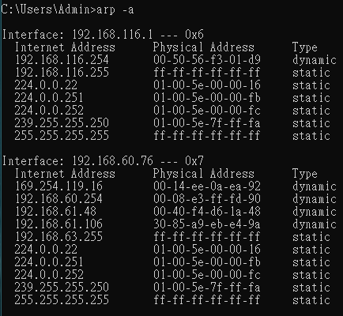
    _dynamic is from ARP request/reply,static is manually set_
    - To manually create an static ARP in ARP cache
    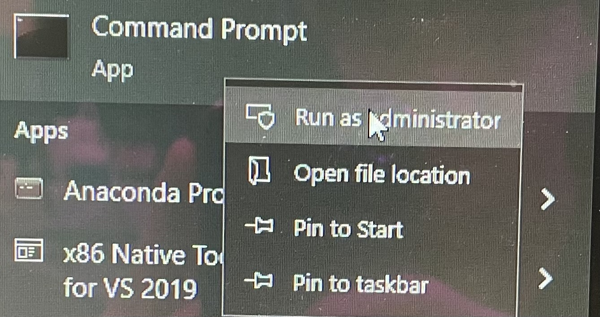
    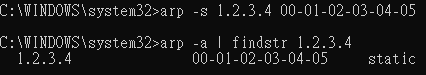
* RARP
    - Use at early generation, use Self MAC address to get an IP address for itself
    -  Send `RARP packet(client MAC included)` to `RARP server`, `RARP server` will choose an available IP address and send packet to client, then client can access internet now