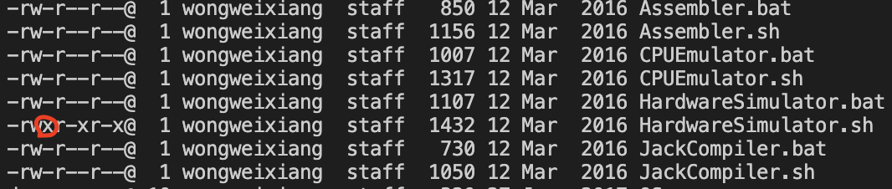
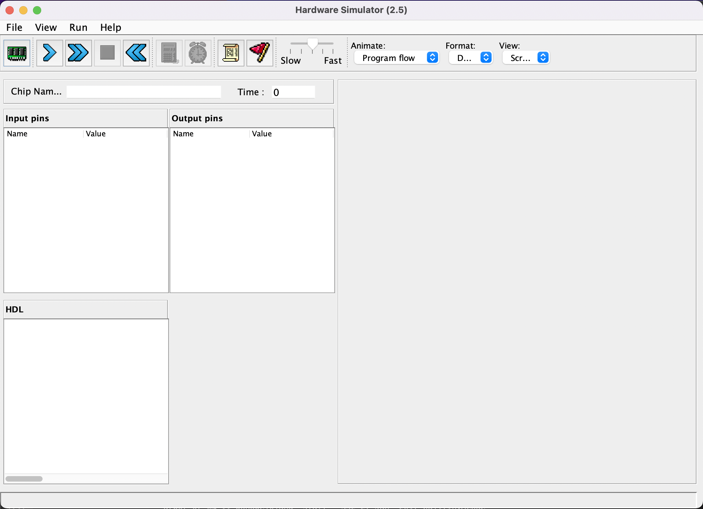

# How To Start
## Step 1
- Go to [nand2tetris.org](https://www.nand2tetris.org/software) and download the software
## Step 2
- Go to [Java](https://www.oracle.com/java/technologies/downloads/) and install Java
## Step 3
- Edit your program under the file `nand2tetris/projects/01/Not.hdl`
## Step 4
### Windows
- Open `tools` file and run `HardwareSimulator.bat`. Now you're free to test your program.
### Mac
- Open `terminal` and use the command `chmod +x HardwareSimulator.sh` to give the `.sh` file became executable.
    - Can use the command `ls -l` to check the permission of the file. ex: 
    - *All the operations need to be under the file "nand2tetris/tools"*
- After that use the command `./HardwareSimulator.sh` to execute the file. Now you will see  and able to test your program.

_*Use "File -> Load Script" to test your program~*_