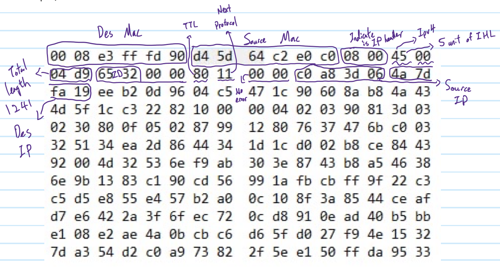

# Week 4

1. Source mac? Destination mac?
    - Source mac: d4-5d-64-c2-e0-c0
    - Destination mac: 00-08-e3-ff-fd-90
2. Ip header length? payload length?
    - Ip header length: 5*4 bytes = 20 bytes
    - TL = 04-d9 = 1241 , payload length = 1241 -20 = 1221 bytes
3. Options?
    - IHL = 5, No options
4. TTL?
    - TTL = 80 = 128 hops
5. Next protocol?
    - Next protocol : 11 = 17 ==> UDP
6. Source IP? Destination IP?
    - Source Ip : c0-a8-3d-06 = 192.168.61.6
    - Destination Ip : 4a-7d-fa-19 = 74.125.250.25