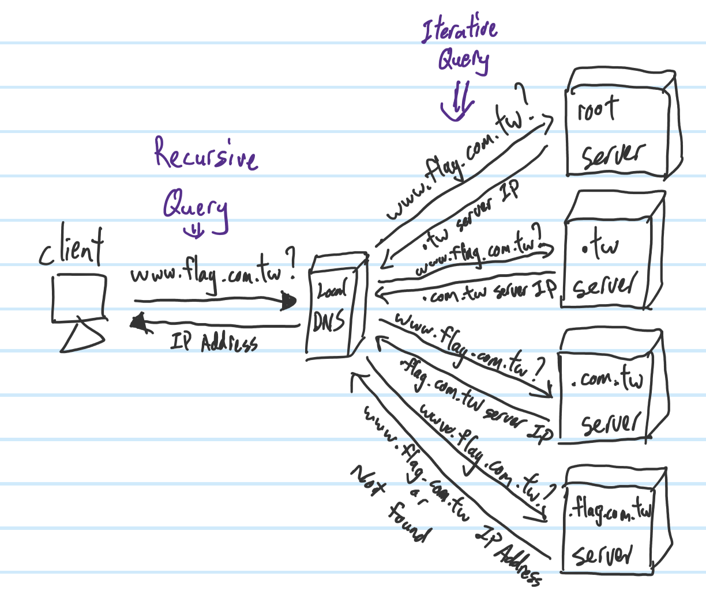
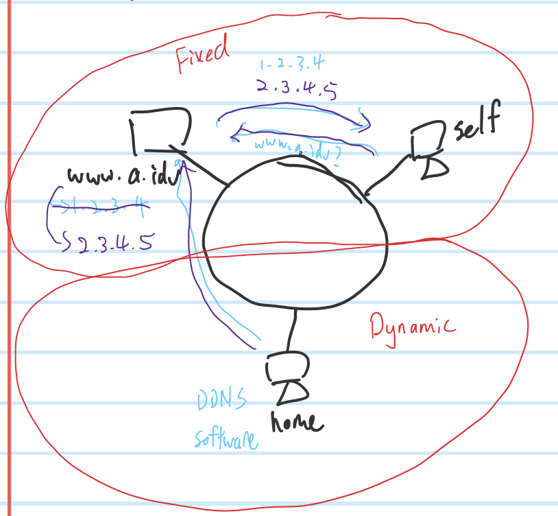
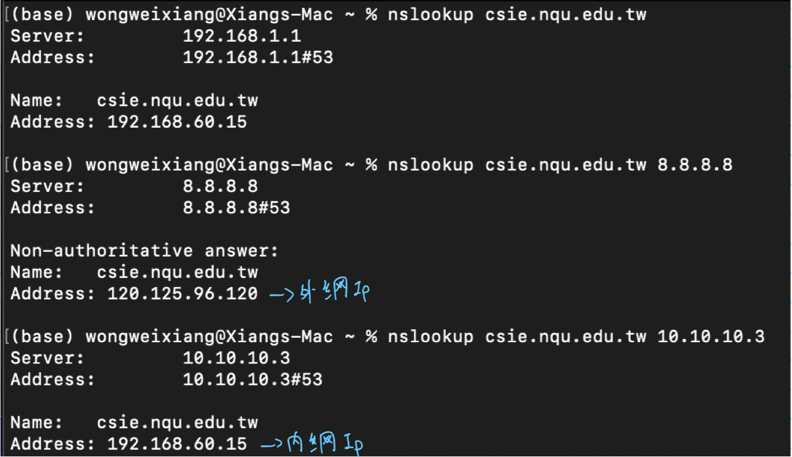

## **DNS**
- Common DNS 
    - `8.8.8.8`
    - `9.9.9.9`
    - `8.8.4.4`
- Zone 
    - DNS server's dominate area
- Fixed Ip Address, Fixed Domain Name
- Root server
    - 14 sets in the world
- DNS Server replied
    1. Is its zone
    2. Contain in cache
- Recursive and Iterative Query

## **DDNS**
- Not fixed Ip Address, Fixed Domain Name

### **IP**
- Addressing , Routing
- split reorganization 
    - Identifier, Flags, Fragment Offset
    - Ipv4 is allow to do when transfering, but Ipv6 only allow before send.
- Ipv4
    - Header length is not fixed, non-optional is 20
    - Ipv6 convert efficiency is better
## **Extra**
### **To set DNS server**
- In Windows: 
    - `setting`->`Ethernet`->`Change adapter options`->`Ethernet's Properties`->`Internet Protocol Version 4`->`Properties`
- In Linux: 
    - `/etc/resolv.conf`
### **Steps of checking network**
1. `ping 127.0.0.1` , to check software(Tcp/Ip)
2. `ping self ip address` , to check hardware(Network Card)
    - On Mac : `ifconfig | grep "inet "`
3. `ping default router` , to check network cable or router
    - On Mac : `netstat -nr|grep default`
4. `ping 8.8.8.8` , popular ip address
5. `ping google.com` , or others popular domain name
    - If 4 success but 5 don't then is DNS issues

### **nslookup**
- Windows :
    - `nslookup /?` , `/?` is to check how to use `nslookup` command, `[]` mean is optional
- Mac :
    - `man nslookup` , `man` stand for manual

    - **Non-authritative answer** means is from cache
    - `nslookup www.nqu.edu.tw 8.8.8.8` means go `8.8.8.8` to check `www.nqu.edu.tw`
    - `nslookup www.nqu.edu.tw` means go default DNS server to check `www.nqu.edu.tw`. Windows: use `ipconfig/all | find "DNS"` to check default DNS server
### **DNSSniff**
- A open source software to block DNS packet and send "fake" packet back

### **Router**
- Droptail
    - Queue management
    - If buffer/queue already full, then drop the new/in-coming packet
- FIFO
    - Scheduling : which packet will be sending out
    - First in first out
- Extra(Not implement)
    - Drop Front : 1. Drop the most front packet if buffer full and new packet comming in. (Front packet already invalid/fail)
    - Random Drop 
    - RR (Round Robin): ex: Buffer 1,2,3. B1 send 1, B2 send 1, B3 send 1, after 1 round start from B1 again
### **Big vs Little Endian**
- Big-Endian:
    - `0x12345678` => `0x12`(a) , `0x34`(a+1) , `0x56`(a+2) , `0x78`(a+3)
- Little-Endian:
    - `0x12345678` => `0x78`(a) , `0x56`(a+1) , `0x34`(a+2) , `0x12`(a+3)

### **API**
- ntoh
    - noths , network to host short(2 bytes)
    - nothl , network to host long (4 bytes)
- hton
    - htons , host to network short(2 bytes)
    - htonl , host to network long (4 bytes)

_**Network only do Best Effort Service**_