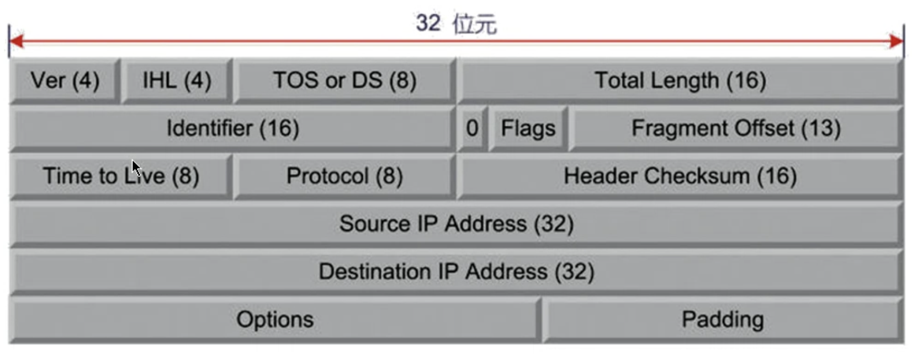
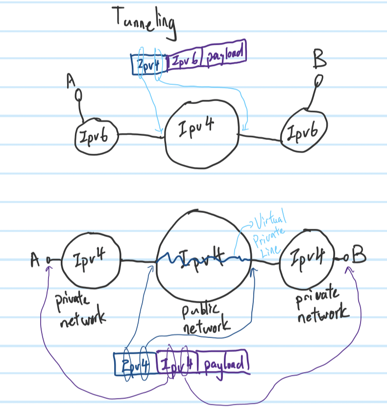
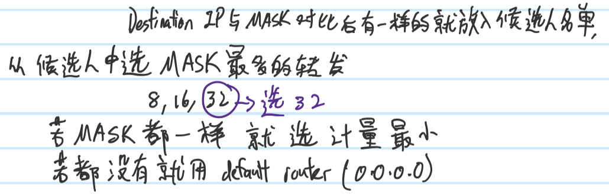

# **IP Header**

- **Ver**
    - 4 bits
    - Version of Ip, `0100 : Ipv4`, `0110 : Ipv6`
- **IHL**(Internet Header Length)
    - 4 bits
    - `1 unit == 4 bytes`. If value == 5, Ip header ==20 bytes(no optional). If value > 5, have optional.

_Ipv4 header 20 bytes, TCP 20 bytes, UDP 8 bytes(normally)_
- **TOS or DS**
    - TOS(Type of Service):
        - 8 bits
        - `Precedence | D | T | R | C | 0`
        - Precedence : value from 0~7 , indicate priority of the packet
            - 3 bits
        - D : Stand for delay, `received time - send time`, time between sent and received.
            - 1 bit
            - Delay sensitive application, D == 1(need less delay, ex: talking)
            - None delay sensitive application, D == 0(delay is okay, ex: download file, watch video(buffering), data(website), backup)
        - T : Stand for throughput(layer 2/3)(goodput for application layer)
            - 1 bit
            - `0 : normal throughput` ,`1 : high throughput`
            - Throughput >= goodput
        - R : Stand for reliability, send 100% of packet(don't throw any data)
            - 1 bit
            - `0 : low reliability`,`1 : high reliability`
        - C : Stand for cost, expensive route or cheap route
            - 1 bit
            - `0 : normal cost`,`1 : least cost`
        - 0 : reserved bit
            - 1 bit
    - DS(Differentiated Service)
        - `DSCP | ECN`
        - DSCP : Categorize data, better the other type of service then is good enough
            - 6 bits
        - ECN : Explicit congestion notification
            - 2 bits
            - ` 11 : heavy load`
            - Indicate the internet is on heavy load or light load
            - To let souce know the internet is on heavy load, please slow down transfer speed
    - IS(Integrated Service)
        - Precision of QOS, ex: If need 1MB tunnel, will reserved 100% of the tunnel for it.
- **TL**
    - 16 bits
    - Total length, `IP header's length + payload` => packet

**Segmentation and Reorganization**
- If packet excess MTU(Maximum Transfer Unit)
- ```Identifier,Flags,Fragment Offset```
- **Identifier**
    - 16 bits
    - To identify the packets if cut into more packets
- **Flags**
    - 3 bits, `0 | DF | MF`
    - DF : `0 : Allowed to cut`,`1 : Not allowed to cut`
    - MF : `0 : Is the last segment` , `1 : Have more segments`
- **Fragment Offset**
    - 13 bits
    - 1 unit == 8 bytes
    - To indicate the cut packet is how far from the origin packet
    - EX: A big packet contain 4480 bytes, cut into (1480 + 1480 +1480 + 40)
        - First FO = 0
        - Second `FO = 1480 / 8 bytes = 185 units`
        - Third `FO = (1480 * 2) / 8 bytes = 370 units`
        - Last `FO = (1480 * 3) / 8 bytes = 555 units`
- **TTL**(Time to Live):
    - For hops count, packet will `-1` of its TTL whenever pass each router. When TTL is `0` router will throw the packet and send an `ICMP` packet to source.(To let source know packet been throw cause TTL=0)
    - **ICMP : For Control and Error Feedback**
    - **For :**
        1. Limited the range that the packet can go
        2. To ensure the packet won't being alive forever when internet errors
    - Different Operating System may have different TTL default value.
- **Protocol**
    - After Ip packet, the protocol used. `1 : ICMP` , `6 : TCP` , `17 : UDP`
- **Header Checksum**
    - 16 bits
    - To ensure/check has the error header?
- **Source IP Address**
    - 32 bits
- **Destination IP Address**
    - 32 bits
- **Options**
    - Source Route : To use specific route, for testing use
    - Route Record : To know the packet pass which router, for testing use
    - Time Stamp : To know the time difference between routers, for testing use
    - Security Label : for security
- **Padding**
    - To let the **IP header** length be the multiple of 4, add 0 if not enough

# _**Extra**_
- Tunneling



- Windows
    - `route print` to show routes
    - Route Rules



