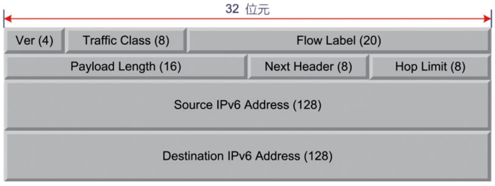
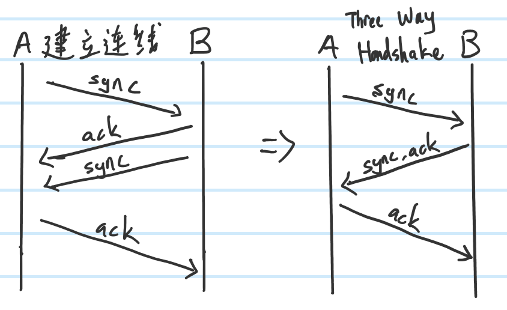
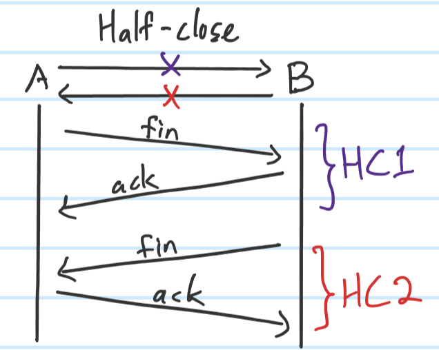

# **IPv6**
### **Types of transmission**
- Unicast: 1 to 1
- Multicast: 1 to many, substitute broadcast
- Anycast: 1 to any, not for normal host, is for router forwarding.
### **Ipv6 Address**
- 128 bits
- 8 blocks, each block 2 bytes(16 bits)
- Use `:` to split, can ignore the front `0` between `:` 
    - ex: `2002:8C6E:C7FA:00A1:0000:0000:0000:09E3` => `2002:8C6E:C7FA:A1:0:0:0:9E3`
- If continuous `0` can replace by `::`, but only can do once
    - ex: `2002:8C6E:C7FA:A1:0:0:0:9E3` => `2002:8C6E:C7FA:A1::9E3`
### **Format**
- `Prefix(N) | Subnet ID(M) | IID(128-N-M)`
- Prefix: To know which type of network 
    - ex: `001X XXXX` => `0010 XXXX or 0011 XXXX` => `2X or 3X` is for global unicast
- Subnet ID: To know which network in this type of network. Ex: 遠傳 or 中華電信 or 台灣大哥大 ...
    - `FE80:3600::/8` , 8 represent have the prefic is 8 bits, so the prefix is `FE` => `1111 1110`
- IID: Interface ID, for identification, normally 64 bits
    1. Generate by random numbers
    2. Transform from MAC 
    3. Set manually
### **Special Address**
- `0:0:0:0:0:0:0:0` or `::` 
    1. Represent not yet setting ip address
    2. If on server means any interface can access(Ethernet or Wifi can access to server)
- `0:0:0:0:0:0:0:1` or `::1`
    - Loop back interface
#### **For Ipv4 communicate with Ipv6**
- IPv4-Compatible Address
    - `0 * 96 bits` + 32 bits of Ipv4 = 128 bits
- 6to4 address
    - `Prefix:2002` + 32 bits of Ipv4 + Subnet ID + 64 bits of IID

### **Ipv6 Header**
- Fixed size 40 bytes

- Ver 
    - 4 bits , `0110`
- Traffic Class
    - 8 bits(6 bits of DSCP + 2 bits of ECN)
    - Like TOS,DS in Ipv4 header
- Flow Label
    - 20 bits
    - To differential the packet use
    - For QOS use
- Payload length
    - 16 bits
- Next Header
    - 8 bits, same as next protocol in Ipv4
- Hop Limit
    - 8 bits, same as TTL in Ipv4

# **Extra**
### **EUI-64**
- MAC address: `d8:50:e6:d0:3b:d0`
#### **Step 1**
- Cut in the middle => `d8:50:e6` || `d0:3b:d0`
#### **Step 2**
- Insert `fffe` into the middle => `d8:50:e6` fffe `d0:3b:d0`, now we got 64 bits
#### **Step 3**
- Take off all the `:` and split it by `:` for every 2 bytes => `d850e6fffed03bd0` => `d850:e6ff:fed0:3bd0`
#### **Step 4**
- Do 1's complement on the 7th bit, `d8` in binary = `1101 1000`. After 1's complement on 7th bit became `1101 1010` change back to hexa =`da`
- Final => `da50:e6ff:fed0:3bd0`
### **AAA server**
- First A: Authentication, to identify who you are.
- Second A: Authorization, give the permission according to who you are.
- Third A: Audit, record what you do in the system
### **Ipv6 address**
1. Manually setting
2. Stateless: Router send prefix, then host can use manual setting, random generate, EUI-64 with MAC, and match with prefix to form 128 bits of Ipv6 address
3. DHCPv6(stateful)

# **Chap09 Transport layer**
## **TCP & UDP**
- TCP
    - FTP : For big data size file transfer.`21(control) & 20(data transfer) port` 21 port open at any time, when transfering data then open and use 20 port(after transfer then close 20 port), this was called `out-of-band`
    - Telnet : For remote login, control usages. `23 port` Control and data use single port, this was called `in-band`
    - SSH : `22 port`
    - SMTP : Simple mail transfer protocol. For send mail `25 port`
    - POP3 : For reeceive mail `110 port(non-encrypted) , 995 port(encrypted)`
- UDP
    - DNS : `53 port` Domain name and ip convertation
    - SNMP : Simple Network Management Protocol. ex: what's the router's name, what's the speed of the router's first interface, setting of it. 
        - MIB(Management Information Base): If had means can setting and get information 
    - NFS : Network File system. For linux system's resources sharing,
    - BOOTP: Predecessor of DHCP
_**http 80 port, https 443 port**_
## **TCP**
- When building connection => Three Way Handshake

    - sync : i want to build connection with you
    - ack : ok, lets do it 

- When closing connection => Half-close
    
    - fin : I want to cut the connection with you
    - ack : ok, got it
    - **After HC1 B still can send packet to A, the whole connection broke when HC2 done**

## **Port Number**
- Use to addressing in Transport Layer
- Dominate by `IANA of ICANN` 
- Publicly known port, Registered port, Dynamic port number
    - Publicly known port number : `0~1023`
        - normally servers, like `/etc/services`
    - Registered port number : `1024~49151`
        - mySQL, Redis
    - Dynamic port number : `49152~65525`
- Client's port
    1. Not conflict with others
    2. Random choose
    3. Common set in 1024~4096
### **Extra**
#### **Why packet lost**
1. Router busy: buffer full, throw the packet
2. Error: external interference...
3. Out of order: first out late reach, late out first reach 
#### **Flow control**
- Network status
- Receiver's buffer

### **Linux**
- `/etc/services`
    - A file in linux system that show services and its port
    - bootps : `67 port/UDP` DHCP Server
    - bootpc : `68 port/UDP` DHCP Client
    - tftp : `69 port/UDP` Special case of "ftp", Trivial File Transfer Protocol. For renew firmware of network devices,like router, base station, switch(刷機用)
    - ntp : `123 port/TCP` For solve time synchronization between devices. `clock.stdtime.gov.tw`
    - syslog : `514 port/UDP` For system log(record use)

_**SQL server : 3306 port**_
- Data base store in disk

_**redis server : 6379 port**_
- Data base store in memory

_**TCP is an heavy protocol, but stable**_

_**UDP is none-connected orientation, but fast**_