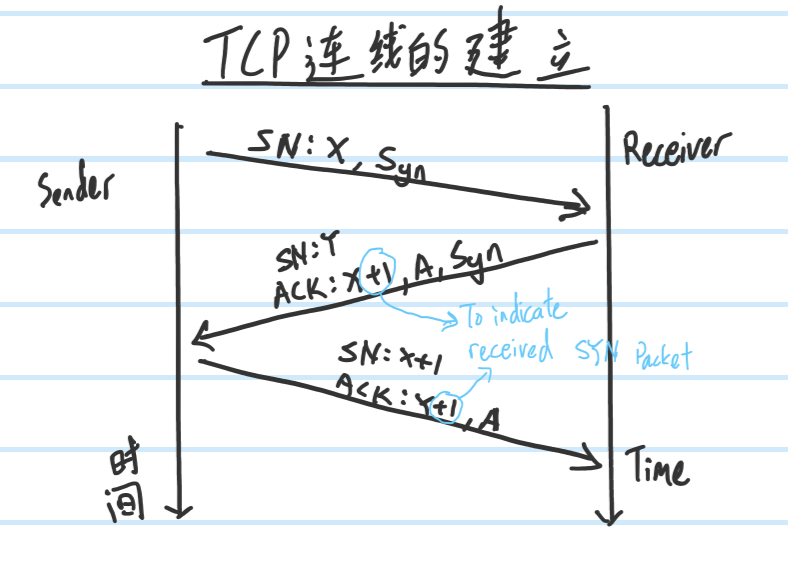
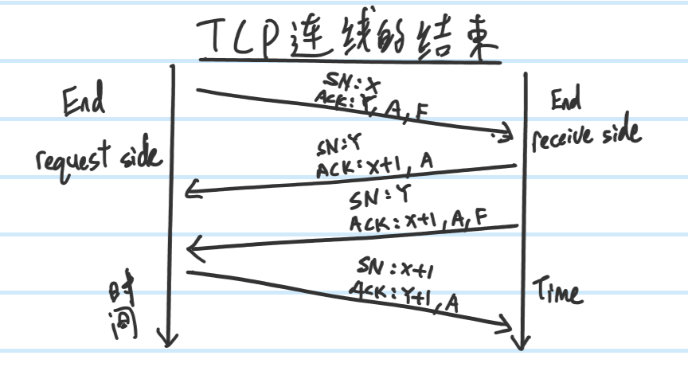
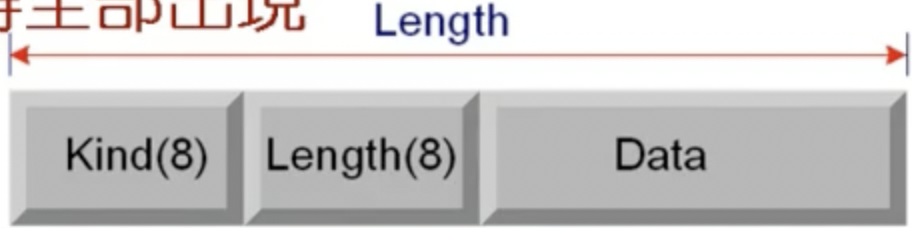
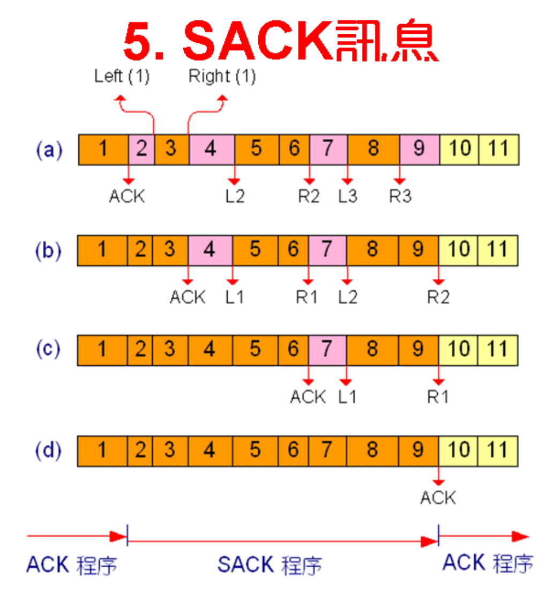
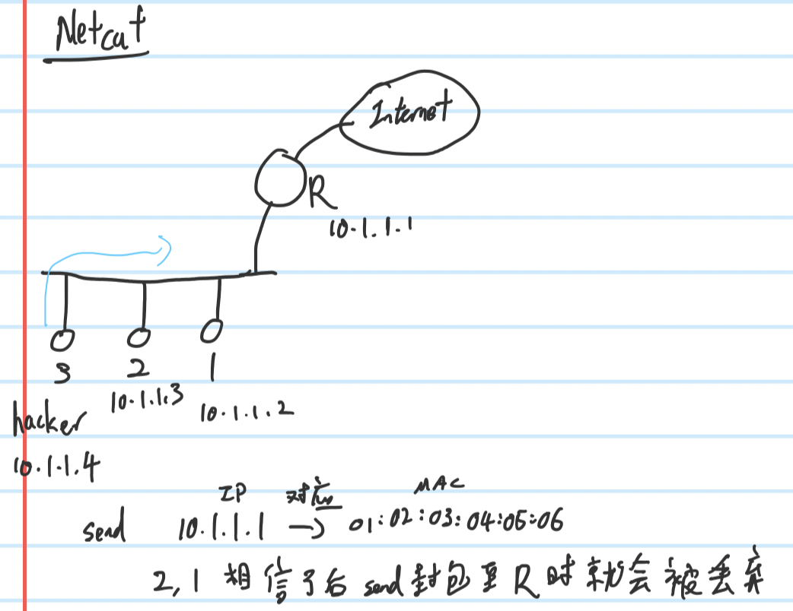
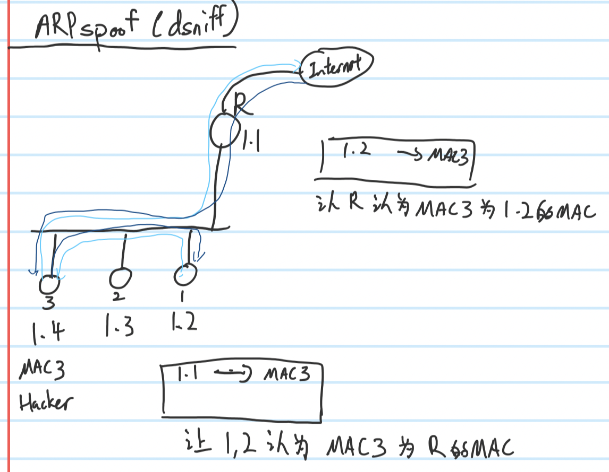
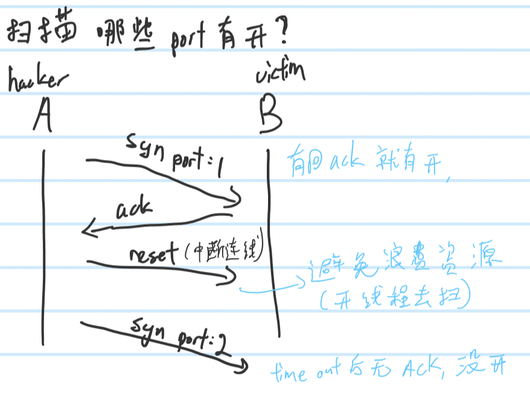

# **Chap09**
## **TCP**
### **Connection Build & Close**

### **Options**

- Kind(8 bits) | Length(8 bits) | Data's content. Commonly use:
    - 0 : 1 byte : End of Option List
    - 1 : 1 byte : No-operation, for padding
    - 2 : 4 bytes : Maximum Segment Size (satellite communication)
    - 4 : 2 bytes : SACK Permitted
    - 5 : Flexible : SACK information
#### **SACK**
- Selective Acknowledgements Permitted 

- After received ack then pin Left and Right, to know which packet's ack haven't come back yet.
- To prevent resend packet that already sent successfully
# **Extra**
## **TCP**
- TCP is a stream, if the data too big, how to distinguish?
    1. User special symbol to distinguish is the same data or not. Ex: `\n,\r,\r\n`
    2. Add a new header to indicate the length of the data

# **Chap10**
## **ARP**
- Address Resolution Protocol
- To get Mac Address from others. Is not secure when designing
- If at the same local network, will get Mac address of others. If not in the same local network, will get default router's Mac address. _**(來源和目的主機在同一區域網路下,ARP得到的是真正目的端的網路卡卡號.若是在不同網路環境下,ARP得到的是default router的網路卡卡號)**_
- Send => Broadcast , Receive => Unicast
- Use **other's Ip address** to get **other's Mac address**
### **Steps**
1. Check caches
2. Broadcast to all (ARP request)
3. Unicast (ARP response)
3. Data transmittioin start
## **RARP**
- Reversed Address Resolution Protocol
- Use **my Mac address** to get **my Ip address**

## **ICMP**
- Internet Control Message Protocol, always combine with Ip header
### **Important Functions**
1. Inquire
    - 0 : Echo reply
    - 8 : Echo request(ex: Ping)
2. Error report
    - 3 : Destination Unreachable(ex: Destination node power off)
    - 4 : Source Quench(ex: Buffer/queue almost full)
    - 5 : Redirect(ex: Detected have another better route)
    - 11 : Time Exceeded
        1. TTL = 0
        2. Big packet after cut into many small packets, if some of the small packet lost and the receiver side can't combine back(reorganization) into the big packet. Receiver will drop the packet and send ICMP to the source
_**In Tpv6, ARP was includes in ICMPv6**_

# **Extra**
- **ARP doesn't have IP header, but ICMP have IP header**
## **To check ARP**
- **Windows**
    - `arp -a`
- **Linux**
    - `arp -n`
- Static is manually setting. Dynamic is get from others
    - Static have more priority than dynamic 
## **Netcut**

- Hacker send ARP that contain fake router's mac address to let others node save the wrong mac address of router.
- How to detect?
    - Behaviour, if detected too many ARP packet then it may be having netcut attack(Unusual frequency of ARP packet)

## **ARP Spoof**

- Hacker wants to monitor all packet
- Hacker wish the packet will send to router through Hacker's computer, and also when packet come from Internet will send through Hacker's computer first then go to the real destination
- How to detect?
    - Check ARP cache, if the IP is different but have the same MAC address, then may under ARP Spoof attack

## **How to detect all available host in the local network**
1. Ping all ip address
    - But in windows ICMP packet will be block by firewall

2. Use ARP to ask MAC address of all ip address
    - If reply MAC address, then its alive
### **Detect available Port**

- Send SYN packet with port `1`, if ACK come back then its open
- Send SYN packet with port `2`, if time up then its close