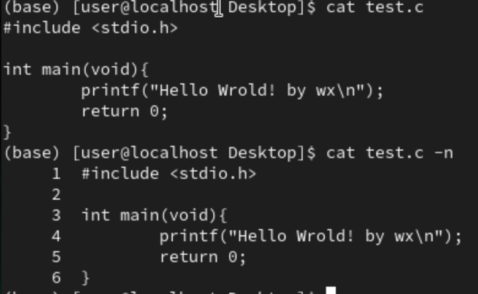
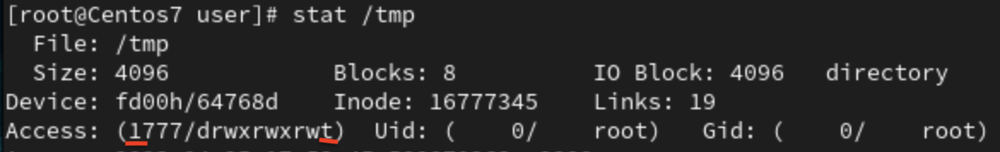
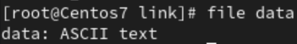
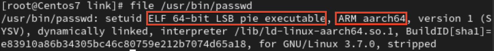
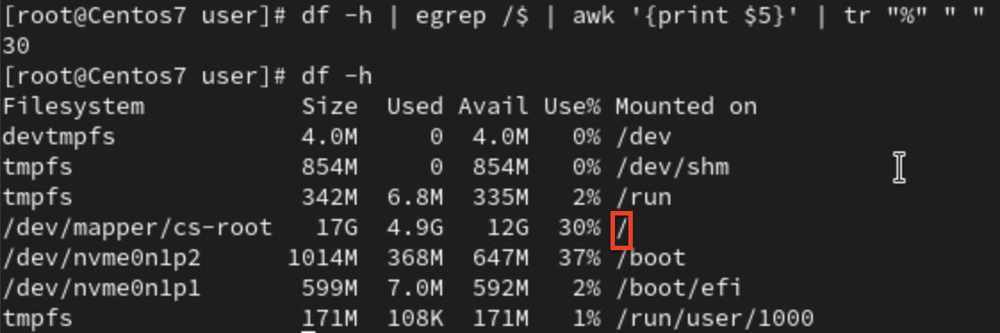
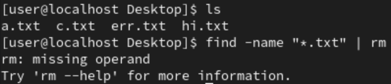
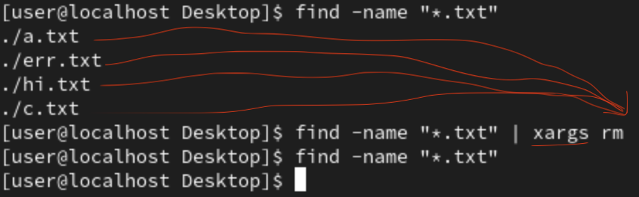

# pwd
- Print Work Directory
- To show current working directory

# ls
- list all file/directory
- `ls -l`
    - `drwxr-xr-x`
        - `d` : directory, if first is `-` then is file, if `b` then is block device(hard disk, USB), if `c` then is char device(字元設備,mouse,keyboard,terminal), if `l` then is link
    - `----------`
        - First `-` is show above
        - Owner(3 bits),Group(3 bits),Other(3 bits)
        - `r` : read
        - `w` : write and delete
        - `x` : executable
- `ls -l test` (test is directory)
    - `ls -l test` : Will only show the details of file/directory under **test**
    - `ls -l -d test` : Will give the information of the **test** directory
- `ls -l -h`
    - File size will show in k, M, GB
- `ls -a`
    - Show hidden file

# ln
- `ln -s data.txt slink` : link by symbolic link to data.txt and the link's name is slink
- `ln data.txt hlink` : link by hard link to data.txt and the link's name is hlink

# cp
- Copy files and directories
- `cp [source] [destination]`
    - `cp aa /tmp` : copy file **aa** to **/tmp**
- `-r` : recursive(for directory) , `-f` : force , `-i` : inquery

# rm
- Remove files and directories
- `rm file/directory`
    - `rm a.txt` : remove a.txt
- `-r` : recursive(for directory) , `-f` : force , `-i` : inquery

# mv
- move (rename) files
- change file/directory's name
- move file/directory
- `-r` : recursive(for directory) , `-f` : force , `-i` : inquery

# cd
- Change directory
- `cd /tmp` : change to `/tmp` directory
- `cd ~` : change to home directory
- `cd -` : change back to last directory

# sudo
- Change to super user(admin) when executing the current command, after the command done will change back to normal user

# su
- Change to super user permanently, use `exit` change back to normal user
- `su - tom` : From user -> root -> tom

# apt
- For installation, use at **Ubuntu** and **Debian** series

# yum
- For installation, use at **Redhat**/**Fedora**/**Centos** series
- `yum install software_package`
    - To install software
- `yum remove software_package`
    - To remove software

# kill
- To terminate process
- `kill -9 4740`
    - `-9` : force kill
    - `4740` : pid, process id

# gedit
- Graphical text editor
- `gedit a.txt`
    - Open a.txt by graphical text editor

# systemctl
- `status` : to check current status, ex : `systemctl status firewalld` means check firewall is active or inactive
- `stop` : To disabled server
- `start` : To enable server
- `reload` 
- `restart`

# echo
- `echo hi` : Terminal will reply "hi"
- `echi "hi" > a.txt` : Will create a.txt file with content "hi", if a.txt exists then will rewrite a.txt with "hi"
- `>>` : 追加
    - `echo 123 >> a.txt` : Will add 123 into the last row of a.txt instead of replace it
- `echo $?`
    - `$?` : Last command success or not?
    - 0 : success
    - Others : having issue

# ./
- To confirm is this directory 
- `./hello` : Execute `hello` file, if `hello` is executable

# cat
- Will show contents at terminal, ex : `cat a.txt` , will show contents in a.txt at terminal
- `cat -n a.txt` : Will show with row indicated
    - 
- `cat <<EOF > b.txt`
    - `Helloworld`
    - `Test`
    - `EOF` (end)
        - Will create b.txt(if not exist) with content "Helloworld" and "Test"
        - `<<EOF` : Next `EOF` will end 
- `cat a.txt b.txt > c.txt`
    - Mix a.txt and b.txt into c.txt

# more
- `more /etc/passwd` : Will show content of /etc/passwd on terminal with pages
- Only go to next page

# less
- `less /etc/passwd` : Will show content of /etc/passwd on terminal with pages
- Can go last page and next page, searching

# head
- `head -n 3 a.txt`
    - Print out first 3 row of a.txt

# tail
- `tail -n 5 a.txt`
    - Print out last 5 row of a.txt
- `tail -f /tmp/a.txt`
    - `-f` : Keep follow (listen)

# stat
- `stat a.txt` : Can check a.txt file's detail information
- Access (0664) : 
    - 3 bits : SUID/SGID/SBIT 
        - `s=4`(SUID) : 在使用時會暫時將使用者權限變成管理者權限,結束後會恢復一般權限
            - 
        - `s=2`SGID : 使用時會變成擁有者的權限
        - `t=1`SBIT : sticky bit,  防止刪除的屬性（只對目錄）, /tmp 下只有目錄建立者與root可以刪除該目錄
            - 
    - `r=4` , `w=2` , `x=1`
- Access time : 讀取時更改
- Modify time : 修改內容時更改
- Change time : 內容改變，屬性改變(chmod)都會更改

# man
- Manual
- `man ls` : Show the manual for `ls`
- After enter manual, use `/-h` and enter will go to the **-h** place

# whatis
- Ask programming's API or command
- `whatis open`
	- open (2)  - describe 
    - `man 2 open` will give more specific manual of the specific "open"
    - 2 is API

# halt
- `halt -p` : pause
- Others similar command : `shutdown` , `poweroff`

# touch
- Can use to **create new empty file** and **renew file's timestamp**
- `touch {a..d}` : Will create a,b,c,d files
- `touch {a..d}{1..4}` : Will create a1,a2,a3,..,d2,d3,d4 files

# chmod
- Change permission of file, change file mode bits
- `chmod -x aaa.txt`
    - Give aaa.txt executable permission

# uname
- Print system information
- `uname -r` : Show system kernel version
- `uname -a` : Show complete information (system)

# hostname
- Show hostname 
- `hostnamectl set-hostname Jack` : Change hostname to "Jack"
    - `bash` : Refresh changed

# which
- Search 執行檔 under environment variable "$PATH"
- `which passwd` : Will show the location of "passwd" 

# locate
- Search in database, so need to update database before using it
- `updatedb`, need to be root
- `locate a.txt` : Will search everything with "a.txt"

# find
- `find . -name a.txt`
    - "." : Start from this directory, `find /root -name a.txt` : search from "/root" directory
    - "-name" : search by name 
- `find -iname "a.txt"` : search without case sensitive
- `find -type d -name "htop*"`
    - `-type d` : directory
    - `-type p` : pipe
    - `-type l` : link
- `find . -type f -perm 0644`
    - `-type f` : file
    - `-perm 0644` : permission with 0644
- `find . -type f ! -perm 0644`
    - Find file that permission is not 0644, `!` : not
- `find . -type f -name "*.txt" -exec rm {} \;`
    - `-exec` : execute the command after find 
    - `{}` : The result of find will put in here
    - `\;` : end
    - `find -type f -name "*.txt -exec chmod 755 {} \;`
- `find . -type f -empty -exec rm {} \;` : Delete empty files
- `rm -rf` : for directory
- `.*` : hidden file
- `-user` : use to specific user name
- `-group` : user to specific group name
- `-mtime -7/7/+7` : -7(7天內), 7(第7天), +7(存在7天以上), 天
- `-mmin` : 分鐘
- `-cnewer timebase` : change time newer than timebase 
- `-size` 
    - `-size 50M` : only 50M 
    - `-size -50M` : Smaller than 50M
    - `-size +50M` : Bigger than 50M

# whoami
- To know is which user(root/jack/user/...), print effective userid

# w
- Show who is logged on and what they are doing
- pts/0 : terminal at vm
- `echo "hi" > /dev/pts/2`
    - Show "hi" on pts/2 terminal

# jobs
- Show all job
- `fg 2` : continue job 2

# passwd
- Change new password for current user
- `passwd tom` : Change password for tom

# file
- `file data.txt` : Show the type of **data.txt**
    - 
- `file /usr/bin/passwd`
    - 
    - 經過編譯的執行檔, 屬於 ARM aarch64 架構

# dd
- 產生大型檔案時使用
- `dd if=/dev/zero of=3M bs=1M count=3`
    - 
    - `if=/dev/zero` : 用 /dev/zero 的裝置來產生0
    - `of=3M` : 檔案名稱為"3M"
    - `bs=1M` : 一次產生 1M
    - `count=3` : 產生3次

# df
- To show system's partition usage information
- `df -h` : 使用k,M,G單位
- `df -h | egrep /$ | awk '{print $5}' | tr "%" " " `
    - 
    - `egrep /$` : 取出以‘/‘為結尾 
        - `egrep` : regular expression
    - `awk '{print 5}' `: 印出第5行
    - `tr "%" " "` : 用空白取代 %

# xargs
- Build and execute command lines from standard input
- `find -name "*.txt" | rm`
    - 
- `find -name "*.txt" | xargs rm`
    - 

# mkfifo
- Make pipe line, ex: `mkfifo testfifo`, create a pipeline with the name "testfifo"
- At terminal 1 `cat < testfifo` , at terminal 2 `echo "hello" > testfifo`

# netstat
- To check if the system's server executing
- `netstat -tunlp | grep 22` : To check if port 22 working normally on this machine
- `netstat -tunlp | grep 80`
    - `t` : tcp
	- `u` : udp
	- `l` : listen 狀態
	- `p` : process
	- `n` : 不解析
    - `grep 80` : filter if have **80**

# exit
- Exit root user to normal user

# pstree
- Show process list

# timedatectl
- `timedatectl set-timezone Asia/Taipei` : 調整時區
 
# ntpdate
- Network time protocol date
- `ntpdate tock.stdtime.gov.tw` ：去時間伺服器進行時間的矯正

# dmesg
- Dump message, can check system's information
- `dmesg | more` : To check system's information with pages

# Extra
## enp0s3
- NIC for connect to Internet
## enp0s8
- NIC in Virtual box, for host only adapter
## **$ and #**
- `$` : Signal indicate normal user
- `#` : Signal indicate root user

## . and ..
- `.` : Current directory
- `..` : Last directory(上一層目錄)