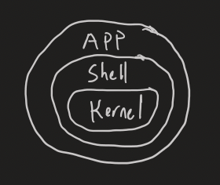
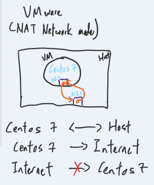
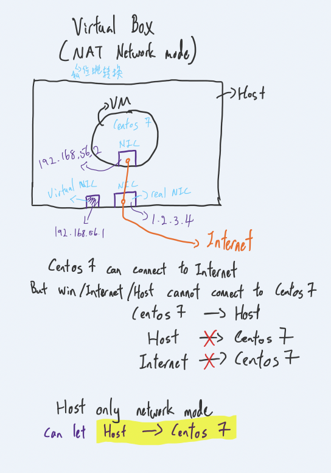

# **Distribution**
- Redhat
    - For **company** use, will have engineer to help at any time, have cost
    - Fedora
        - Community version
        - To test new functions
        - To check any improvement needed?
    - Centos
        - Community version
        - After Fedora tested, test again here
        - When stable then will move to Redhat
- Ubuntu,Debian

# **Kernel**

- Kernel
    - Memory
    - Process
    - Socket
    - Driver
    - File system
- Shell
    - Bridge between Kernel and APP

- Many of Linuxs are same **Kernel** but different **Shell**
    - Most of the command are same but some will be different. EX: Centos use `yum` ,  Ubuntu use `apt` for installation

# **Network**
## **VMWARE**

- NAT
    - **VM**(Virtual Machine) can talk to **Host**
    - **VM** can connect to **Internet**
    - **Host** can talk to **VM**
    - **Internet** cannot link to **VM**

## **Virtual Box**

- NAT
    - **VM**(Virtual Machine) can talk to **Host**
    - **VM** can connect to **Internet**
    - **Host** cannot talk to **VM**
    - **Internet** cannot link to **VM**

- Host only
    - To let Host talk to VM

_**Windows use `ipconfig`, Linux use `ifconfig` to check network properties...**_