# **Chap 5**

## **File system**

- Windows' file system
    - FAT 16
    - FAT 32
    - NTFS
        - Windows -> Mac : 寫入可能會有問題
    - EXFAT
        - 可跨平台

- Older file system
    - ext2
    - ext3
        - 相容於 ext2
        - 比 ext2 多了**日誌系統**, 不需掃描整顆硬碟,只檢查有更動的磁碟資料
    - ext4
        - 相容於ext3
        - 突破檔案系統的大小限制
- XFS
    - 64 bits 日誌型檔案系統
    - Suitable for big size data transfer(適合大型檔案傳輸)
    - Maximum 8EB(exabyte) : 1 EB == 109 GB

- When store file will use at least 1 block
    - ex: data 1kb, 1 block 4kb, when storing data will use 1 block to store, so will still occupy 4kb 

### **Inode**
- 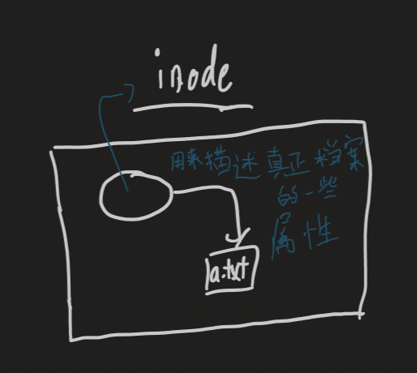
- Metadata : data that use to describe data (用來描述資料的資料)
    - File size
    - Owner
    - Owner's group
    - Time (access time, change time,…)
    - Block location
- 當tom user要存儲a.txt時，系統會先去檢查a.txt 的 inode, 若tom沒有權限就會被阻擋下來

### **extra**
- `stat`
	- `stat a.txt` : Can check a.txt file's detail information
	- Access (0664) : 
		- 3 bits : SUID/SGID/SBIT 
			- `s=4`(SUID) : 在使用時會暫時將使用者權限變成管理者權限,結束後會恢復一般權限
                - 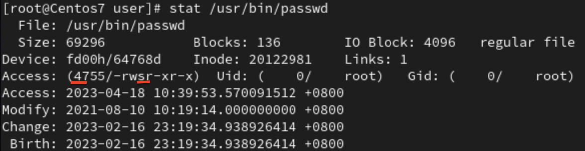
			- `s=2`SGID : 使用時會變成擁有者的權限
			- `t=1`SBIT : sticky bit,  防止刪除的屬性（只對目錄）, /tmp 下只有目錄建立者與root可以刪除該目錄
                - 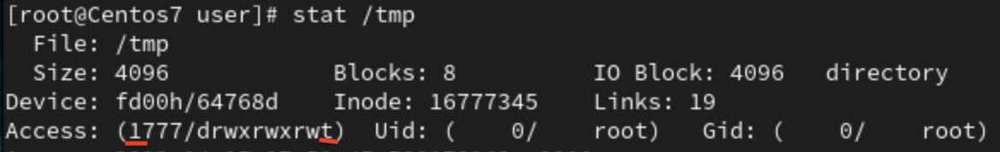
		- `r=4` , `w=2` , `x=1`
	- Access time : 讀取時更改
	- Modify time : 修改內容時更改
    - Change time : 內容改變，屬性改變(chmod)都會更改

- `which`
	- 找尋執行檔所在的位置
	- `which passwd` : Will show the location of "passwd" 
	
- `su`
    - `su - tom` : From user -> root -> tom

### **Link**
- Symbolic link : slink
    - 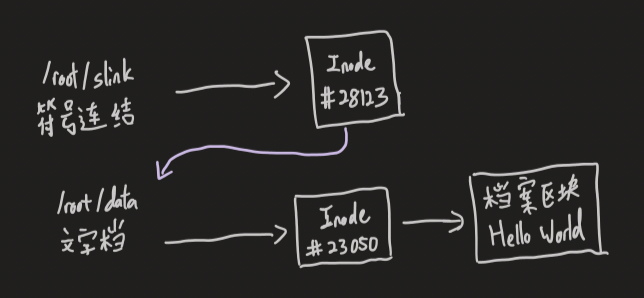
    - 產生時權限是全開的，slink權限不能更變，會去參照原本檔案的屬性
    - 若`chmod 777 slink`，原本的檔案會改變權限但slink的權限還是一樣不會變
    - 產生不同的inode, 原本的檔案刪除後符號連結就無效了，與原本檔案指向不同的inode
    - 連結數不會變，都是1
        - 
    - 可以跨分割區，可以使用於目錄

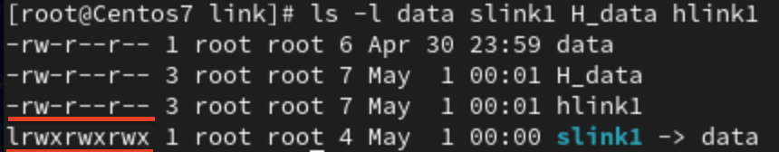
- Hard link : hlink 
    - 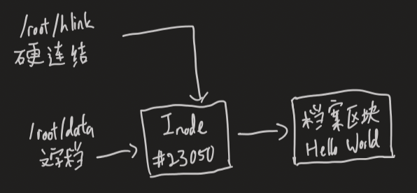
    - 產生時權限和原本檔案是一樣的，可以更改權限，更改後原本的檔案也會一起改變
    - 原本的檔案刪除後，硬連結還是有效的,與原本檔案指向同一個 inode
    - 增加連結時，連結數會變多
        - 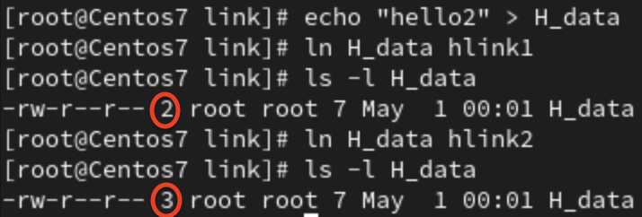
    - 缺點 ： 不可跨分割區，不可使用於目錄

- `ln`
	- `ln -s data.txt slink` : link by symbolic link to data.txt and the link's name is slink
    - `ln data.txt hlink` : link by hard link to data.txt and the link's name is hlink

### **Executable file**
- Windows
    - `.exe` or `.bat`
- Linux
    - Depend on the executable permission (x)
    - `chmod +x a.txt` : Give executable permission to a.txt
    - `/root/user/a.txt` : Execute **a.txt** under **/root/user/** directory (absolute path)
    - `./a.txt` : Execute **a.txt** under current directory

- `file`
    - `file data.txt` : Show the type of **data.txt**
        - 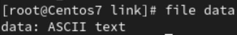
    - `file /usr/bin/passwd`
        - 
        - 經過編譯的執行檔, 屬於 ARM aarch64 架構

- `dd`
	- 產生大型檔案時使用
	- `dd if=/dev/zero of=3M bs=1M count=3`
        - 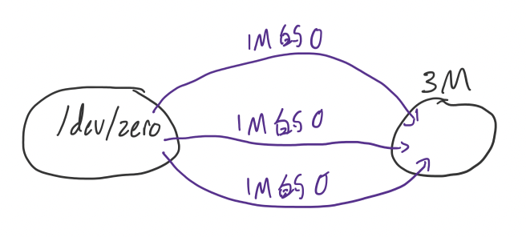
		- `if=/dev/zero` : 用 /dev/zero 的裝置來產生0
		- `of=3M` : 檔案名稱為"3M"
		- `bs=1M` : 一次產生 1M
        - `count=3` : 產生3次

- `df`
	- To show system's partition usage information
	- `df -h` : 使用k,M,G單位
	- `df -h | egrep /$ | awk '{print $5}' | tr "%" " " `
        - 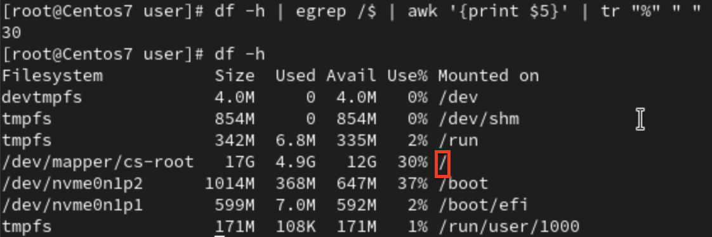
		- `egrep /$` : 取出以‘/‘為結尾 
		    - `egrep` : regular expression
		- `awk '{print 5}' `: 印出第5行
        - `tr "%" " "` : 用空白取代 %

# **調整時間**
- Step 1
    - `timedatectl`
        - `timedatectl set-timezone Asia/Taipei` : 調整時區
- Step 2
    - `ntpdate`
	    - Network time protocol date
	    - `ntpdate tock.stdtime.gov.tw` ：去時間伺服器進行時間的矯正

# **Extra**
- Windows 的捷徑
    - Can link to file/directory at any "place"(可以連結到任意地方的檔案/資料夾)
    - Will indicated by the up pointed arrow（有向上箭頭的符號來代表）
    - 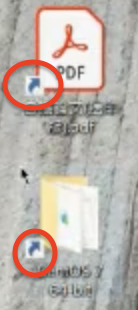

