# **Mount USB on VMware Fusion**

## **FAT32**
- If USB driver is FAT32, Linux system can identify the USB driver and mount(new partition and mount) it automatically
    - 
### **Step 1**
- Plug in USB to machine
    - 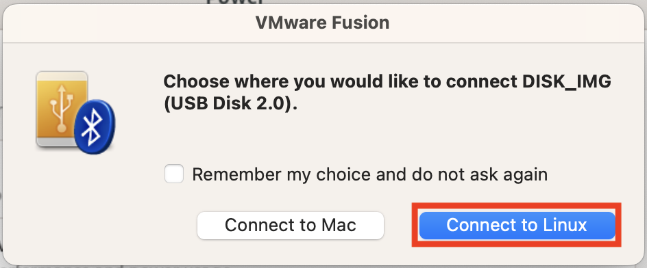
- `lsusb` : To check USB device is connected to VM    
    - 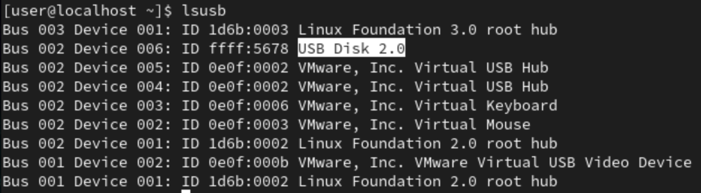
- `df -h` : Check where it mounted
    - 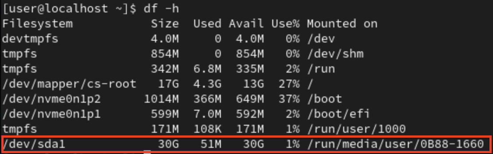
    - Done if mounted, if not then go to step 2
### **Step 2**
- `ls -l /dev | grep "^b"` : To check whether VM deteched the USB
    - 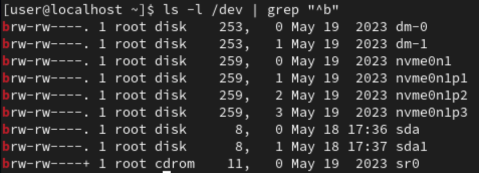
    - **sda1** is what we want 
- `sudo mount -t vfat -o iocharset=cp936 /dev/sda1 ./mydata` : mount /dev/sda1 to mydata(directory)
    - `df -h` : Check if successful
    - 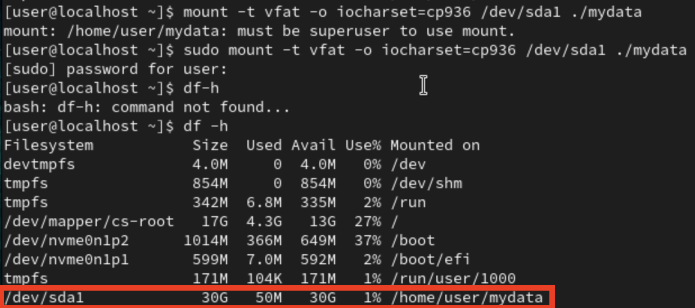
    - Done!

## **NTFS**
- 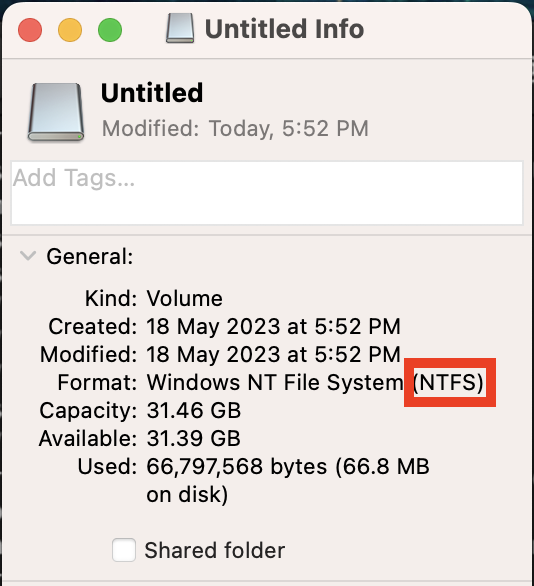
### **Step 1**
- `wget https://tuxera.com/opensource/ntfs-3g_ntfsprogs-2017.3.23.tgz`
    - Download driver for NTFS(安裝驅動程式)
- `tar -zxvf ntfs-3g_ntfsprogs-2017.3.23.tgz`
    - Unzip it
    - 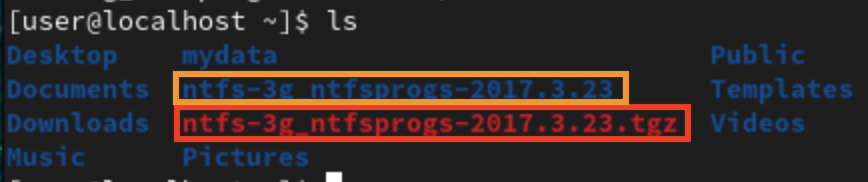
        - red is zip file
        - orange is after unzip file(we want this)

### **Step 2**
- Compile and install, change to root to do this step
- `cd ntfs-3g_ntfsprogs-2017.3.23/`
- `./configure`
    - 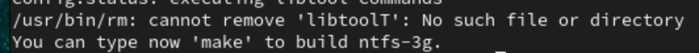
    - If no error then can go next command
- `make`
- `make install` 

### **Step 3**
- Mount USB with VM
- `mkdir myusb` : Create a directory for mount
- `sudo mount -t ntfs-3g /dev/sda1 ./myusb`
    - Mount NTFS USB to **myusb** directory
- 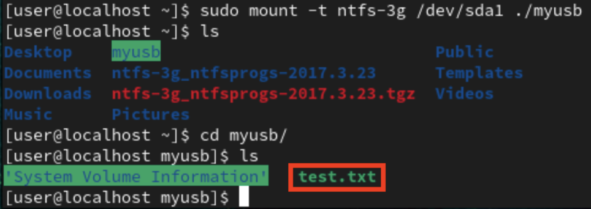
    - Now we can see the **test.txt** which is the file on the USB!
#### **To Unmount**
- `sudo umount ./myusb`
    - 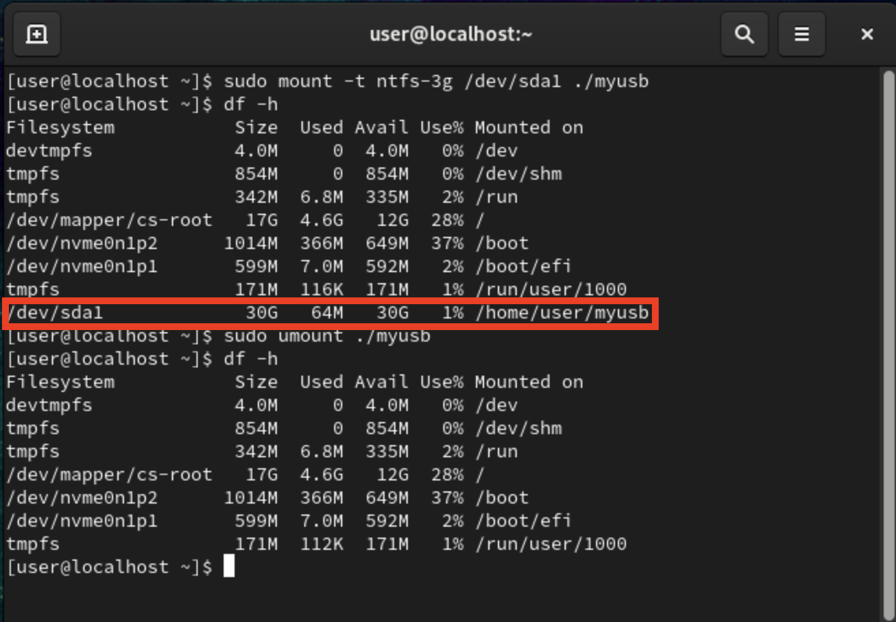

# **Disconnect USB on VMware Fusion**
## **Step 1**
- Unmount USB from VM
- `df -h` : To check USB mounted on which directory
- `umount /dev/sda1 /run/media/user/0B88-1660` : To unmount USB from VM
- `df -h` : Check again is the USB was disappeared
    - 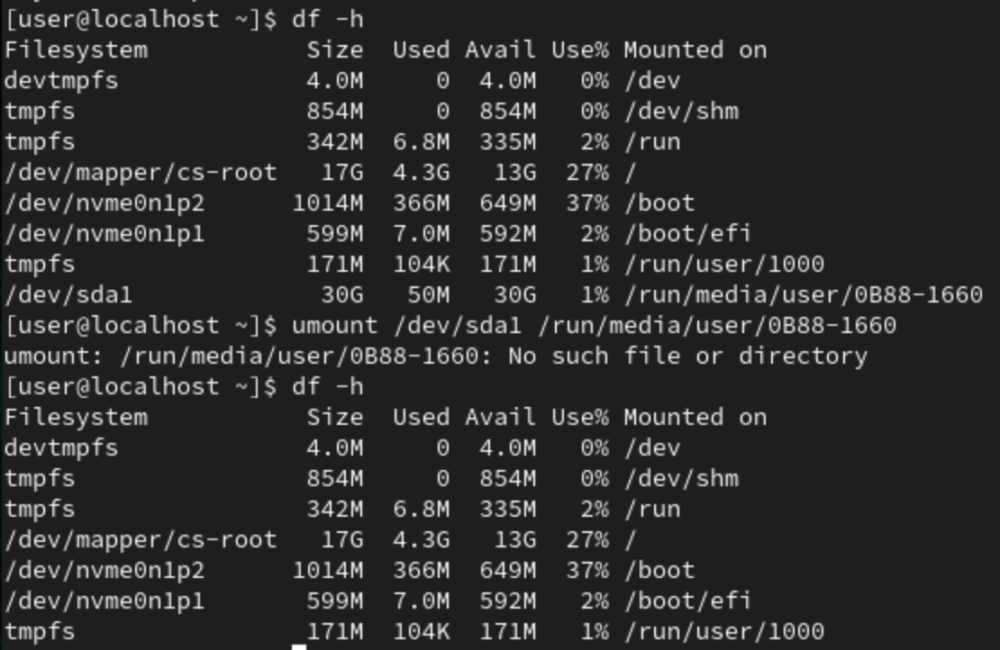

## **Step 2**
- Disconnect USB from VM
    - 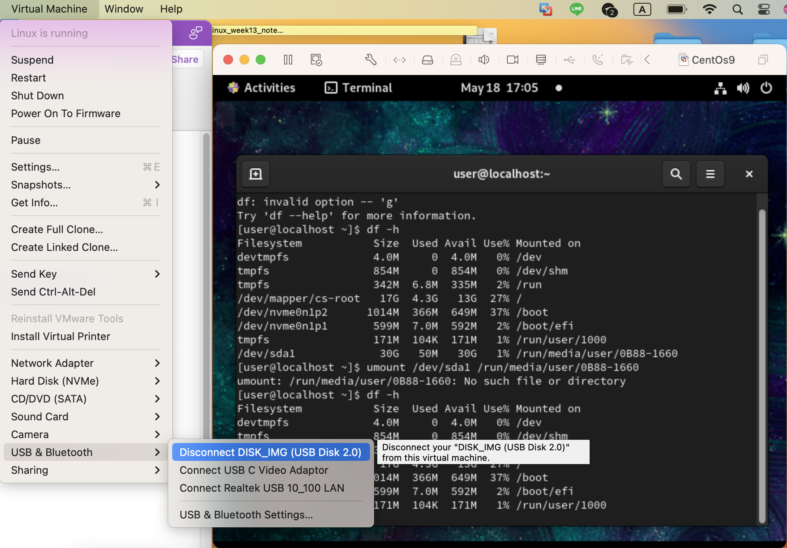
    - Done!

# **CHAP 7**

- `groundadd`
	- `groupadd sales`
		- sales:x:1001: 
			- sales : group name
			- x : password,但密碼檔不會放在這裡所以用x來代表
			- 1001 : group id
			
- `/etc/group` : All group will be stored here

- `useradd`
    - `-c` : Comment
    - `-g` : Main group
    - `-G` : Addition/attach group
    - `-d` : Specify home directory
    - `-e` : Expired date for the user
    - `-u` : Specify user id(UID)
	- `useradd mike`
		- 沒有參數就是用預設值 : 家目錄(/home/mike) , 群組(mike)

- `/etc/passwd`
	- 沒有放任何密碼, 密碼儲存於`/etc/shadow`
	- 儲存一般使用者和系統帳號
	-  `mike:x:1001:1002::/home/mike:/bin/bash`
		- `mike` : user's name
		- `x` : password, but store in `/etc/shadow`
		- `1001` : uid
		- `1002` : group id
		- `::` : 5th place for comment
		- `/home/mike` : home directory
		- `/bin/bash` : shell
	-  `…… :/sbin/nologin`
		- Shell 是`/sbin/nologin` 為系統帳號，不允許登錄
	- 一般使用者的uid是從1000開始(預設)
	- Root id 是 0 

- `/etc/shadow`
	- 密碼放在這裡

## **Stop user login**
- 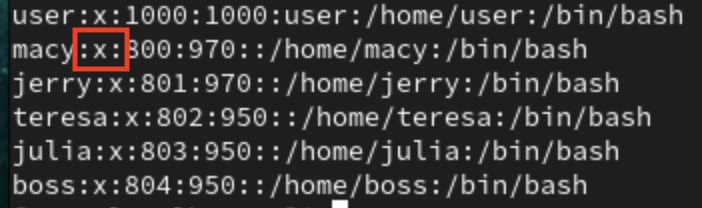
    - Under `/etc/passwd`, change `x` to `!x`/`!` can stop user login
- `chsh tom` : Change shell for tom
    - change `/sbin/nologin` to be new shell also can stop user login

## **File and Directory permission**
- File permission, `r` : read , `w` : write , `x` : execute
- 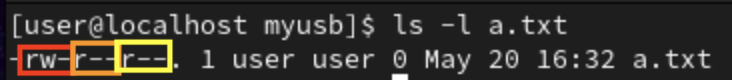
    - red : owner's permission
    - orange : group's permission
    - yellow : others' permission
- `chmod`
    - `u` : change owner's permission
    - `g` : change group's permission
    - `o` : change others' permission
    - `a` : change all permission
    - `chmod a+x a.txt` : give everyone permission to execute **a.txt**


## **Extra**
### **Setting passwd without interaction**
- `echo "tom" | passwd --stdin tom`
    - 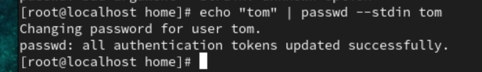
- Linux set user script
```
for user in tom marry peter john erick
do 
    id $user > /dev/null 2>&1
    if [ "$?" -ne "0" ];
    then
        useradd $user
        echo $user | passwd --stdin $user
        echo "$user is added into system"
    fi
done
```
- `-ne` : not equal