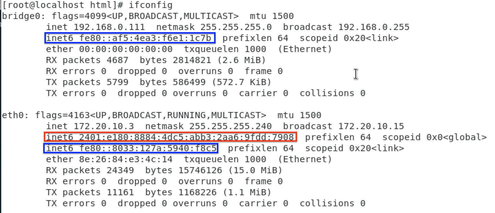
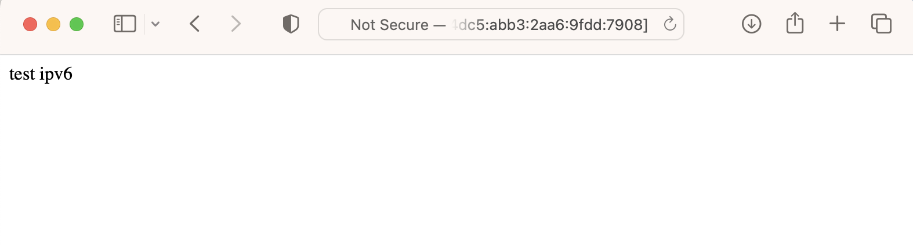
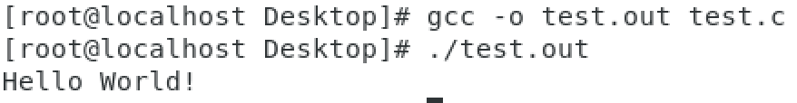

# **Web server using Ipv6**
## **Step 1**
- Go to Setting -> Network -> Choose Bridge mode
- `systemctl start httpd`
    - To start http server on centos7
- `ifconfig`
    - To check ipv6 address on the Virtual machine

    - Red -> Global use, this is what we wants
    - Blue -> Start with `fe80:...` is for local use
## **Step 2**
- `cd /var/www/html`
    - Create the **htm** file under this directory
- EX: `echo "test ipv6" > ip.htm`
    - Creating a file named **ip.htm** with contents **test ipv6**

## **Step 3**   
- Open browser in host machine
- `http://[ipv6_address]/file.htm`
    - Ex : `http://[2401:e180:8884:4dc5:abb3:2aa6:9fdd:7908]/ip.htm`

## **Result**


# **Writting C program in Linux(Centos7)**
## **Step 1**
- `sudo yum install gcc`
    - Install gcc
- `gedit test.c`
    - Create a file named **test.c** and use editing tool **gedit** to open it
## **Step 2**
- Start coding C program in it
```
#include <stdio.h>
int main(void){ 
    printf("Hello World!\n"); 
    return 0; 
    }
```
- Save it
## **Step 3**
- `gcc -o test.out test.c`
    - Compile **test.c** and name the output file to **test.out**
- `./test.out`
    - execute **test.out** under this directory(./)

## **Result**
