# **Snapshot**
## **VMware Fusion**
- 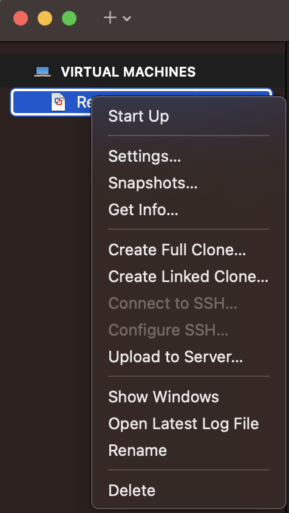
- 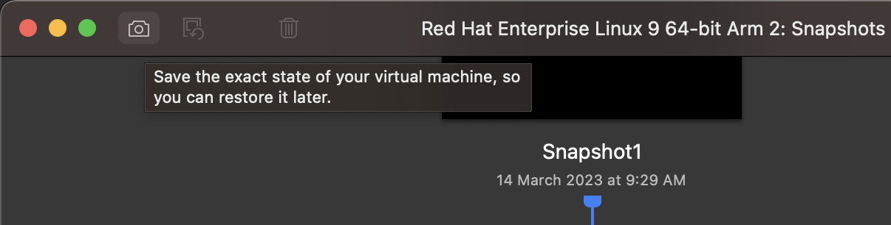
- Click the camera icon to take snapshot

# **Create python environment by miniconda**
## **Step 1**
- `sudo yum install wget -y`
    - wget can install software without open browser
- Go to [Miniconda](https://docs.conda.io/en/latest/miniconda.html)
    - 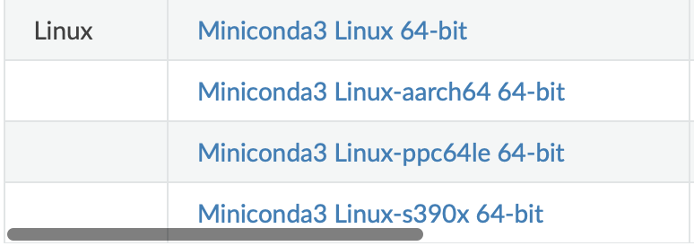
    - Choose your computer architecture and **right click** then choose **Copy Link**
- `wget URL_Link`
    - Use wget to download the **Miniconda Installer**
    - Paste the Link at `URL_Link`
## **Step 2**
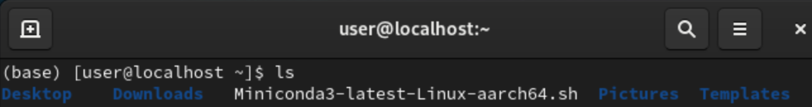
- `bash Miniconda3-latest-Linux-aarch64.sh`
    - To run the installer 
    - type `bash Mini` and press **tab** key, Linux will auto complete the rest
    - To skip the license pages press **q**

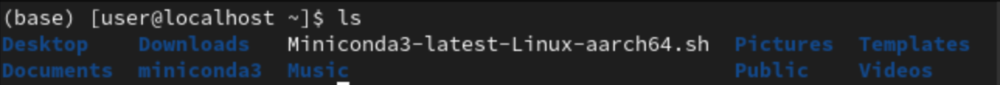
- I installed under `/home/user/miniconda3`
- `/home/user/miniconda3/bin/conda config --set auto_activate_base false`
## **Step 3**
- `gedit .bashrc`
    - Use **gedit** to edit **.bashrc**, to add **conda** path into system environment 
- Add `export PATH=$PATH:/home/user/miniconda3/bin`
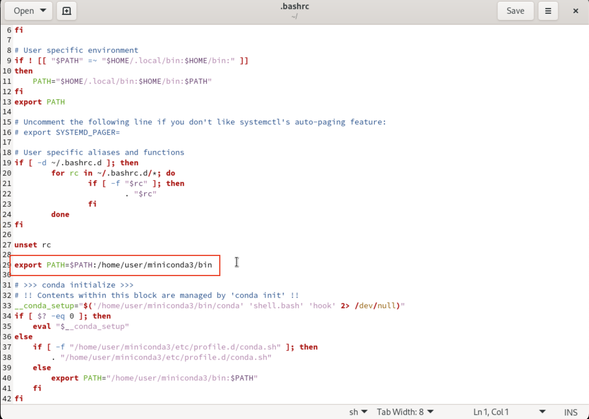

- `conda --version`
    - To check does it added into system environment
    - 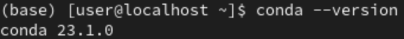

## **Step 4**
- `conda init`
    - To initial 
- `conda create -n mypython3.10 python=3.10`
    - `-n` : name, ex: `-n mypython3.10` = name is **mypython3.10**

## **Step 5**
- `conda activate mypython3.10`
    - To activate the environment created in **Step 4**
- `conda deactivate`
    - To come out from the environment

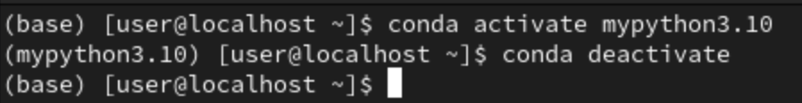

# **Install python3.9 on CentOs7(UTM m1 Mac)**
- `sudo yum -y install epel-release`
- `sudo yum -y update`
- `sudo reboot`
- `sudo yum groupinstall "Development Tools" -y`
- `sudo yum install openssl-devel libffi-devel bzip2-devel -y`
- `sudo yum install wget -y`
- `wget https://www.python.org/ftp/python/3.9.13/Python-3.9.13.tgz`
- `tar xvf Python-3.9.13.tgz`
- `cd Python-3.9*/`
- `./configure --enable-optimizations`
- `sudo make altinstall` 

- From https://computingforgeeks.com/install-latest-python-on-centos-linux/

# **Auto Subtitle**
## **Step 1**
- `sudo yum install epel-release`
    - To install the Extra Packages for Enterprise Linux (EPEL) repository, which contains additional packages unavailable in the default repositories
    - M1 Mac stop here, 7 does not have aarch64 version
    - 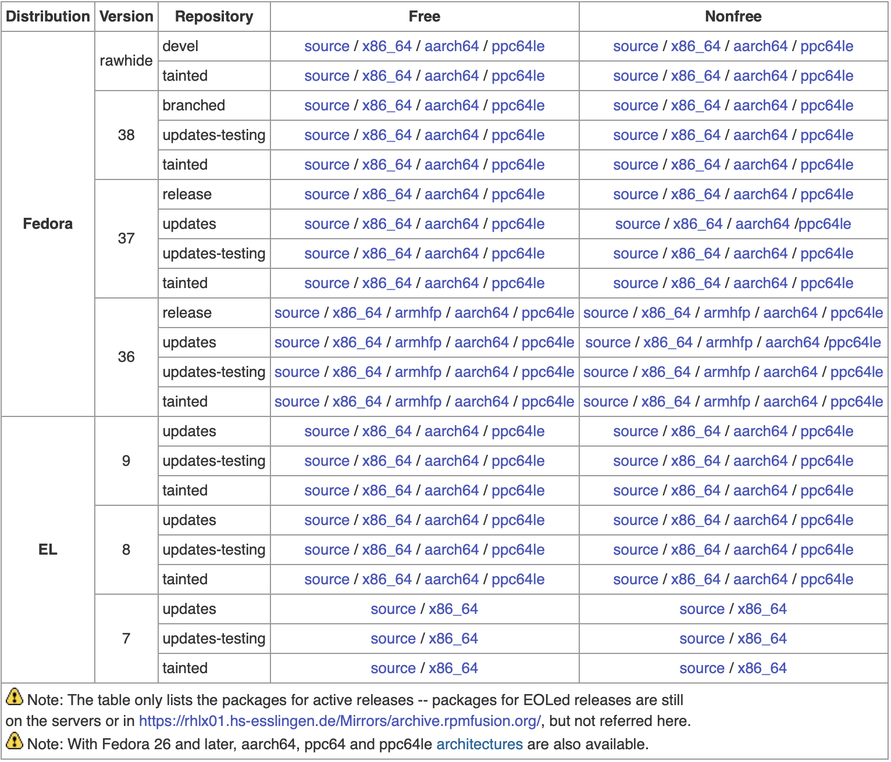
- `sudo yum localinstall --nogpgcheck https://download1.rpmfusion.org/free/el/rpmfusion-free-release-7.noarch.rpm`
    - To download RPM fusion repository
- `sudo yum install ffmpeg ffmpeg-devel`
    - To install FFmpeg and all its dependencies
- `ffmpeg -version`
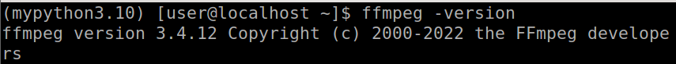

## **Step 2**
- `sudo yum install vlc`
- `conda activate mypython3.10`
    - Python3.10 environment
- Go to [smallko_whisper](https://github.com/smallko/test-whisper) and copy file **gen_sub.py**
    - Can use `gedit gen_sub.py` and copy code(RAW) into this python file
- 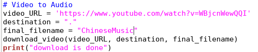
    - **video_URL** change to your youtube's url link 
    - **final_filename** the file's name after execute program
### **gen.py && gen_sub.py && gen_sub_toEnglish.py**
- **gen.py**
    - Have mp4 file in local storage
    - Auto detect language
- **gen_sub.py**
    - Use Youtube URL link
    - Auto detect language
- **gen_sub_toEnglish.py**
    - Generate English subtitle 

## **Step 3**
- `sudo yum install git`
- `pip install git+https://github.com/openai/whisper.git`
    - 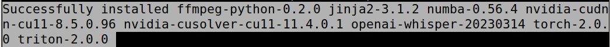
- `pip install pytube`
- `python gen_sub.py`
    - 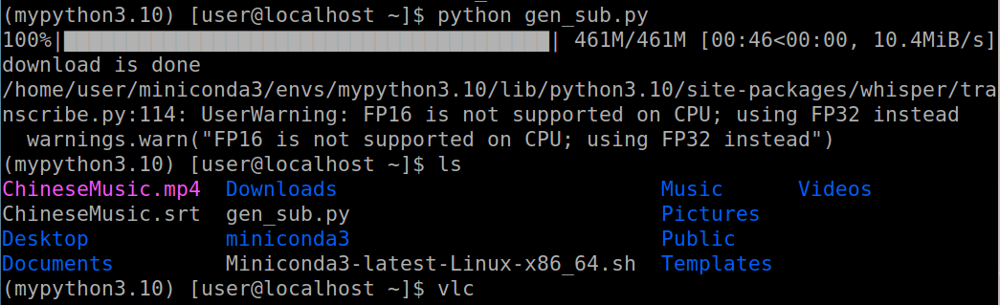
    - If want to edit the subtitle file just use `gedit ChineseMusic.srt`

## **Step 4**
- `vlc`
    - To open vlc
- 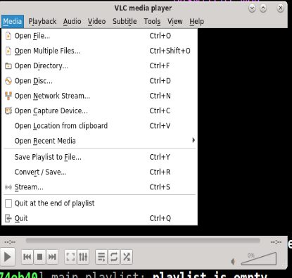
    - Open the **ChineseMusic.mp4** 
- 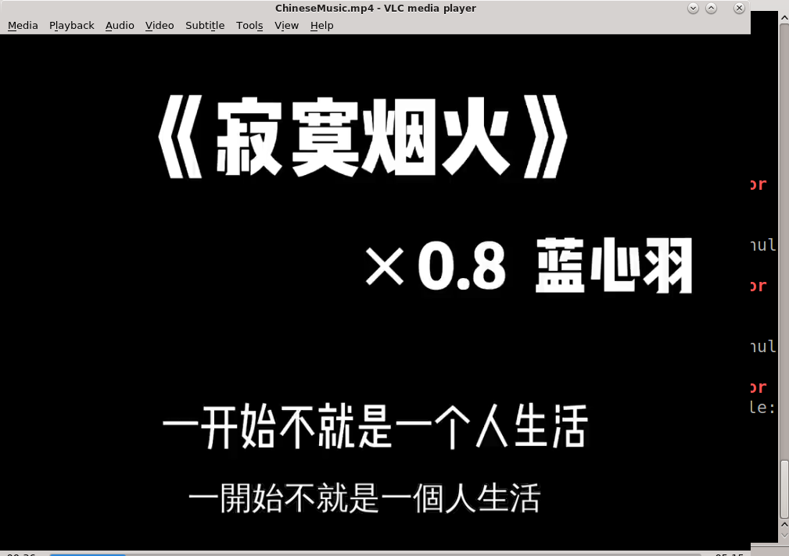

# **Notes**
## **GPL Authorized**
- After editing other's program/software/code needs to share with GPL authorized too
## **Apache Authorized**
- After editing other's program/software/code can keep by your own
## **Virtual Machines**
1. VMWare
    - VMWare WorkStation
    - VMWare Player
    - VMWare Fusion
    - file extension : vmdk
2. Virtual Box
    - free
    - Under Oracle
    - file extension : vdi
3. hyper-v (Windows)
4. kvm (linux)
## **Ways to login**
1. Graphical 
2. Literalization , text only
## **Network**
- NAT 
    - VM is inside Host
- Host Only
    - VM cannot access to Internet
- Bridged
    - VM can access to Internet and Internet can access to VM, same as Host

## **Exam**
- Linux disk partitioner (must)
    1. `/` : root
    2. `swap` : virtual memory
    - Others
        - `/boot` , `/home` , `/var`