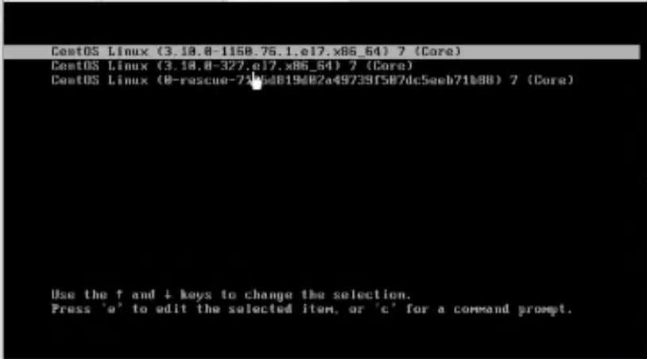
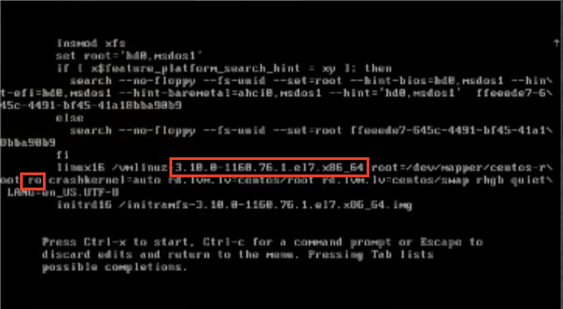
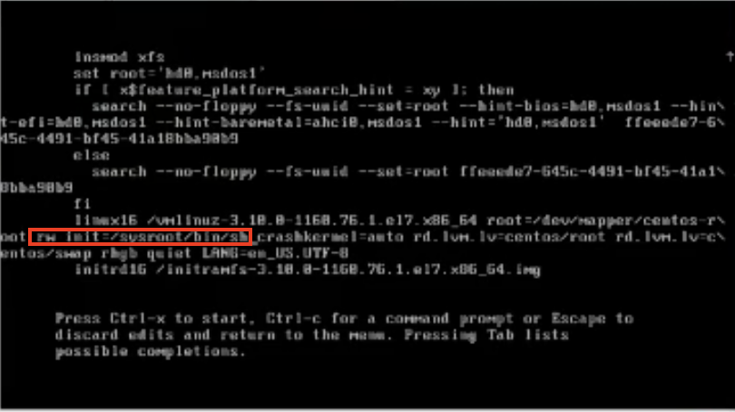
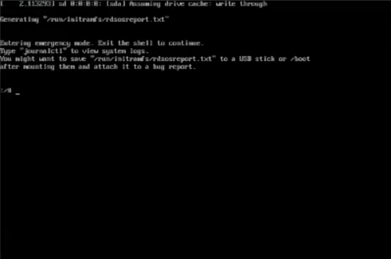
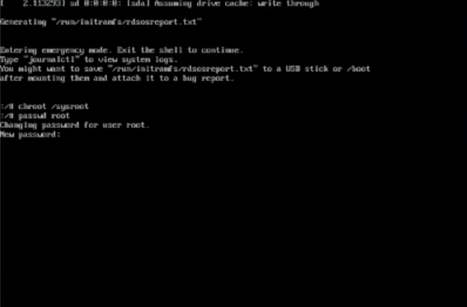
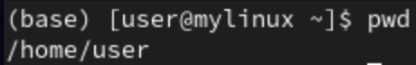
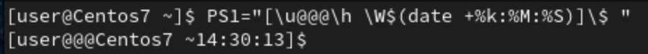

- Linux => root
- Windows => Administrator

# **Shell's short key**
- **ctrl + a** : Jump to the command first character 
- **ctrl + e** : Jump to the command last character
- **alt + d** : Delete all command behind cursor
- **tab** : Will complete the key in work

# **Starting/Boot process**
1. Load **BIOS**(Basic Input Output System)
    - To check basic hardware information, ex: hard disk size, CPU, Memory(RAM), Graphic card(GPU)...
2. Load the **boot program**(Bootloader) from reading the **MBR**(Master boot record) inside the computer's hard disk
3. Bootloader will load the **operating system**(OS)(Linux's kernel) into main Memory, OS will do the configuration. Ex: load network card driver...
    - GRUB is Linux's default boot management system, can use to choose which OS to load if have 2 or more OS
    - GRUB also can log in to **single mode**
4. Load the first program
    - systemd : **pid=1**, newer system
    - init : **pid=1**, older system
    - Setting environment variable, checking partition, mount file system, open ssh server(if default set to open when start),...
    - Enter default start mode(graphical mode, test mode,...)

_When program executing will called process, pid(process id), can use `pstree` to check the process list_
    

# **Linux's log in mode**
- Graphical mode
- Text mode
- Single mode
    - For system maintenance, recovery,... Ex: reset password...
## **Enter single mode to change password**
1. Press **e** at GRUB menu select option

    - `3.10.0` is the version of the kernel, 3 is the major verison, 10.0 is the minor version
    - `-1160` is the number of updates/patch 

2. Find **ro** of the kernel **3.10.0-1160**  

    - After press **e** will enter this 

3. Change **ro** to **rw init=/sysroot/bin/sh**

4. Press **ctrl + x** to enter single mode

    - type the command to change password
    - `chroot /sysroot` : To access the system
    - `passwd root` : To reset password

5. Now you can key in your new password

    - After changed password, type the command below to restart machine
    - `touch /.autorelabel` : Update selinux information
    - `exit` : To exit chroot
    - `reboot` : To reboot system

_Refer from [Unixmen](https://www.unixmen.com/reset-root-password-centos-7/)_

# **Prompt**
- 
    - `user` : user name (before **@**)
    - `mylinux` : host name (after **@**)
    - `~` : current directory (~ is home directory for user)
- 
    - `PS1="[\u@@@\h \W$(date +%k:%M:%S)]\$ "`

# **command**
- touch
    - Can create empty file and change file's timestamp
    - `touch aaa.txt` : Will create file **aaa.txt**

- chmod
    - To change permission of the file/directory
    - `chmod +x aaa.txt` : Give **execute permission** to the file **aaa.txt**

- pstree 
    - To check process list

- dmesg
    - Dump message, can check system's information
    - `dmesg | more` : To check system's information with pages

- netstat
    - To check if the system's server executing
    - `netstat -tunlp | grep 22` : To check if port 22 working normally on this machine
        - `t` : TCP's information
        - `u` : UDP's information
        - `l` : Listen state, is a server?
        - `p` : Process
        - `n` : Not parse(不解析)
        - `grep 22` : Filter if have **22**
- uname
    - To check OS's information/name
    - `uname -r` : Kernel's information
    - `uname -a` : Complete information of OS
    
- `cat /etc/redhat-release`
    - To check Linux's version, ex: CentOs 7.9 2009

- hostname
    - To show hostname
    - `hostnamectl set-hostname Centos7` : Change hostname to **Centos7**
    - `bash` : Refresh changed hostname

- w
	-  pts/0 , terminal at vm
	- `echo "hi" > /dev/pts/2`
        - Show "hi" on pts/2 terminal

- jobs
    - Show all job
    - `fg 2` : continue job 2