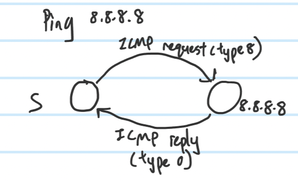
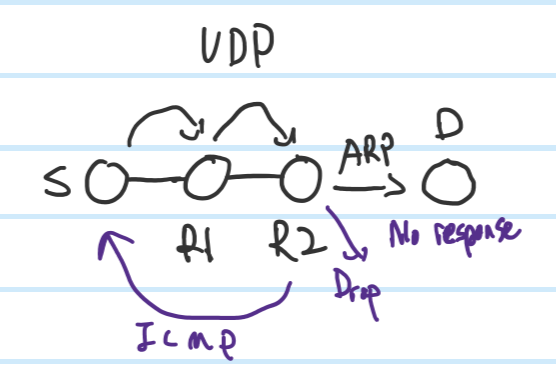
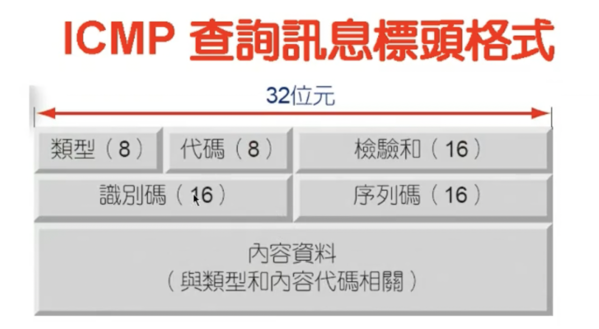
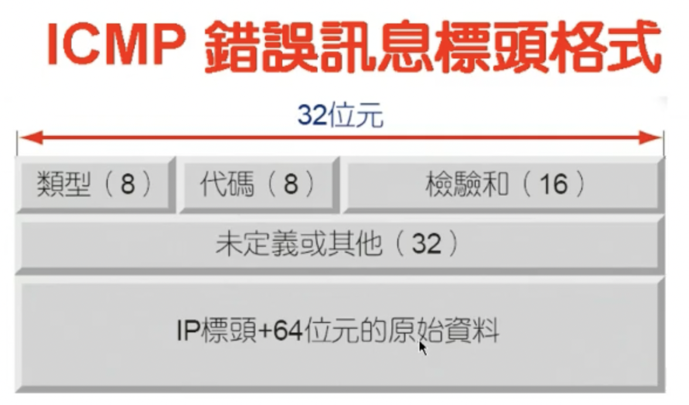
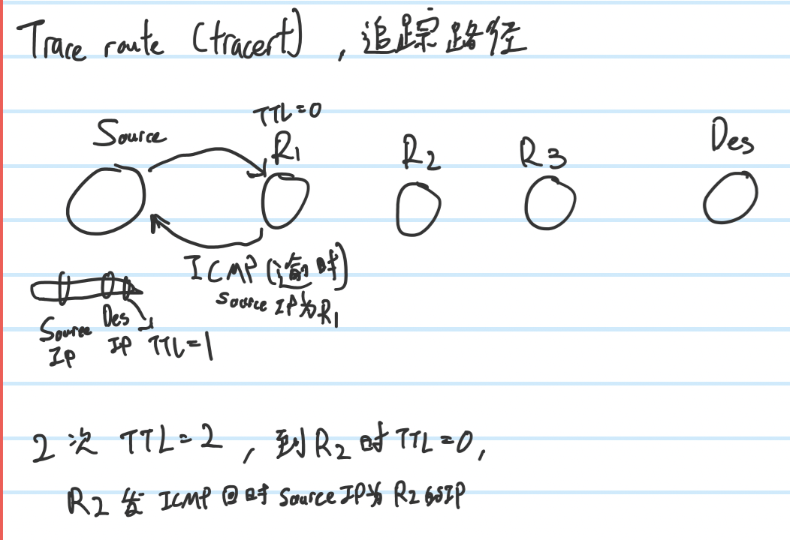

# **ICMP**
- 2 main functions
    - Inquire 
    - Error report

- **Inquire example :** `ping`

    - Send ICMP to the other (Echo request, type 0)
    - The other side send back ICMP packet (Echo reply, type 0)
- **Error Report exmaple:** Deistination Unreachable

## **Headers**

- 代碼(Code) : To specify the type in more details
- 識別碼(Identifier) : This is the n-th times of asking
- 序列碼(Serial number): This is the n-th times of response

## **Extra**
- Lost rate: `(lost packets / total packets) * 100%`,ex: sent 4 packets, received 3 packets, lost 1 packet ==> lost rate = (1/4)*100% = 25%

# **Extra**
- Trace route (Tracert)

## **Linux**
- To turn into router
    - `echo 1 > /proc/sys/net/ipv4/ip_forwarding`
- To change back to normal
    - change `1` to `0`
- `-n` : Do not parse.

## **ARP**
- Only in Ipv4, not in Ipv6
- Cause ARP use broadcast, Ipv6 don't have broadcast
- In Ipv6, already included in `ICMPv6`

## **Ways to setting IPv6**
1. Manually setting Ipv6 address
2. Stateless
    - A: Router provide `2000:0:1:1::/64`  
    - B: MAC(48 bits) use EUI turn into 64 bits
    - Add A & B become 128 bits 
3. DHCPv6

## **Link**
- `csie.nqu.edu.tw/smallko/sdn/sdn.htm`