# **Chap11**

### **Route Distance**
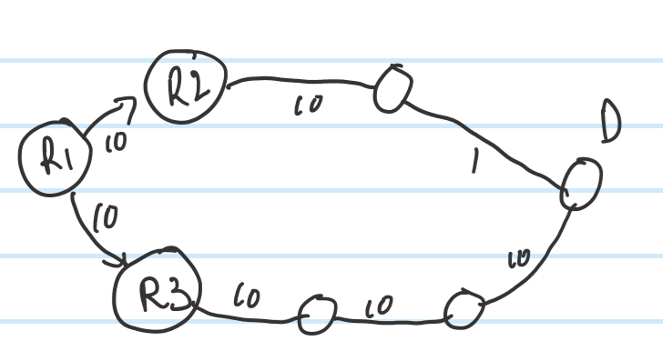
- If consider about **Hop Count**, choose **R2** cause only need 2 hops
- If consider about **Bandwidth**, choose **R3** cause have bigger bandwidth. All node have 10M bandwidth from R3, the last node of R2 have only 1 bandwidth, and the biggest bandwidth is depent on the least bandwidth

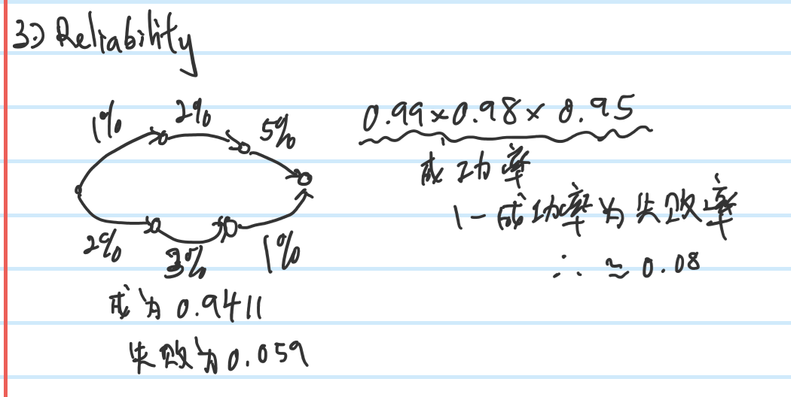
- **Lost rate** == 1 - **Success rate**
- 1%(lost rate) == 1 - 99%(success rate)
- Top total lost rate
    - 1 - (0.99 x 0.98 x 0.95) == 0.07831
    - Top total lost rate = **7.831%**
- Bottom total lost rate
    - 1 - (0.98 x 0.97 x 0.99) == 0.058906
    - Bottom total lost rate = **5.8906%**

### **Static Routing**
- Manually set all the routes
- Benefits : No maintenance cost
- Short : If have problem(route broke in middle) then connection lost, is not flexible

### **Dynamic Routing**
- Routers exchange information wth each other and make the path through some algorithms.
- Benefits : Is flexible, if middle path broke then routers will recalculate a new path for it.
- Short : Have maintenance cost

#### **Distance Vector**
- Routers exchange information with besides, after all routers in the network done exchanging then the route's path is know now. Do exchange information **periodically**
- Benefits
    - Easy for setting
- Shorts
    - **Maintenance cost relatively high**, cause need to keep exchanging information between routers periodically(occupy bandwidth)
    - **Convergence speed slow**, ex: Network connection lost, need more time to recover(find new path/route)
    - Only suitable for **small scale network**, big scale network will take too much resources and time to do exchange
    - Only have the **information of distance(hops)**, less hop may have smaller bandwidth(slower) only, more hop may have bigger bandwidth(faster)

##### **Creating Route Table**
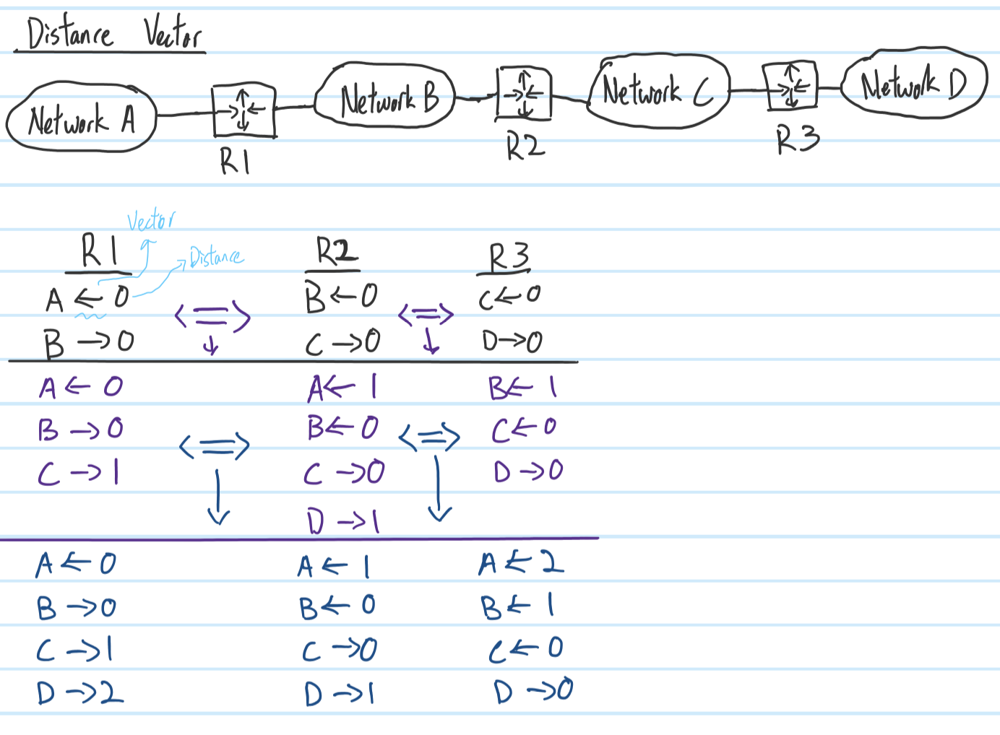
- `->` or `<-` is vector, `0,1,2` is distance(hops)
- Black color is starting()
- Purple color is after first exchange 
- Blue color is converge(status), cause route-table will be the same(stable) even routers do exchange information

##### **RIP**
- International standard
- Max hop count is **0~15** 

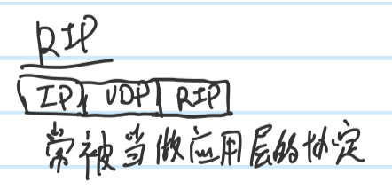

#### **Link-State**
- All router send their connection-status(surrounding node) to the network through broadcast, create the network topology after all broadcast done. Then use some algorithm and the network topology to calculate the path.
- Benefits 
    - When creating the topology/route-table will need some time and bandwidth, but after done the route-table the **maintenance cost will be relatively low**.
    - **Do maintenance only when the route-table changed(ex:connection lost)**
    - **Convergence speed fast**, when route path having problem, recovery will be fast.
- Shorts
    - When creating the topology/route-table will need a lot of time and bandwidth
    - Mechanism more complicated, need more RAM and processor resources 

##### **Creating Route Table**
1. Use **LSA** through **flooding** to send informations to all router in the network to create topology
    - LSA : Link-State-Advertisement
2. Take self as root and use SPF algorithm to calculate all the shortest route(path)
    - SPF : Shortest Path First
3. Create route-table

**_dijkstra algorithm is the base and a classical algorithm_**

###### **Dijkstra Algorithm(Extra)**
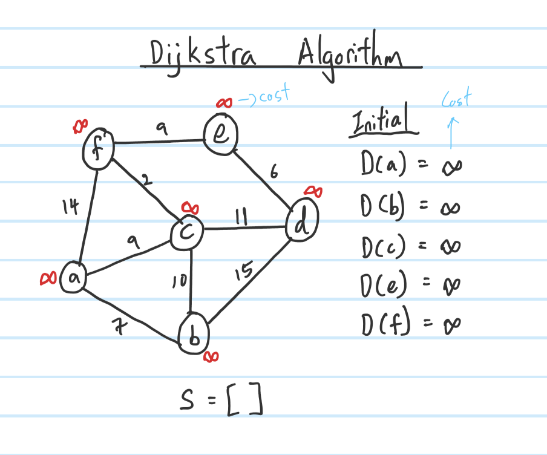
- Initial all node's cost to infinity, ex: D(a)=infinity
- `S=[]`

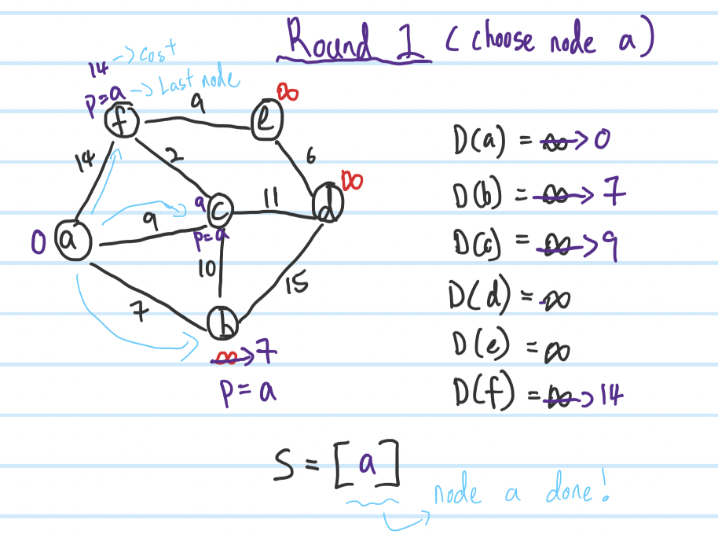
- Steps :
    1. Round 1 take self(`node a`) as root so `D(a) == 0`
    2. For `node b`: infinity > 7 so **renew cost to 7** and set `p=a`(last node is **a**)
    3. For `node c`: infinity > 9 so **renew cost to 9** and set `p=a`(last node is **a**)
    4. For `node f`: infinity > 14 so **renew cost to 14** and set `p=a`(last node is **a**)
    5. `S=[a]`, put `node a` into `S` meaning that `node a` **done** 

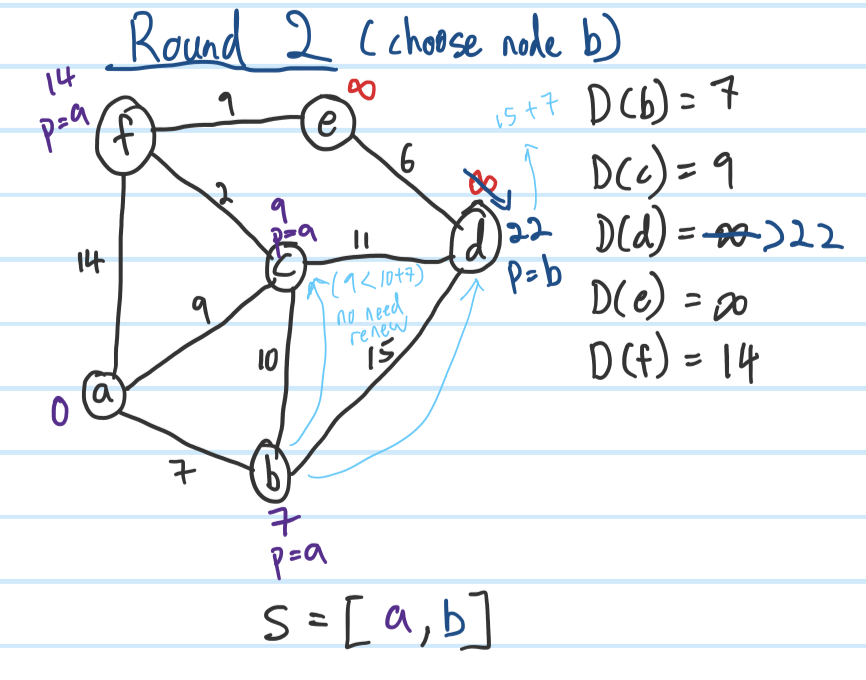
- Steps :
    1. Round 2 choose `node b`, cause it have the least cost( **D(b)=7** )
    2. For `node c`: 7+10 > 9 so **No need renew**
    3. For `node d`: infinity > 7+15 so **renew cost to 22** and set `p=b`(last node is **b**)
    4. `S=[a,b]`, `node b` **done**

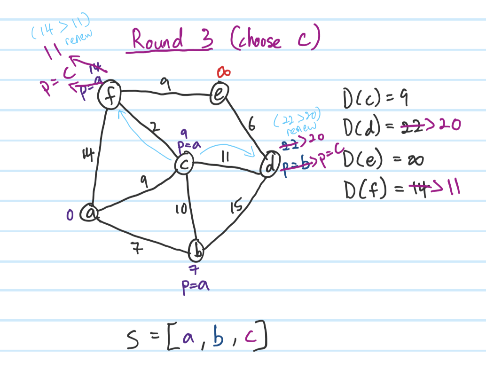
- Steps :
    1. Round 3 choose node `node c`, **D(c)=9** it is the least cost
    2. For `node d`: 22 > 9+11 so **renew cost to 20** and set `p=c`(last node is **c**)
    3. For `node f`: 14 > 9+2 so **renew cost to 11** and set `p=c`(last node is **c**)
    4. `S=[a,b,c]`, `node c` **done**

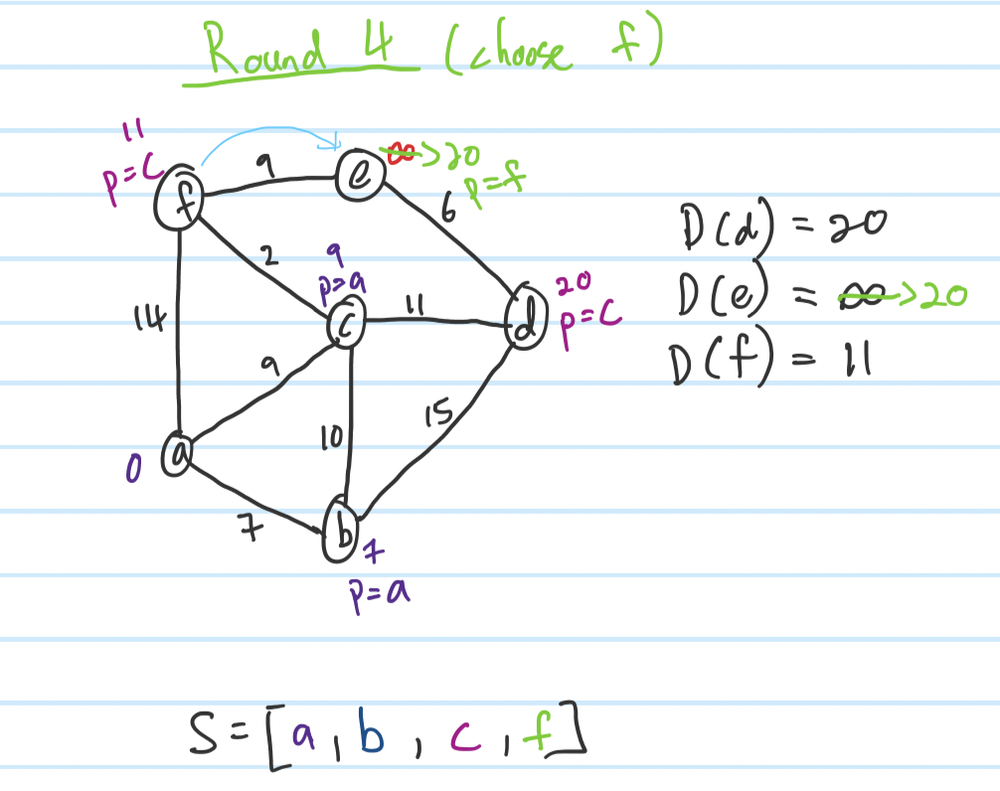
- Steps :
    1. Round 4 choose `node f`, **D(f)=11** it is the least cost
    2. For `node e`: infinity > 11+9 so **renew cost to 20** and set `p=f`(last node is **f**)
    3. `S=[a,b,c,f]`, `node f` **done**

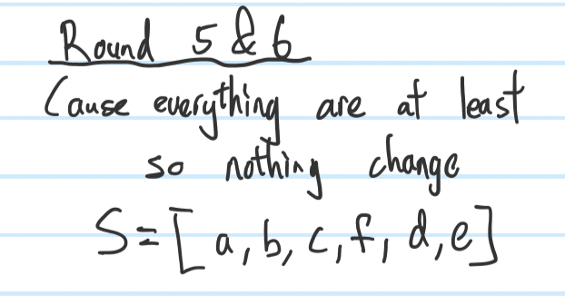
- For round 5 & 6, because all node are at the least cost so nothing change
- `S=[a,b,c,f,d,e]`, all node **done**

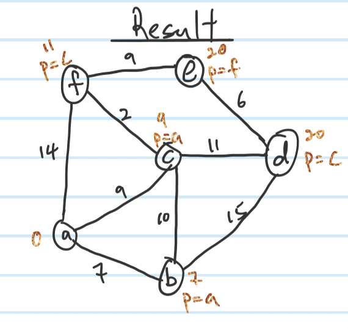
- If want to find the least cost from `a to e`
    1. `node e` **p=f** >>> `e->f`
    2. `node f` **p=c** >>> `e->f->c`
    3. `node c` **p=a** >>> `e->f->c->a`
    4. Reverse it become `a->c->f->e`, cost is 20 (**D(e)=20**)

##### **OSPF**
- International standard

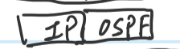

#### **Hybird**
- Mix both benefit of `distance vector` and `link-state`
- DV : Create the best route-table that have the best path/route to destination network
- LS : Only renew when route/path status changed(topology changed)
##### **IS-IS**
- Design by OSI (standard)
- Intermediate System-to-Intermediate System

##### **EIGRP**
- Design by Cisco
- Enhanced Interior Gateway Routing Protocol


# **Extra**

## **Internal & External System**
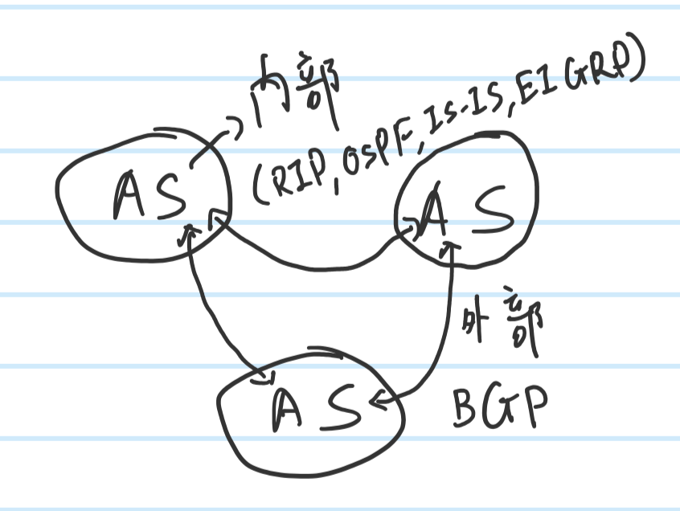
- AS : Autonomous System, ex: TANet(Taiwan Academic Network)
- Protocol above are use in the AS network (Internal), ex : RIP,OSPF,IS-IS,EIGRP 
- Protocol between different AS network (External), ex : BGP

## **Layer3 devices**
- Layer 3 switch
    - Path routing through hardware
- Router
    - Path routing through software
    - DHCP
    - NAT
    - Firewall(simple)
- Difference
    - Router have more functions but layer3 switch have faster speed on routing

## **HA**
- High Availability
- Ex: Have a spare router to connect to internet when the main router broken or something happen

## **Windows**
- `route print`

### **How routing table work**
```
    Network Destination || NetMask || Gateway || Interface || Metric 
---------------------------------------------------------------
(DefaultRoute)0.0.0.0   || 0.0.0.0 ||   G0    ||     I0    ||  M0
            D0          ||    N0   ||   G0    ||     I0    ||  M0
            D1          ||    N1   ||   G1    ||     I1    ||  M1
            D2          ||    N2   ||   G2    ||     I2    ||  M2
            D3          ||    N3   ||   G3    ||     I3    ||  M3
            D4          ||    N4   ||   G4    ||     I4    ||  M4
```
**_If a packet's Destination IP is `192.168.60.10`_**
1. Do AND operation with NetMask(N0,N1,...), if after mask is same as Network Destination(D0,D1,...) then put in "Spare list" intp `SL0,Sl1,..`
2. If have more than 1 Network Destination in the spare list, then choose the NetMask that have most `1`. ex: N0 = `0.0.0.0` and N3 = `255.255.252.0`, then choose D3 cause N3 have 22 `1`
3. If have the same amount of `1` then compare Metric(M0,M1,...) and choose the least amount
4. Send the packet through Interface to Gateway and the cost is Metric

- **If don't have any other choice then will use default route**
