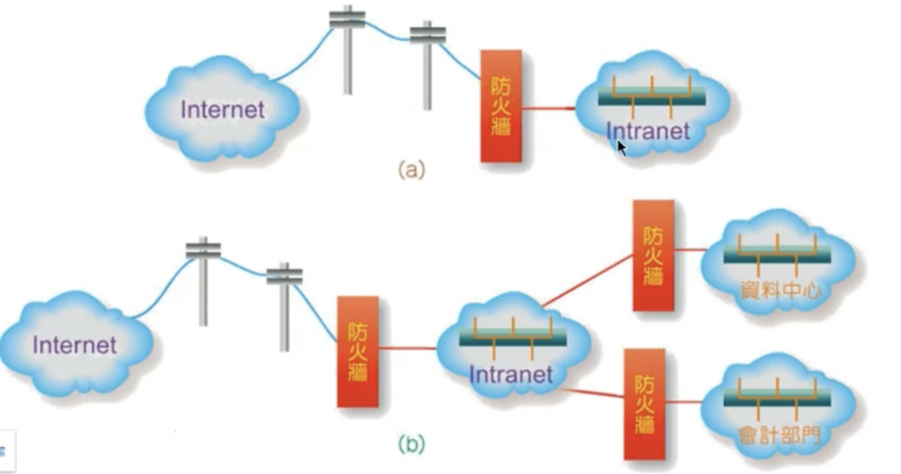
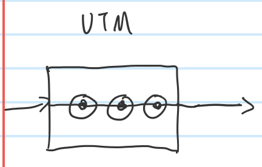
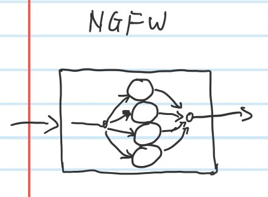
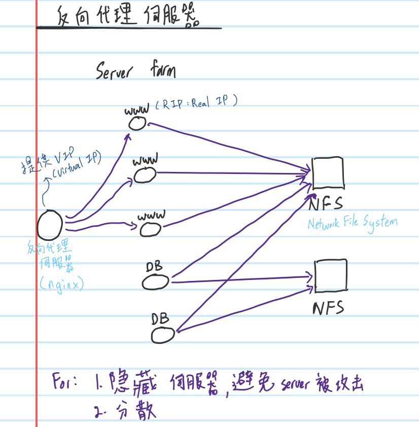
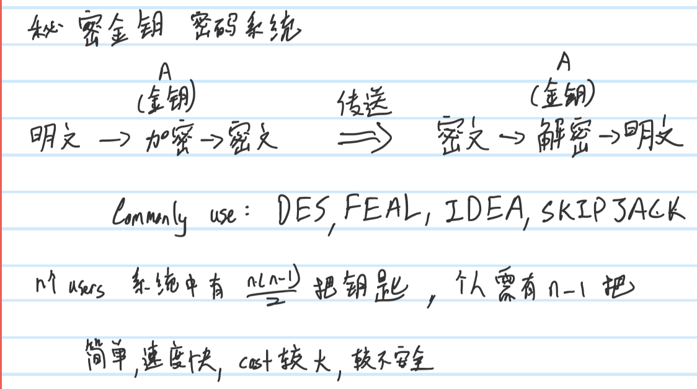
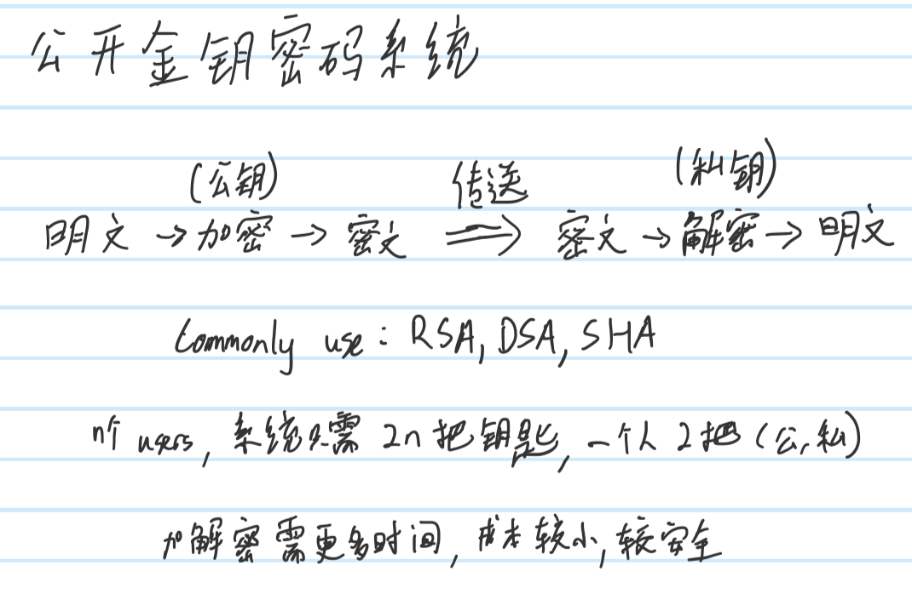

# **Chap12**
## **Information Security**
### **Goals**
1. Confidentiality(機密性)
    - Information/data is secret, been processed, even others steal it but never know the real information of it.
2. Integrity(完整性)
    - Information/data need to be complete, cannot be destroyed during transmission
3. Availability(可用性)
    - Ex: Someone cut the ethernet cable to let others can't access to Internet, availability been destroyed.
    - Software and hardware failures, power failures, natural disasters and human negligence, computer viruses will affect availability
### **Scope**
- Physical safety
- Software safety
- Personnel safety
- System safety
- Network safety
### **Causes of Information Security**
- Network
    - Invade database through network...
- Fire
    - Physical data been burned...
- Earthquake
    - Physical data been bury...
- Poor operation
    - personnel issues, lack of knowledge...
- Physically
    - Steal physically...
- Information Crime
    - Hacker, political influential...
- Electricity
    - Server shut down cause lack of electricity...
- Lightning strike
    - Machine damaged cause lighting strike...
- Software
    - EX: `CVE-2022-29072`, 2022 is year, 29072 is numbering
### **Extra**
- 4's 9 == 99.99%, only 0.01% of error rate in a year
- 5's 9 == 99.999%, only 0.001% ""

## **Network Security**
### **Cyber ​​Threat Objects**
- Resouces
    - CPU time, memory space....
- Data/information 
    - Secret data, database...
- Identity
    - Bank account, password....
### **Ways of threating**
- Interrupt transfer
- Data theft
- Data temparing
- Impersonation/fraudulent of identity
- System intrusion
- Vandalism
- Computer viruses
### **Prevent Strategy**
- Firewall
- Encryption
- Authentication
- IDS(Intrusion Detectioin System)
### **Extra**
- 0 day attack
    - Someone found loophole/leak of A's system and put into Internet, the hacker attack A's system when defenders is filling/repairing the leak.

## **Firewall**

- Allow valid packet access, block invalid access...
- Firewall between intranet
    - To prevent personnel operation error, spy...
    - Also don't block access between different department to enhance information security
### **Types of firewall**
#### **Packet Filter**
- Work on Network layer and Transport layer
- Filter by source ip, destination ip, packet type, port number 
- Whitelist and Blacklist mode
    - Whitelist, only users on whitelist can access
    - Blacklist, all user can access except users on blacklist
#### **Application Gateway**
- Work on Application layer
- Proxy server (client's agent)
    - Will save cache to others user to access, this can save bandwidth and have a quicker response

### **Extra**
- When setting firewall, most of it will have some interval between rules. If need to insert new rule then will have space to put it.
- Strategy is if fullfill the rule 1 then will skip rule 2,3,...
- UTM(Unified Threat Management), a device combine lots of function including firewall, VPN, antispyware,...

- NGFW(Next-generation firewall), almost same with UTM, but more expensive, cause different mechanism

#### **Reverse proxy server**

- Server's agent
- NFS(Network File System), to prevent data lost if database crash 
- For High Availability, Efficiency, Response Time, prevent direct attack from Internet

## **Encryption**
- Why
    - **Confidentiality** 
        - Symmetric encryption & Asymmetric encryption
    - **Integrity** 
        - Hash functioin
    - **Non-Repudiation** 
        - Electronic signature
- Key
    - Algorithm and the parameters can be separate so that we can change and modify our 'key', the parameter call key.
### **Symmetric encryption & Asymmetric encryption**
- 對稱式加密(Secret Key) & 非對稱式加密(Public Key)
- Symmetric encryption (Secret Key) system

    - Use the same key to do encryption and decryption
    - Benefits : easy, execute speed fast
    - Shorts : Need more cost, Not secure
- Asymmetric encryption (Public Key)

    - Use different key to do encryption and decryption
    - Benefits : Low cost, Secure
    - Shorts : Need more time to do encryption and decryption
#### **Extra**
- Use **asymmetric** way to create a secret tunnel, then send **symmetric key** through this secret tunnel, after that use this key to communicate.

## **Authentication**
- To confirm who you are, ex: electronic signature  

## **IDS**
- Intrusion Detection System
    - Only recording if have instrusion
### **IPS**

# **Extra**
## **AAA**
- Authentication：To **identify** who you are, is legal user or not
- Authorization ：To **give permission** Ex: normal user can only read the file, admin user can read and write the file.
- Accounting ：To **log an audit trail**, ex : record what this user done.
