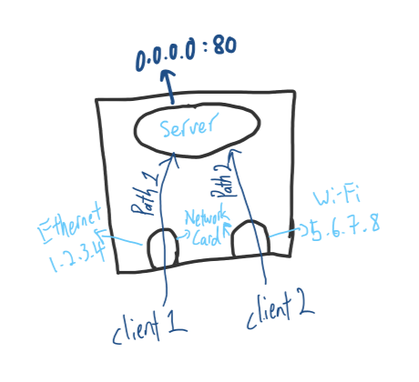
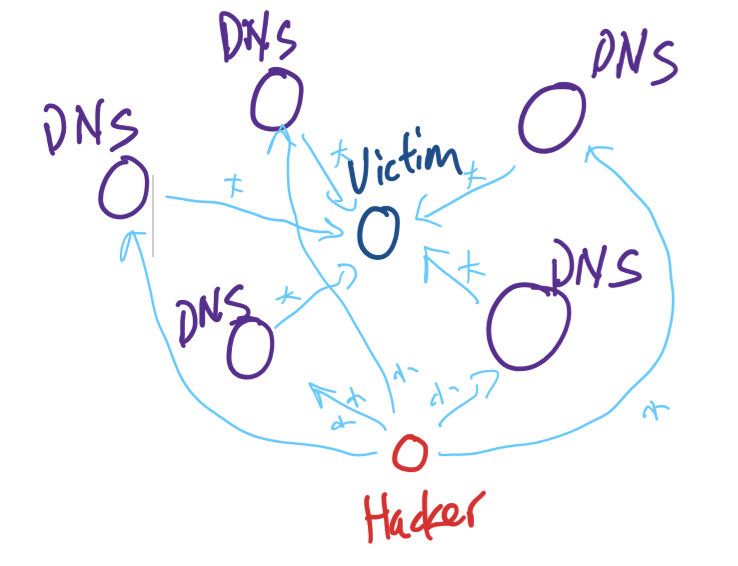

## **Common Reserved Address**
-   `10.0.0.0/8` : Class A private-use networks
-   `172.16.0.0/12` : Class B private-use networks. It's special case cause mask is 12 not 16, range is `172.16.0.0~172.31.255.255`
-   `192.168.0.0/16` : Class C private-use networks
-   `0.0.0.0/8`
    - Represent "This Network", to communicate with other nodes in the same network. Ex: `0.0.0.123`, same network and host address is 123.
    - Represent "No ip address yet", use `0.0.0.0` to get an "IP address" from DHCP server.
    - Represent any interface address on the server/host. Ex: , if the server is `0.0.0.0:80` both path 1 and path 2 can connect to the server. But is the server is `1.2.3.4:80` then only path 1 can connect to the server, if `5.6.7.8:80` then only path 2 can connect to the server.
## **Loop Back**
- `ping 127.0.0.1`, if failed, means TCP/IP stack in the operating system having problem.(IPv4)
- `ping -6 ::1`, for IPv6
## **DHCP**
- Port Number
    - DHCP Client : 68 , DHCP Server : 67
- Services
    1. IP address
    2. Mask
    3. Default Router
    4. DNS(Domain Name System) Server
    5. TFTP Server...
    - 1~4 is needed others are chooices.
- DORA
    - Discover : Client send packet through broadcast to discover DHCP server.
    - Offer : Servers send offer packet to client, normally use the first/fastest offer packet, other servers will know been rejected and take back the packet.
    - Request : Client send request packet to server 
    - Acknowledge : Server send ack packet to client when received request packet
## **DNS**
- For transaction between Domain Name and IP Address
    - use DN check IP , Forward Name Query
    - use IP check DN , Backward Name Query
- 53 port
- UDP 
    - Cause need as fast as possible, if failed/lost packet then ask again 
    - Not secure, packet easy to been block on the way. Ex: hacker block the DNS packet and send fake website/ip/message.
- Applications of DNS:
    - DDOS attack: send small packet, come back with big packet.
         
    - CDN
        - Content Delivery Network
        - Resources important, where is not important
        - In advance setting of DNS, it can give different response by different IP address
        - Ex: Youtube have different branches around the world, Asian centre, Australia centre....
- Steps of checking DN to IP
    1. hosts
        - Windows
            - Windows\System32\drivers\etc
        - Linux 
            - /etc/hosts
    2. cache
        - `ipconfig/displaydns` to show cache
        - `ipconfig/flushdns` to delete cache
    3. DNS server
## **FQDN**
- Fully Qualified Domain Name
- Max: 5 floors. Each floor at least 2 char, max 63 char. Maximum total length is 253 char.
- Host Name, Domain Name, Root Domain
    - Ex: `www.flag.com.tw.` : `www` is host name, `.flag.com.tw` is domain name, `.` is root domain.(machine start from right side)
- Root domain is the topest level
    - TLD(Top-Level Domain): Under root domain, gTLD(Generic TLD) for different organizations, ccTLD(Country Code TLD) for different countries.**US:edu,UK:ac**
    - Ex: `. -> tw -> edu -> ntu -> ee -> www` == `www.ee.ntu.edu.tw`
****
## **Extra**
### **NAT**
- **DNAT**
    - Change _Destination IP Address and Port No_ at Router/NAT then send packet to the host
- **SNAT**
    - `1 to 1`, when sending packet to Internet, Router/NAT will find **an available ip** to change the _Source IP Address_ and **record** it. When packet come back will check the record and send it.
    - Have limited available ip address.
- **NAPT**
    - Also call SNAT, when sending packet to Internet, will change **Source IP** to Router/NAT IP address and find **an available port** to change the _Source Port Number_ and **record** it. When packet come back will check the record and send it.
    - Need only 1 ip address to connect to Internet
### **Network efficiency**
- Network slow are because of _network busy_ or _server busy_ or both.
- **RTT**
    - Round Trip Time
    - The needed time that packet send go and back.
- **OWD**
    - One Way Delay
    - The needed time that packet send go only.