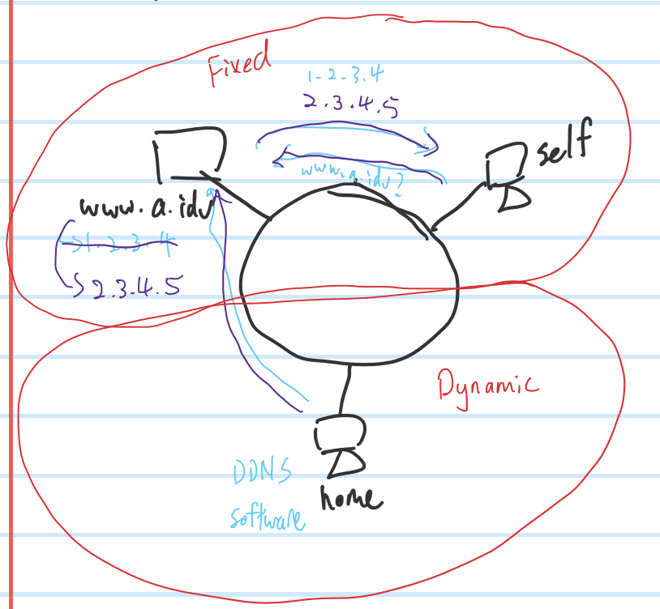
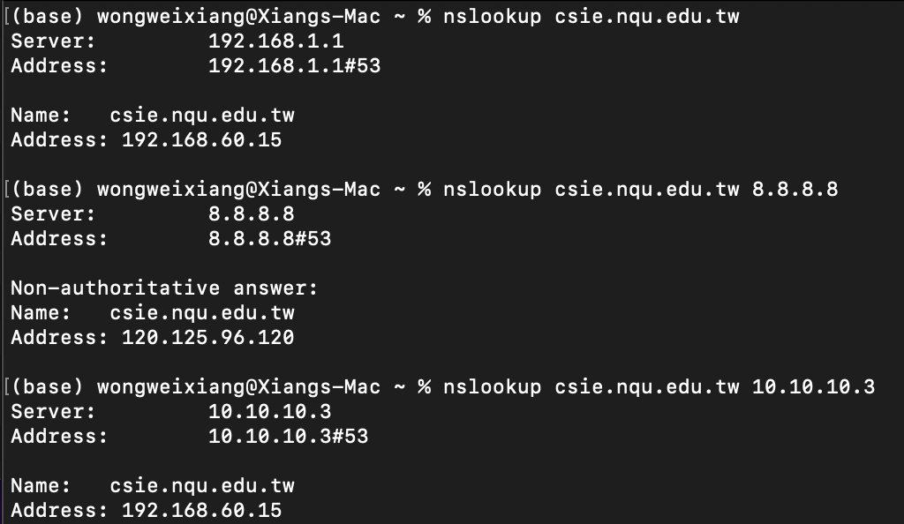

## **DNS**
- Common DNS 
    - `8.8.8.8`
    - `9.9.9.9`
    - `8.8.4.4`
- Zone 
    - DNS sever's dominate area
- Fixed Ip Address, Fixed Domain Name
## **DDNS**
- Not fixed Ip Address, Fixed Domain Name

### **IP**
- Addressing , Routing
- Ipv4
    - Header length is not fixed, non-optional is 20
    - Ipv6 convert speed is faster
## **Extra**
- In Linux: `/etc/resolv.conf`
### **Steps of checking network**
1. `ping 127.0.0.1` , to check software(Tcp/Ip)
2. `ping self ip address` , to check hardware(Network Card)
    - On Mac : `ifconfig | grep "inet "`
3. `ping default router` , to check network cable or router
    - On Mac : `netstat -nr|grep default`
4. `ping 8.8.8.8` , 
5. `ping google.com` , or others popular domain name
    - If 4 success but 5 don't then is ????

### **nslookup**
- Windows :
    - `nslookup /?` , `/?` is to check how to use `nslookup` command, `[]` mean is optional
- Mac :
    - `man nslookup` , `man` stand for manual

    - **Non-authritative answer** means is from cache