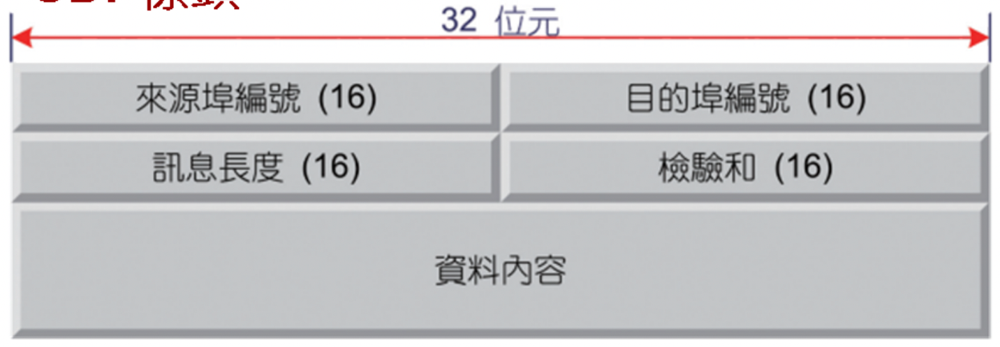
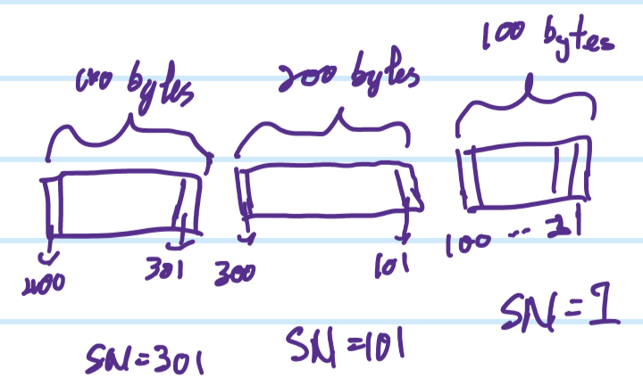
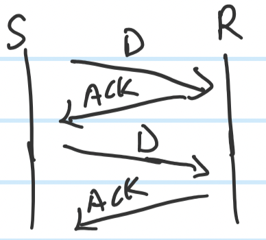
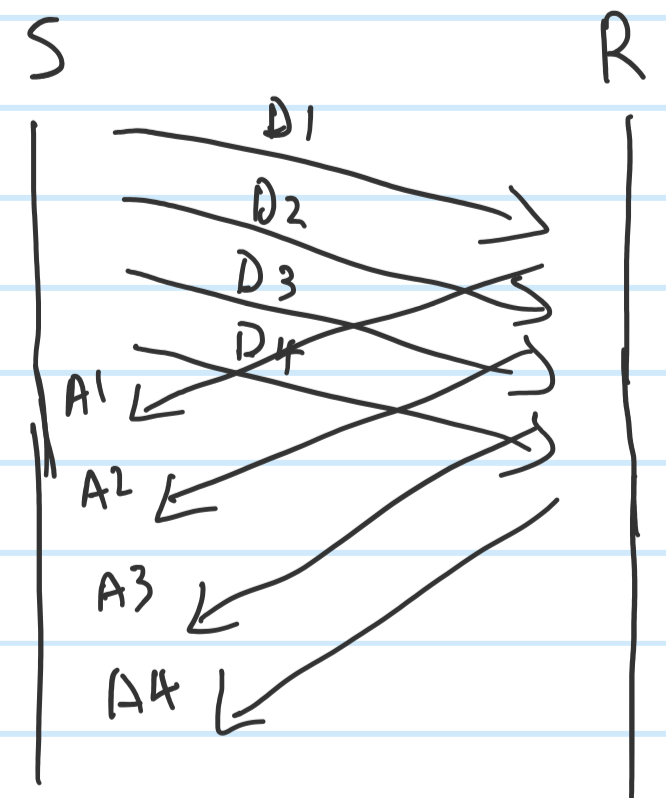
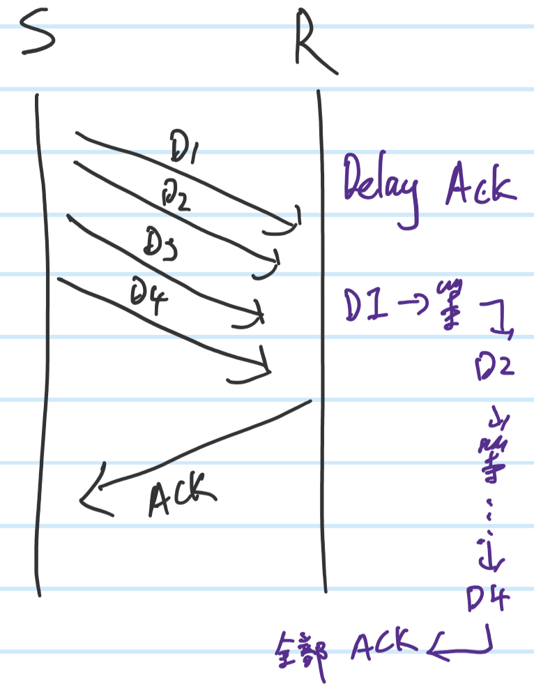
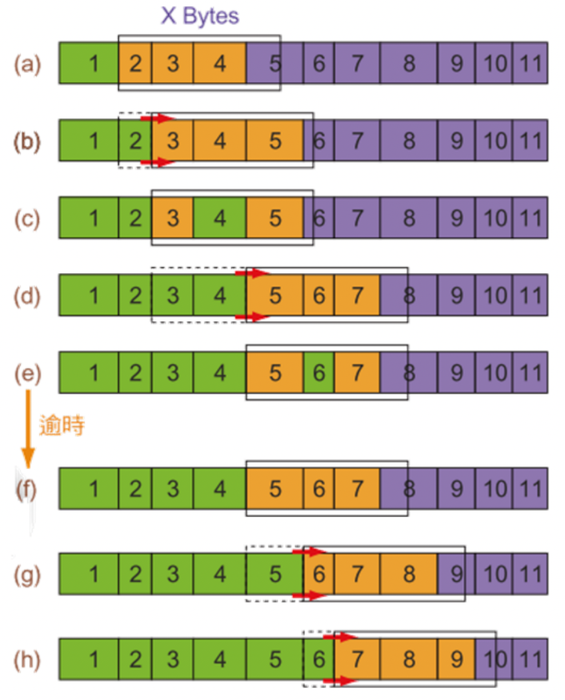
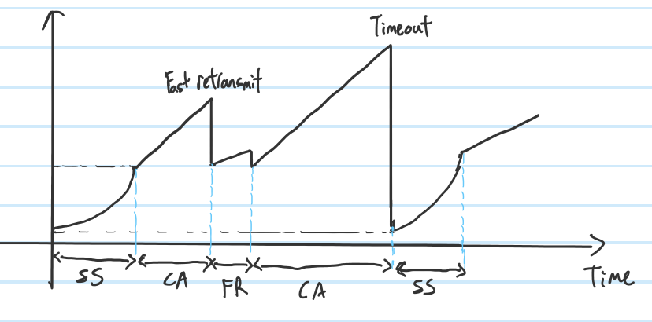
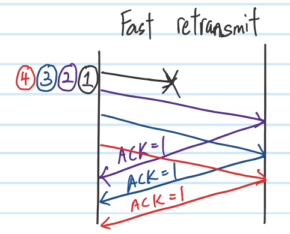

# **UDP**
- Focus on speed, not stable. 
- Wont check if the data successfully sent(No ACK)
## **UDP Header**

- Source port 
    - 16 bits , Max: 65535 (2^16 -1)
- Destination port
    - 16 bits , Max: 65535 (2^16 -1)
- Length
    - 16 bits , Min: 8(2+2+2+2)
    - Including udp header and data(payload)
    - If val==8 : no data only header 
- Checksum
    - 16 bits
    - To protect `UDP header and payload`
    - Pseudo Header, including network layer's source ip and destination ip address, for uniqueness.
# **TCP**
- Focus on stable, more complex than UDP
- Packet lost:
    1. Data lost(not reach receiver, RTO=0, not receive ack)
    2. ACK lost(RTO =0, ack not come b)
- RTO
    - Timer, ACK had to sent back to sender before RTO=0
## **SN**
- Sequence Number
- Initial SN by random, unit is `bytes`
### **Function**
1. To determine which packet is lost and which is successful sent
2. To solve out of order
    - packets may take different path/route, may cause first out last reach
### **How to give**

- Take the first No as SN

### **How it work**

- If `S` send a 100 bytes packet to `R`, SN==1, and R will send an ACK ==101
    1. All data before SN =101 already received
    2. Wish the next packet's SN ==101

## **Sliding Window**
- For flow Control (To limit packet send)
### **Stop and Wait**

- Data send, wait ACK, receive ACK, send next Data
- Waste network resources
### **Multiple Stop and Wait**

- Send 4 data and wait for ACK
### **Delay ACK**

- Receiver will send ACK after receive multiple packets/data

### **Factors influence window's size**
    1. Receiver buffer's size
    2. Network Status

- `Green : Received ACK`||`Orange : Data sent, but not yet receive ACK`||`Purple : Data not yet send`||`Rectangle : Window's size`
- From `(e) to (f)`, time's up(RTO==0), so `5,6,7` resend data
# **Extra**
## **Linux sed command**
`sed -i "/^$/d" filename.txt`
- `sed`: linux's stream editor, can do add, delete, edit, search and more operations without open the file
- `-i`: Change the file, if not will only show on the screen
- `"/^$/d"`
    - `^`: head
    - `$`: end
    - `^$`: empty space
    - `d`: delete
## **TCP avoidance**

- SS 
    - Slow Start: Packet's quantity sent grow exponentially, until reach critical value(certain value)
    - To know the Max size of windows ASAP
- CA
    - Congestion avoidance: Packet's quantity grow linearly, to avoid network heavy load
    - After SS reach critical value then become CA
- FR
    - Fast recovery

- Receive all ACK == 1, sender will know packet 1 lost, then send packet 1 again before timeout. Then height = height/2, cause the network may in busy now.