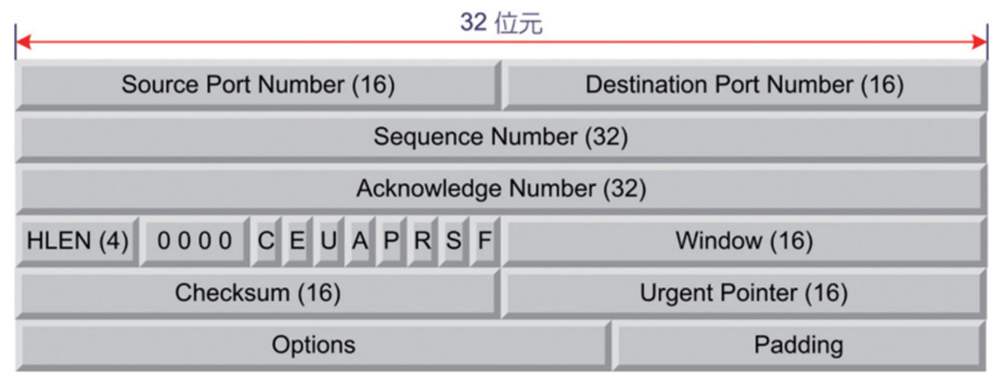
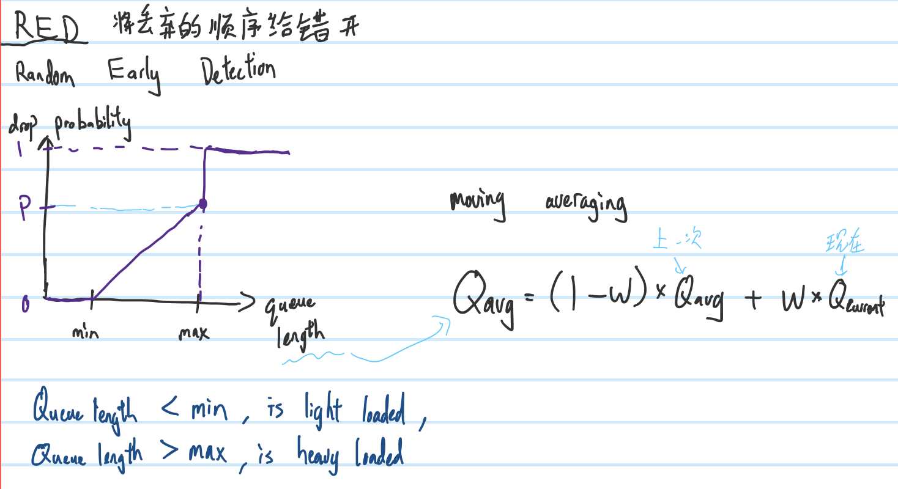

# **Chap 9**
## **TCP**
### **Header**

- Normally `20 bytes` (No Options)
- Source Port Number
    - 16 bits = 2 bytes
    - Max: 65535
- Destination Port Number
    - 16 bits = 2 bytes
    - Max: 65535
- Sequence Number(SN)
    - 32 bits = 4 bytes
    - TCP is a stream, SN use to indicates which the packet is sending.
    - SN in a packet is use to indicate this packet is in which part of the stream
- Acknowledge Number
    - 32 bits = 4 bytes
    - After received packet, receiver send ACK to sender to indicate the expect SN of the next packet
- HLEN
    - 4 bits
    - Header length, `1 unit = 4 bytes`, ex: if HLEN is 5 then meaning that the TCP header length is `5(rows) * 4(bytes) = 20 bytes`
    - If >5 then have options
- 0000
    - 4 bits
    - Reserved
- CEUAPRSF
    - 8 bits = 1 byte
    - `C`
    - `E`
    - `U`
        - Urgent, 1 means is urgent(have priority)
        - 0 is normal, will just follow the queue
        - ex: User close program before the program finish, this packet will set `U = 1`
    - `A`
        - First packet of Syn `A is 0`
        - 1 means Acknowledge Number is working.
    - `P`
    - `R`
        - Reset, disconnect the connection
        - ex: ACK=101, but next SN=999, then receiver will think is a suspicious connection, set R = 1 and disconnect the connection
    - `S`
        - Syn, when 3 way handshake will be 1 else is 0
    - `F`
- Window
    - 16 bits = 2 bytes
    - To the the other knows the available buffer size
- Checksum
    - 16 bits = 2 bytes
    - Will use Pseudo Header to protect the TCP header
    - Pseudo Header will include IP of Des and Source, and more...
    - Is a must
- Urgent Pointer
    - 16 bits = 2 bytes
    - Point to the packet that `U = 1`

# **Extra**
## **Queue Management**
- When need to throw the packet
### **Drop Tail**
- When buffer of the queue full, throw the in-coming/last packet of the queue
## **TCP Global Synchronization**
- Problem: Everyone had the same speed of sending data, so `queue` will easily get full, it will cause to the packet dropped, so will down the speed together, and cause to idle resource.
    1. Low link utilization
### **RED**
- Random Early Detection
- To solve global synchronization by stagger the order of packet drop

- Is a moving averaging method