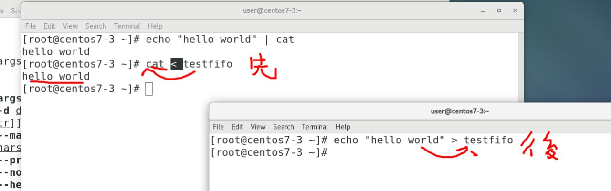
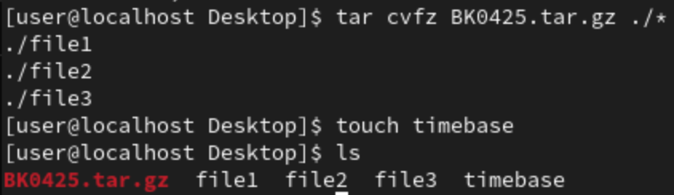
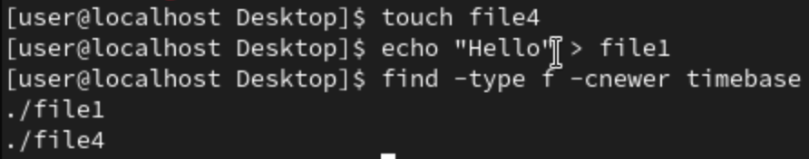
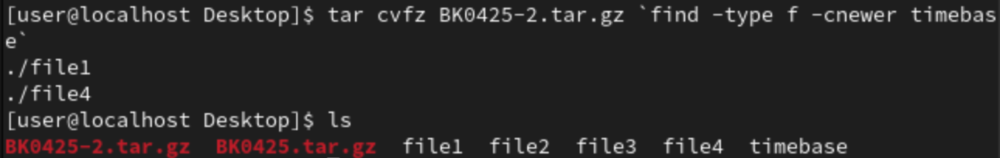
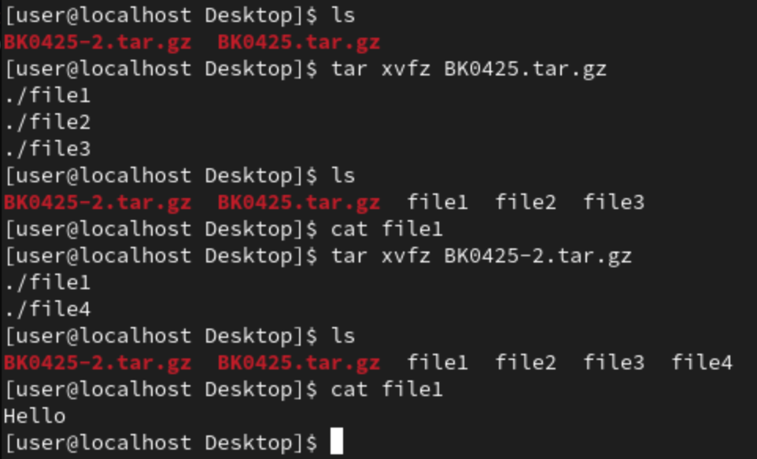

- `du`
    - Estimate file space usage
    - `du -h -s /etc`
        - Will give the size of the directory "/etc"
        - `-h` : use the common unit 
        - `-s` : show only sum of all file of /etc 
    - `du --max-depth 1` : Show current directory's first depth information

## **Command I/O**
- 0
    - Standard Input
    - ex: keyboard
- 1
    - Standard Output
    - Screen
- 2
    - Standard Error Output
    - Screen

- `echo hi 1> hi.txt`
    - 1 is omittable => `echo hi > hi.txt`

- `ls aaa 2 > err.txt`
    - `2 > err.txt` : Redirect error output into **err.txt**


- `ls aaa hi.txt 1>a.txt 2>b.txt`
	- `1>a.txt` : Redirect standard output into **a.txt**
    - `2>b.txt` : Redirect error output into **b.txt**

- `ls aaa hi.txt 1> c.txt 2>&1`
	- `1> c.txt` : Redirect standard output into **c.txt**
	- `2>&1` : Redirect standard **error output** to **standard output**
    - Conclusion : All output(stdout & errout) will be stored in **c.txt**

- `ls aaa hi.txt >/dev/null 2>&1`
    - Won't show any output on screen, redirect everything to **/dev/null**(黑洞)

- `xargs`
    - Build and execute command lines from standard input
    - `find -name "*.txt" | rm`
        - 
    - `find -name "*.txt" | xargs rm`
        - 

- `mkfifo`
	- Make pipe line, ex: `mkfifo testfifo`, create a pipeline with the name "testfifo"
	- At terminal 1 `cat < testfifo` , at terminal 2 `echo "hello" > testfifo`
        - Will show "hello" on terminal 1
        - 

- `which`
    - Search 執行檔 under environment variable "$PATH"

- `locate`
	- Search in database, so need to update database before using it
	- `updatedb`, need to be root
    - `locate a.txt` : Will search everything with "a.txt"

- `find`
	- `find . -name a.txt`
		○ "." : Start from this directory, `find /root -name a.txt` : search from "/root" directory
		○ "-name" : search by name 
	- `find -iname "a.txt"` : search without case sensitive
	- `find -type d -name "htop*"`
		○ `-type d` : directory
		○ `-type p` : pipe
		○ `-type l` : link
	- `find . -type f -perm 0644`
		○ `-type f` : file
		○ `-perm 0644` : permission with 0644
	- `find . -type f ! -perm 0644`
		○ Find file that permission is not 0644, `!` : not
	- `find . -type f -name "*.txt" -exec rm {} \;`
		○ `-exec` : execute the command after find 
		○ `{}` : The result of find will put in here
		○ `\;` : end
		○ `find -type f -name "*.txt -exec chmod 755 {} \;`
	- `find . -type f -empty -exec rm {} \;` : Delete empty files
	- `rm -rf` : for directory
	- `.*` : hidden file
	- `-user` : use to specific user name
	- `-group` : user to specific group name
	- `-mtime -7/7/+7` : -7(7天內), 7(第7天), +7(存在7天以上), 天
	- `-mmin` : 分鐘
	- `-cnewer timebase` : change time newer than timebase 
	- `-size` 
		○ `-size 50M` : only 50M 
		○ `-size -50M` : Smaller than 50M
    - `-size +50M` : Bigger than 50M

## **Backup**

### **Step 1**
- We have **file1**,**file2**,**file3** 
- `tar cvfz BK0425.tar.gz ./*`
    - `c` : create
    - `v` : 完整地顯示處理過程
    - `f` : 指定檔名 `BK0425.tar.gz`
    - `z` : 要壓縮
    - `./*` : all file under this directory
- 
- `touch timebase` 
    - Make a timebase, to know which action made after this backup

### **Step 2**
- Make a new file called **file4**
- Make some changes into file1
- `find -type f -cnewer timebase`
    - find the file that had newer change time than **timebase**
- 

## **Step 3**
- ```tar cvfz BK0425-2.tar.gz `find -type f -cnewer timebase` ```
    - Backup all file that had newer change time than **timebase**
- 
- Backup Done!!!
## **Step 4**
- Now we delete all **file1** to **file4**, and try to use backup file that we made to call back all file1,...,file4
- 
- `tar xvfz BK0425.tar.gz`
    - Now we can see only **file1**,**file2** and **file3**
    - Inside **file1** is empty
- `tar xvfz BK0425-2.tar.gz`
    - Now we can see all **file1** to **fiel4**
    - **file1** have content **Hello**
    