## **Filter content**

### **通配符**
- Normally use to match file's name(用來匹配檔案名稱)
- `*` : 表示任何值或字符, _0個_ 或 _很多個_
    - `ls a*` => a,aa,aaa,aaaa,a24sa,...
- `?` : 表示單個字符
    - `ls a?` => aa,ab,ac,a9,a8
- `#` : 表示一個數字

### **grep**
- `grep`
    - `-i` : without case sensitive(不區分大小寫)
    - `-n` : show row number(顯示行號)
    - `-v target` : except **target** (除了target以為都要)
    - `-r` : recursively (遞回搜尋所有的資料夾與子資料夾)
	- `-A 1` : after 1 row(多顯示目標後一行)
    - `-B 2` : before 2 row(多顯示目標前兩行)
	- `\grep "ABC" a.txt` : disabled **alias** 中有關 "grep" 的指令
        - Ex: `alias grep='grep --color=auto'` , 會將這行disabled
    - use to grep specific content of file(內容的篩選, 用雙引號框起來較好)
        - `cat a.txt | grep "aaa"`
        - `grep "aaa" a.txt`
        - `grep "a*" a.txt` / `cat a.txt | grep "a*"`
        - `grep -v "ABC" a.txt` : 匹配除了 ABC 以外
        - `ps -ef | grep sleep | grep -v grep`
            - `ps` : 看背景有哪些process在運行
            - `grep -v grep` : 將搜尋本身(這個process)給過濾掉
        - `grep -v "^#"` : 去掉註解, linux 配置檔中 “#”為註解行
        - `grep "^$"` : 匹配空白行
        - `grep -v "^$"` : 去掉空白行
        - `grep -r "a" /etc` : 搜尋/etc下所有檔案中的"a"
        - `grep -A 1 "abc" a.txt` : 匹配a.txt中"abc"與之後的一行
        - `grep -B 1 "abc" a.txt` : 匹配a.txt中"abc"與之前的一行
    - user to grep specific file's name
        - `ls /etc | grep netowkr`

### **正則表達式**
- Normally use to mach the content of the file(針對檔案裡面的內容在做匹配)
- `*` : 匹配前面的元素/子表達式 0次 或 多次
    - Ex : `grep "a*" a.txt, will show a,aa,aaa, but not b,c,bb,...
- `?` : 匹配前面的元素/子表達式 0次 或 1次
- `+` : 匹配前面的元素/子表達式 1次 或 多次
    ○ Ex : `grep "^ab+" a.txt` , **+** grep 看不懂需要用 **egrep**(extended grep)
    ○ Ex: `egep "^ab+" a.txt` , OK
- `^` :  head, 以什麼為開頭
    ○ Ex : `cat /etc/passwd | grep "^root"`
- `$` : 以什麼為結尾
    ○ Ex: `cat /etc/passwd | grep "nologin$"
        § nologin 為系統帳號
    ○ `cat /etc/passwd | grep "nologin$" | wc -l` 
        § 有多少個系統帳號
- `[]` : 用來定義字符組
    ○ Ex : `grep "^[aA]"` : 匹配 a 或 A 開頭
    ○ Ex:  `grep "a[0-9]"` : 匹配a0,a1,…,a9
    ○ [a-z] : a,b,c,…,x,y,z
    ○ [A-Z]: A,B,C,…,X,Y,Z
- `|` : 或
    - Ex : `grep "ab|ac" a.txt` , 匹配 "ab" or "ac"

- EX : 匹配`/etc/resolv.conf`中的ip地址
    - `cat /etc/resolv.conf | egrep "((2(5[0-5]|[0-4][0-9]))|[0-1]?[0-9]{1,2})(\.((2(5[0-5]|[0-4][0-9]))|[0-1]?[0-9]{1,2})){3}"`
    - `(2(5[0-5]|[0-4][0-9]))` : 匹配200-255
        - `5[0-5]|[0-4][0-9]` : 匹配50-55 or 00-49
    - `[0-1]?[0-9]{1,2}` : 匹配0-199

# **Chap 6**

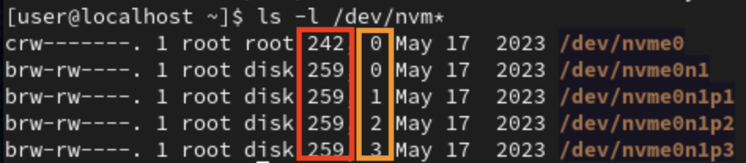
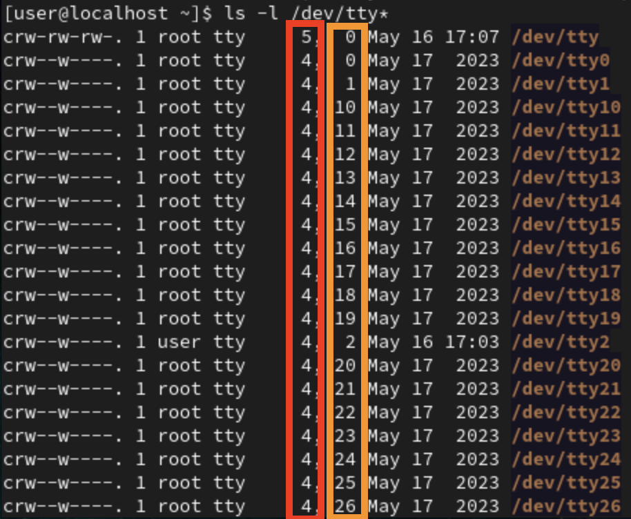
- red color : major (主設備號), for distinguish between different devices(用於區分不同的設備)
- orange color : minor (次設備號), same device but different number (相同的設備，區分第幾個)
    - shared same driver from the same major（共享主設備號的驅動程式）
- EX : **nvme0n1**,**nvme0n1p1**,**nvme0n1p2**,**nvme0n1p3**
    - Same major **259**, minor 

## **Mount**
- After mount the device with directory of linux, then when we access the directory will same as access the device

### **Mount on VMware Fusion**
#### **Step 1**
- Power off VM
- Go **Setting => Add Device... => New Hard Disk**
    - 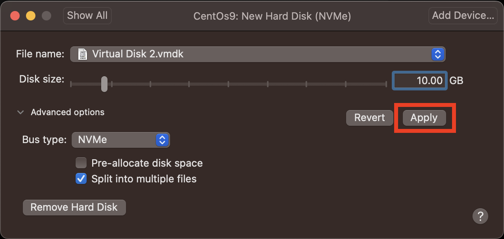
- Start VM
- `ls -l /dev | grep "^b"` : Show all block device to check whether the new hard disk been detected
    - 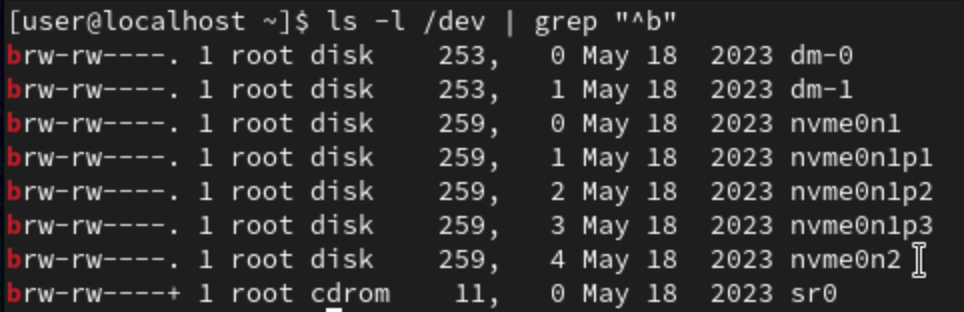
    - **nvme0n2** is the new hard disk, its been detected by the VM!

**Step 2**
- Create new partition of the hard disk
- **fdisk**
    - `p` : Pist out partition information(列出硬碟裡的分割區資訊)
    - `n` : New partition(在硬碟中新增分割區)
    - `d` : Delete partition(刪除分割區)
    - `t` : Modify partition's file system(變更某分割區的檔案類型)
    - `w` : Save and write into disk(儲存目前對硬碟的修改，寫入硬碟)
    - `q` : Quit(離開fdisk工具)
- `sudo fdisk /dev/nvme0n2` : To Partition the new disk(磁碟切割)
    - Enter **n** to add new partition
        - 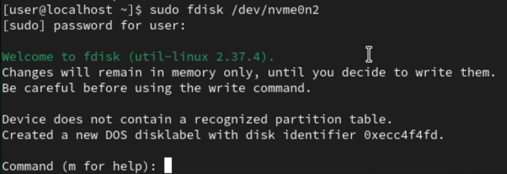
    - Keep enter to use default setting for new partition
        - 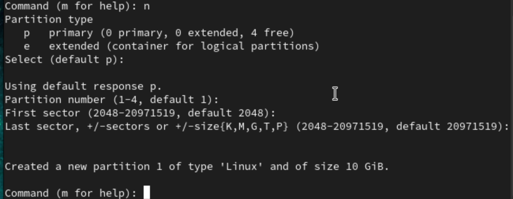
    - Enter **p** to check the new partition is created
        - 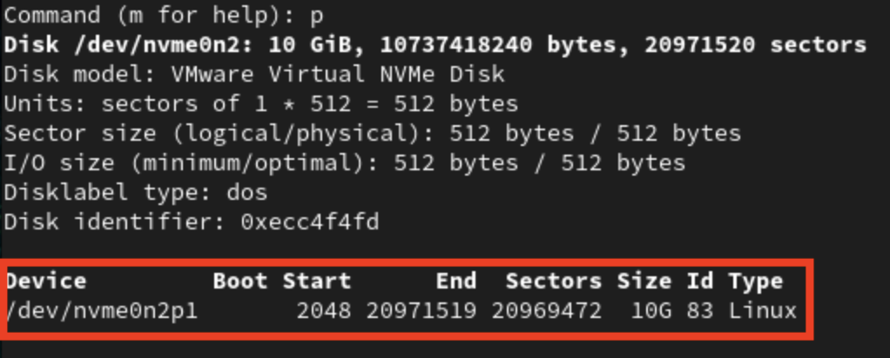
    - Enter **w** to save and write into disk
        - 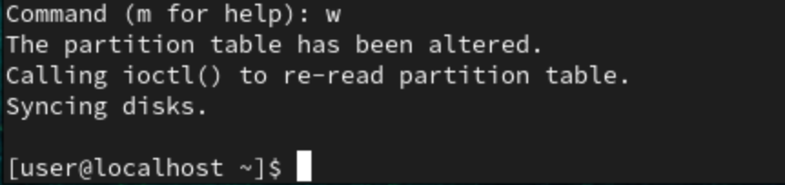
- Now we got new partition named **nvme0n2p1**
    - 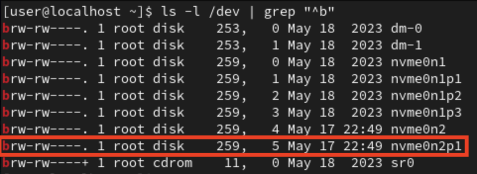

### **Step 3**
- Format the new partition(/dev/nvme0n2p1) to **XFS** file system(格式化 /dev/nvme0n2p1 分割區為 XFS檔案)
- `mkfs -t xfs /dev/nvme0n2p1`
    - 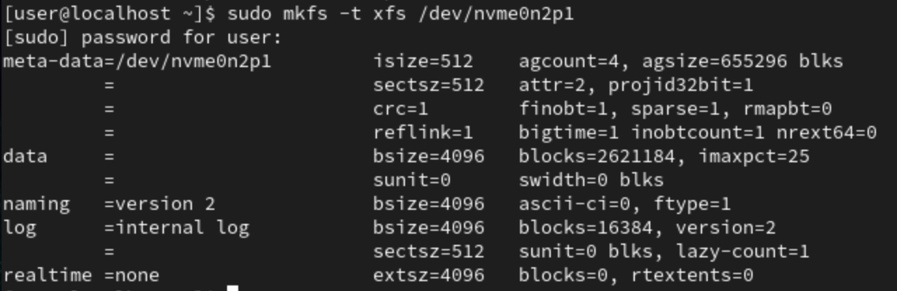

### **Step 4**
- Mount the new partition on VM
- `mkdir mydata`
    - 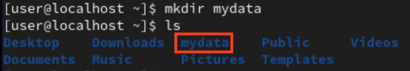
- `sudo mount /dev/nvme0n2p1 ./mydata`
    - 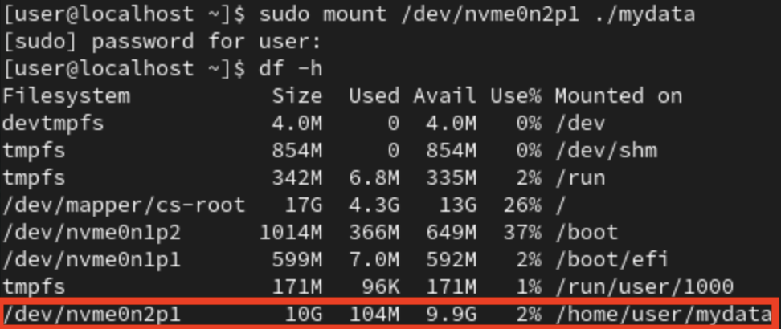
    - use `df -h` to check
- Try access the new device
    - `cd mydata`
    - `sudo dd if=/dev/zero of=500M_File bs=1M count=500`
    - `df -h`
        - 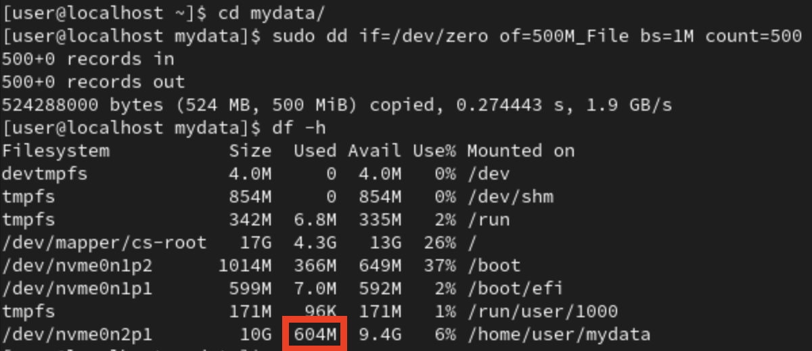
#### **Umount**
- `sudo umount /dev/nvme0n2p1 ./mydata`