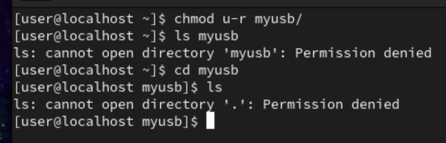
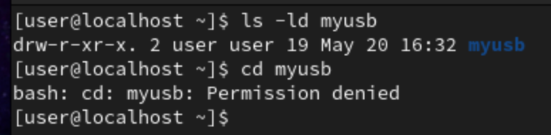
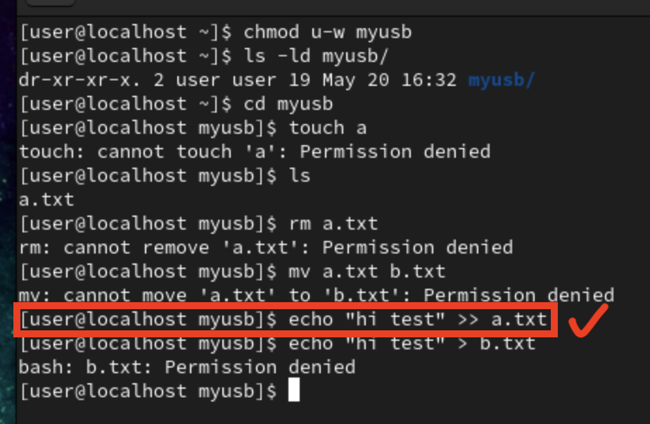
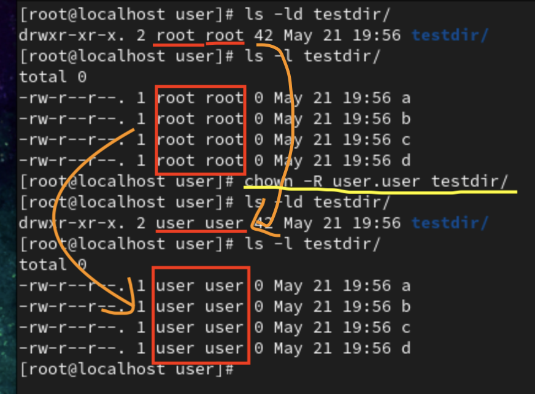
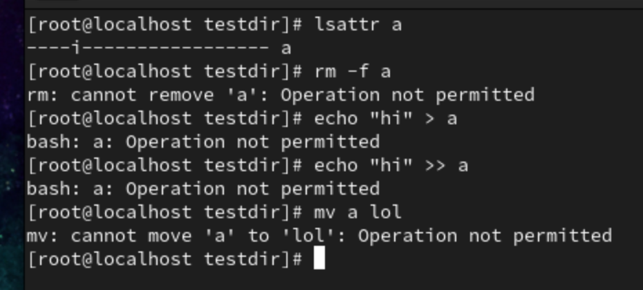
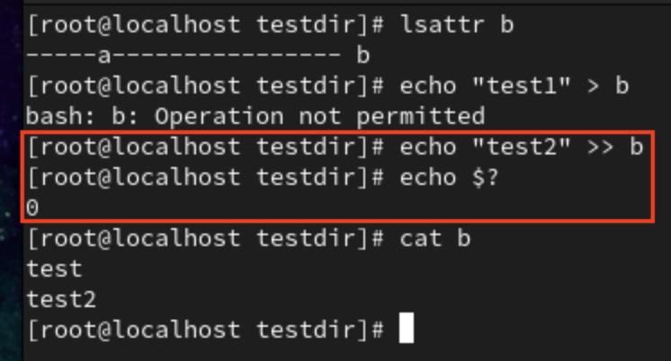
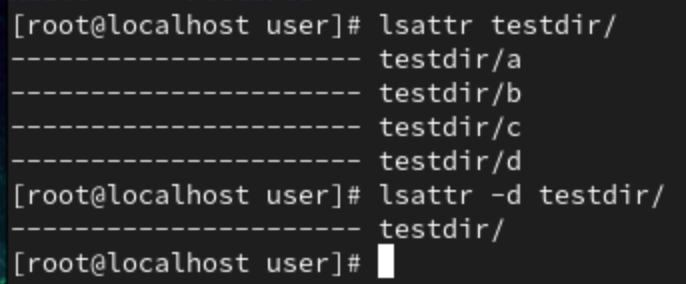
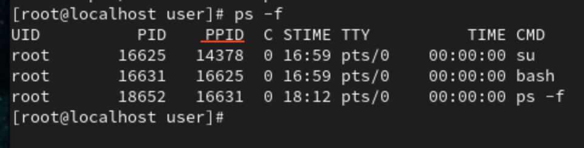
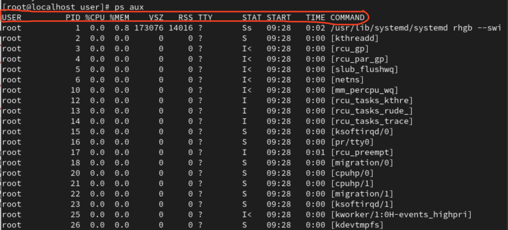
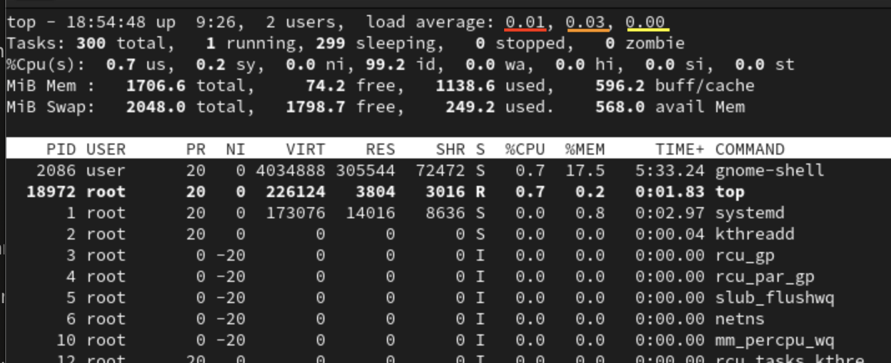

# **Chap 7**
## **Directory's permission**

_**建立directory add `-p`, 如果資料夾不存在,則創建資料夾,如果資料夾存在,則不動作,也不會有錯誤發生**_

- Directory's permission
	- `r` : can list files inside the directory
		- `ls testdir`
        - If don't have `r` permission, then can't use `ls` command to list the file under the directory
        - 
	- `x` : can access to the directory
		- `cd testdir`
        - Can't use `cd` command to access the directory if don't have `x` permission
        - 
	- `w` : can add, delete file/directory, change file/directory's name
		- `touch a.txt` , `mkdir subdir2`
		- `rm a.txt` , `rm -r subdir2`
		- `mv a.txt b.txt` , `mv subdir2 subdir3`
        - 
            - Can **modify file** under directory, but can't change file's name, add and delete file under directory 
	- 如果目錄權限沒有w,就無法刪除檔案....但這只是對一般使用者,管理者(root)還是可以照常刪除

- `chown`
    - use to change owner of file/directory
	- `chown -R tom.tom testdir` : change directory/file's owner to tom, group to tom
        - `-R` : change directory and all file/directory under it
    - 

- `chattr`
	- Change attribute, with this attribute we can prevent root mis-operation 
	- `i` : immutable,不可變動(不可以寫入、刪除、建立連結檔等)
		- `+i` to add , `-i` to clear 
		- `chattr +i a` , `chattr -i a`
        - 
	- `a` : append only
		- can't use `vim` and `echo "text" > a.txt`, only `echo text >> a.txt`
        - 
	
- `lsattr`
	- List attribute
    - 

### **su and su -**
- `su - tom` : will login to tom's home directory
- `su tom` : will stay at same directory

# **Chap 8**
- System process management
    - A process is a running program
- `sleep 100` , running in foreground 
    - Can't do other input/command
- `sleep 100 &` , running in background
    - Can do other input/command
- `cat /proc/cpuinfo` : check cpu's information
- `cat /proc/meminfo` : check memory's information
    - `free -h` : To check memory;s usage information

## **ps**
- `ps`
	- To check process
	- `-f` : more details
	    - 
            - PPID : Parent process id, **PID fork from it's PPID**
            - PID : Process id
	- `ps aux` : show all system's process
        - 
            - USER : Owner of the process
            - PID : Process id 
            - %CPU : CPU's usage
            - %MEM : Memory's usage
            - VSZ : Virtual memory's usage, in KB
            - RSS : Fixed memory's usage, in KB
            - TTY : Process is from which terminal, `?` is system service
            - STAT : Status of the process, `S` : Sleep, `R` : Running
            - START : Date when the process was started
            - TIME : Actual CPU used time
            - COMMAND : The command of the process

- `pstree` : To check relation of process
    - **systemd** : First process of Linux OS, _pid = 1_
        - Early Linux, **init** : _pid = 1_
### **Extra**
- `cat /dev/urandom | md5sum` : 增加系統負載, 系統壓力測試時使用

## **top**
- `top`
    - 可以實時地觀測process, `ps` 只可以看一瞬間的情況
    - 
        - Red : Load average of 1 minute
        - Orange : 5 minute
        - Yellow : 15 minute
## **Throw forground process to background**
- `sleep 100` : Target command
- Press **Ctrl + Z** : Pause current process
- `bg` : 丟去background去執行
### **Call back to foreground**
- `jobs` : 查看背景process
- `fg 2` : 將第二個background process抓回來foreground