- ACL(Access Control List)
	- `getacl a.txt` 
		- Get file access control list of a.txt
	- `setfacl -m u:tom:rw- a.txt`
		- `-m` : modify
		- `u` : which user, in this case is tom
		- `rw-` : permissions
		- `a.txt` : target file, in this case is a.txt
        - 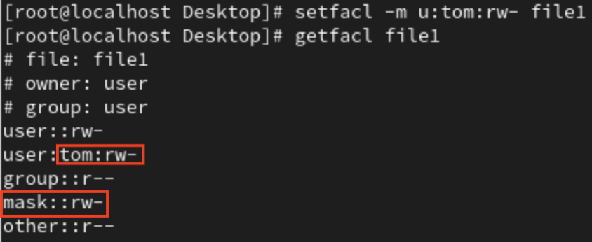
    - `setfacl -m m:r-- file1`
        - `m` : mask, is a protection, all user will do AND with mask
        - 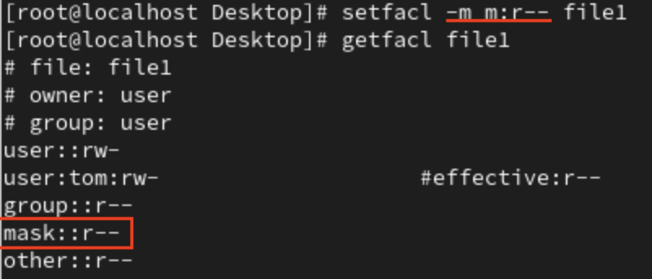
    - `setfacl -m g:rom:rw- file1`
		- `g` : which group, in this case is tom
        - 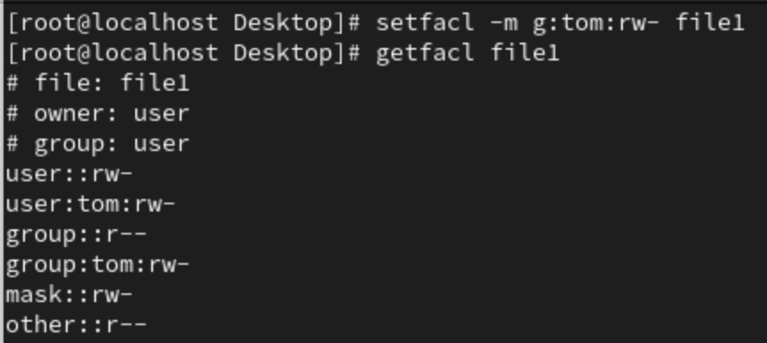
    

# **Chap 9**
- Scheduling : Do what, when
- 運維 : 運作與維護(Operation and Maintenance)
    - 多核心，多張網路卡，多個硬碟，。。。
    - 定期備份
## **Extra**
- SRE : Site Reliability Engineering
    - MTBF : Mean Time Between Failure
    - MTTR : Mean Time To Repair
- SPF : Single Point Failure
    - If server have only one NIC/Hard_Disk/Power_Supply, then fault tolerance is low

## **FirewallD**
- `iptables`
	- Create new rules need to reboot, will lost connection when rebooting

- `firewallD`
	- After create new rules don't need to reboot, can apply directly
	- Provide many zones, ex: public,external,work,home,…

- `firewall-cmd`
	- `firewall-cmd --state` : Get firewall state
	- `firewall-cmd --get-zones` : Get zone list
	- `firewall-cmd --get-active-zones` : Current using zone
	- `firewall-cmd --zone=public --list-all` : List all rule of public zone
	- `firewall-cmd --zone=public --add-service=http` : Add http service to public zone
	- `firewall-cmd --zone=public --remove-service=http` : Remove http service from public zone
	- `firewall-cmd --zone=public --add-port=2222/tcp` : Add 2222 port (tcp) to public zone
	- `firewall-cmd --zone=public --remove-port=2222/tcp` : Remove 2222 port(tcp) from public zone
	- `firewall-cmd --permanent --zone=home --change-interface=ens0s3` : Change home zone interface to "ens0s3" permanently 

### **Change ssh port on CentOs**
1. `cd /etc/ssh`
2. `vim sshd_config`
3. Change **Port 22** to target port number, ex: **Port 2222**
    - 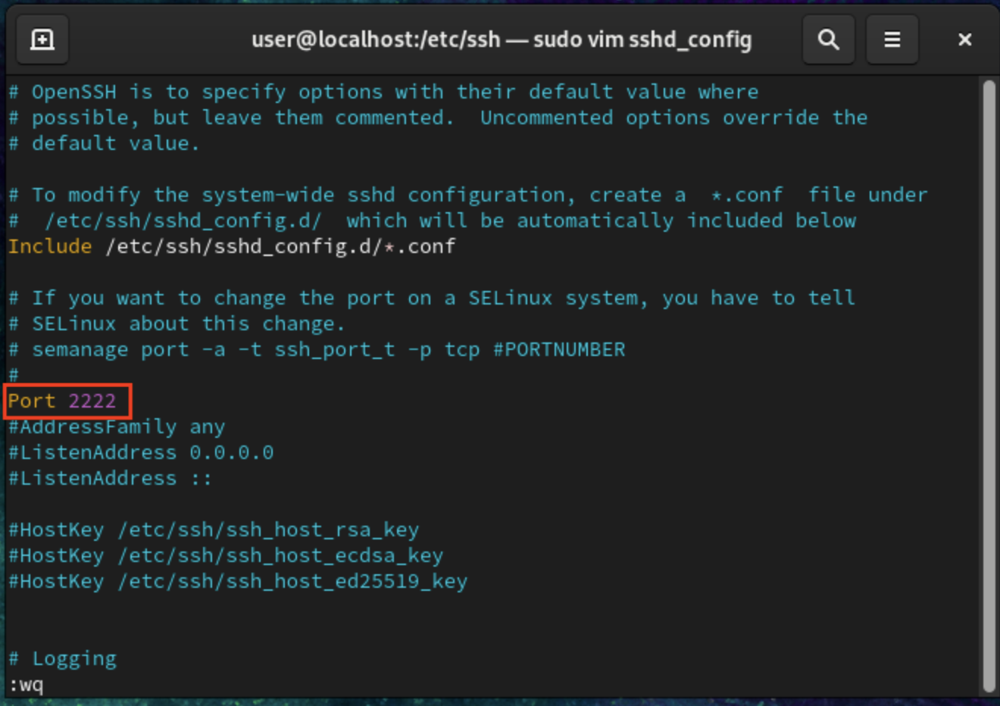
4. `systemctl restart sshd` : Restart ssh server
5. `netstat -tulnp | grep sshd` : To check ssh information
    - 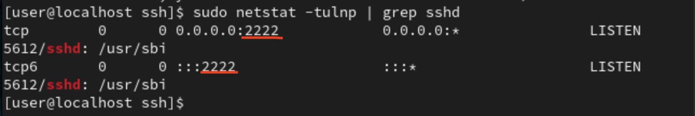
    - Done!!!
#### **Error**
- 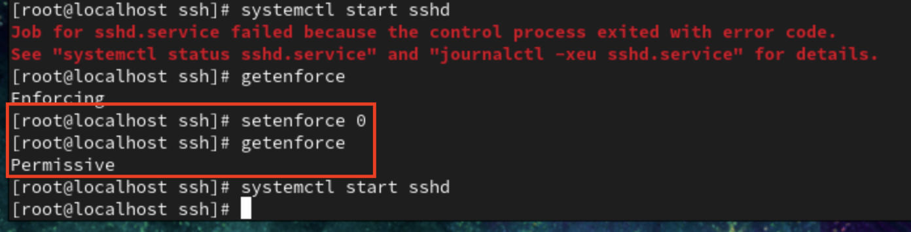
- If having error abbove, can use `setenforce 0` or go [Week2](Week2.md) and check **Change SELINUX from enforcing to disabled**

## **setup**
- `setup`
    - 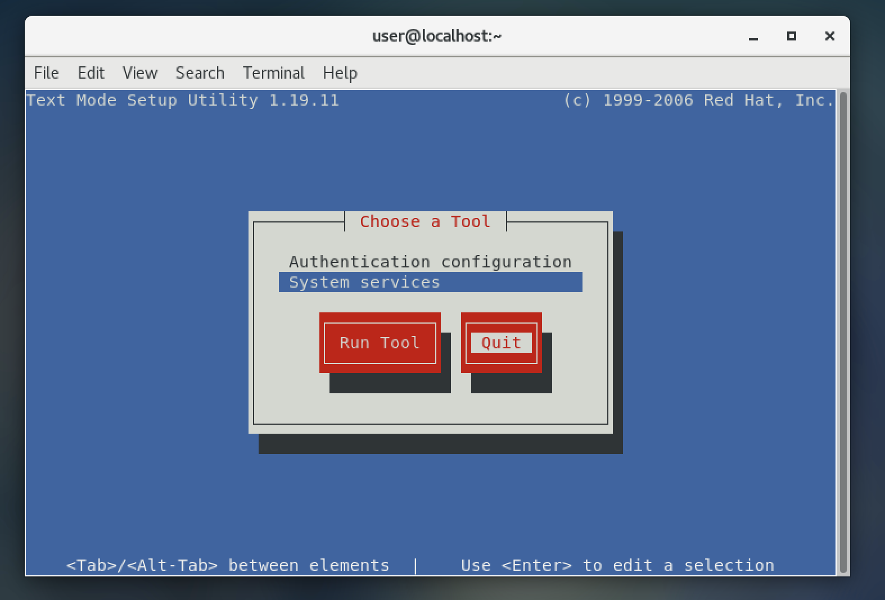 

## **備份**
- /etc : user account and password, server configuration(sshd,httpd,ip,dns,…),…
- /home : user's data
- /var : log, html(網頁伺服器), … 
	- /varspool : mail
### **打包&壓縮**
- 打包是將檔案合在一起，並不會縮小
- 壓縮方式
    1. **gzip** : `.tar.gz` or `.tgz`
        - `gzip testfile` : 使用gzip來壓縮**testfile**
        - `gunzip testfile.gz` : 解壓縮**testfile.gz**
    2. **xzip** : `.tar.xz`
    3. **bzip2** : `.tar.bz2`
        - `bzip2 file1` : 使用bz2來壓縮**file1**, 原檔會被壓縮檔取代
        - `bunzip2 file1.bz2` : 解壓縮**file1.bz2**, 壓縮檔會被原檔取代
    4. **zip** : `.tar.zip`
        - If file need to use at **Windows** and **Linux**, then use **zip** to compress
        - `zip -r testfile.zip testfile` : `-r` use to specific filename after zip
        - `unzip testfile.zip`
- `tar` : 打包
	- http://note.drx.tw/2008/04/command.html
    - `c` : create new tar file(產生新的包裹檔案)
    - `v` : verbose, show the process(顯示過程)
    - `f` : To specific filename/file(指定檔案名稱)
    - `x` : Unpack(解打包)
    - `z` : zip/unzip(處理壓縮/解壓縮), for **gzip**
    - `t` : to check/show `.tar` file's content, not unpack
    - `j` : zip/unzip, for **bz2**
    - `tar -cvf test.tar a b c d` : Pack file **a** , **b** , **c** , **d** , into new file **test.tar**
        - `tar xvf test.tar` : Unpack **test.tar**
	- `tar -czvf myfiles.tar.gz file*` : Pack and zip(compress) all filename start with **file** into **myfiles.tar.gz**
	    - `tar -xzvf myfiles.tar.gz` : Unpack and unzip **myfiles.tar.gz**
    - `tar jcvf myfiles.tar.bz2 file1 file2` : Pack and bzip2 **file1** and **file2** into **myfiles.tar.bz2**

## **Setting system's time and time zone**
1. Hardware time : Run by BIOS, battery on the mother board provide
    - 關機時亦持續運作
2. System time : Run by Linux Operating System
    - 系統開機時讀取硬體時間(Hardware time)後，便由Linux管理系統時間
- Change timezone
    1. `timedatectl list-timezones` or `timedatectl list-timezones | grep Taipei`
    2. `sudo timedatectl set-timezone Asia/Taipei`
    3. 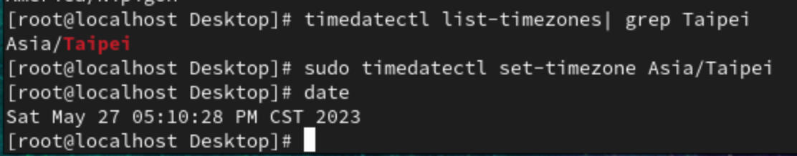
- `date`
    - `date +"%Y/%m/%d %H:%M:%S"`
        - 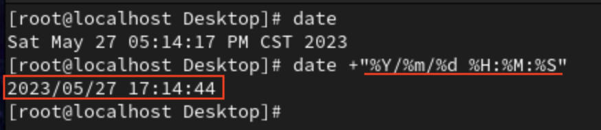
    - ``` touch `date +"%Y_%m_%d.txt"` ``` : To create a file with specific date's format
        - 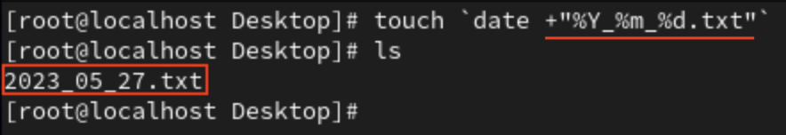
        - ``` `` ``` : 要先執行
## **Homework**
- Target : Access http server through ssh tunnel to bypass firewall
### **step 1**
- At VM open ssh server
    - `systemctl start sshd`
- Open VM's firewall, and open ssh port
    1. `systemctl start firewalld` : Start firewall
    2. `firewall-cmd --state` : Check is running or not
        - 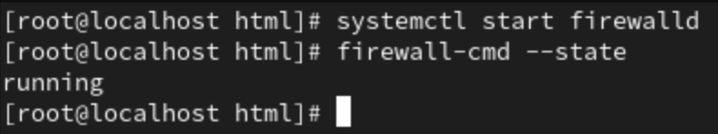
    3. `firewall-cmd --get-active-zone` : check using which zone
    4. `firewall-cmd --zone=public --list-all` : check the zone's service
        - 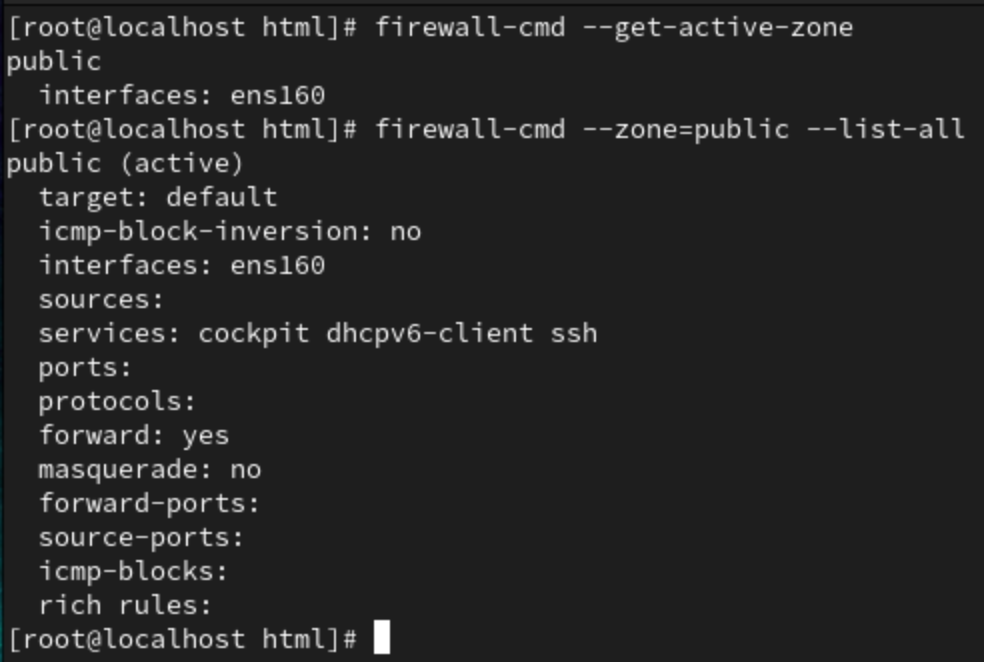
        - Firewall only allow ssh
### **Step 2**
- Run http server on VM
    - `systemctl start httpd`
- Simply create some content
    - `cd /var/www/html`
    - `echo "Hello ssh tunnel" > test.htm`
- Check ip address of VM
    - `ifconfig`
    - 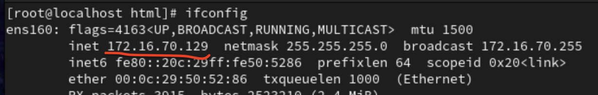
    - `172.16.70.129` is my VM ip address
### **Step 3**
- Create a ssh tunnel from our 8080 port to VM 80 port(http)
    - `ssh -L localhost:8080:172.16.70.129:80 user@172.16.70.129`
        - `-L localhost:8080:172.16.70.129:80` : Link localhost(host)'s 8080 port to target(172.16.70.129)'s 80 port(http)
- 
    - We can now see the **Hello ssh tunnel**(we create in **Step 2**) at our host