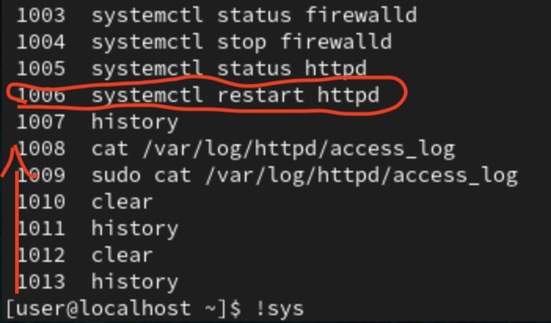
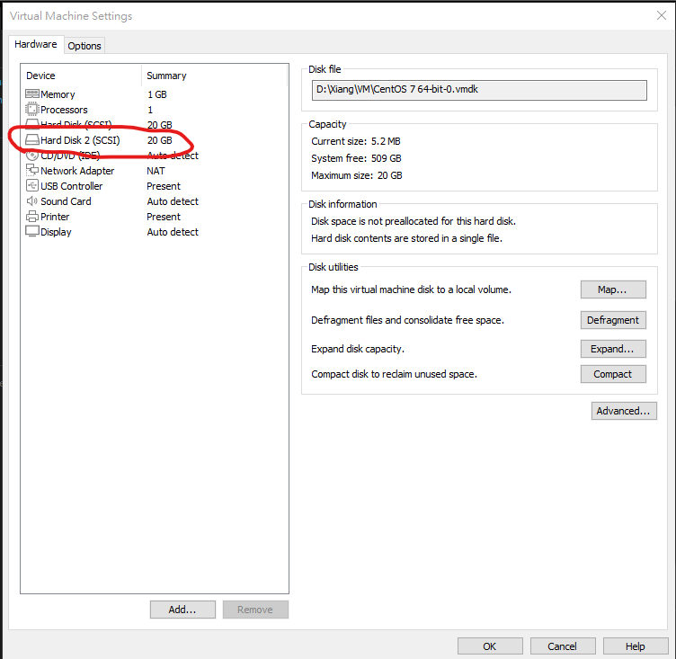
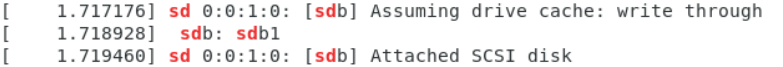
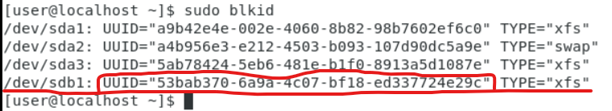
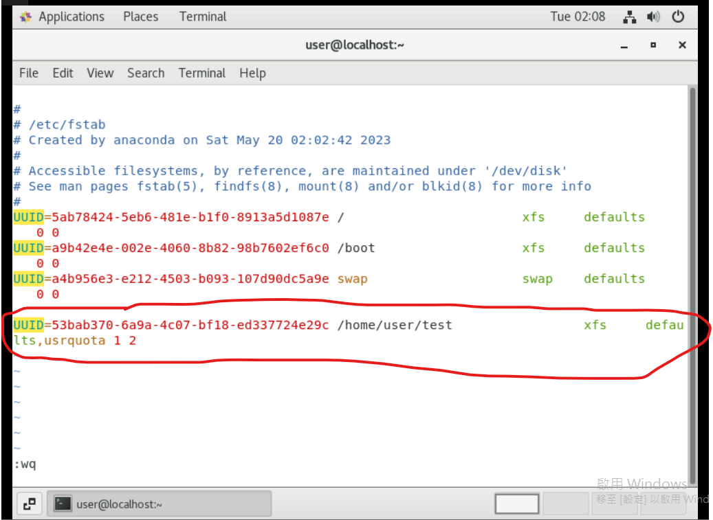
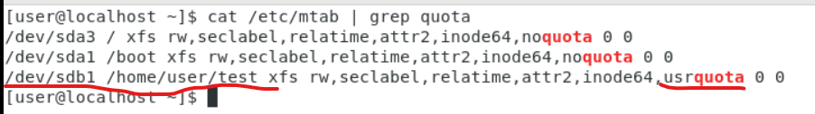
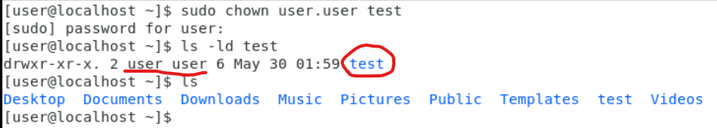
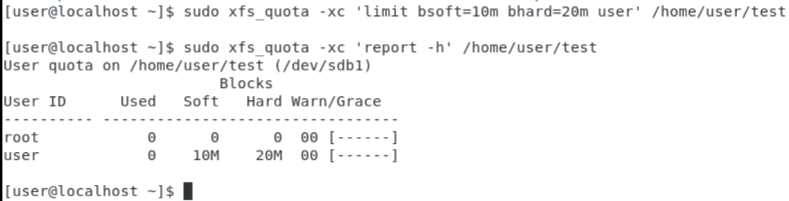
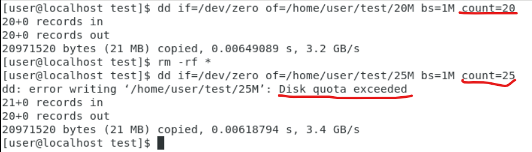
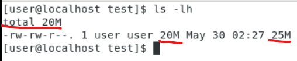

## **Setting system time and time zone**
- ```touch `data +%Y%m%d` ``` 
- `touch $(date +%Y%m%d)`
    - **``** and **$()** almost the same

_``` `` ``` and `$()` almost the same_

- NTP (network time protocol)
	- For time synchronization
- Cluster
    - 集群(有很多的server)
    - Master, Slave

- `ntpdate watch.stdtime.gov.tw` : get time from ntp server
	- `timedatectl set-timezone Asia/Taipei` : 須先設定時區

- `hwclock`
    - `hwclock -r` : 從BIOS讀取硬體的時間
    - `hwclock -w` : 將時間寫入BIOS

- `history`
	- 顯示歷史指令
	- `!988` : 執行歷史紀錄裡的第988指令
	- `!sys` : 從最新的往上匹配sys，然後執行
        - 


## **Extra**
- **Data -> analyze -> Information**
- 如果安裝完server,卻無法連接? 如何debug:
	1. Check server's status, ex : `systemctl status httpd`
	2. Check firewall and selinux, ex: `firewall-cmd --zone=public --list-all`,`getenforce`
	3. Check port number, ex : `netstat -tulnp | grep httpd`
### **Status code**
- 1XX : Informations
- 2XX : sucess message
- 3XX : 跳轉
- 4XX : Server error, ex: 404 not found
- 5XX : Client error, ex: link to a null web 
### **cat /var/log/httpd/access_log**
```
192.168.1.38 - - [30/May/2023:10:44:09 +0800] "GET /test.htm HTTP/1.1" 200 17 "-" "Mozilla/5.0 (Macintosh; Intel Mac OS X 10_15_7) AppleWebKit/605.1.15 (KHTML, like Gecko) Version/16.3 Safari/605.1.15"
```
- `192.168.1.38` : Source ip address
- `- -` : 跳轉(從哪來),ex : 超連結，搜索引擎
- `[30/May/2023:10:44:09 +0800]` : Happening time
- `"GET /test.htm HTTP/1.1"`
    - `GET` : get website
    - `/test.htm` : **test.htm** under `/`(首頁,index)
    - `HTTP/1.1` : http 1.1 format
- `200 17` : status code
- `"Mozilla/5.0 (Macintosh; Intel Mac OS X 10_15_7) AppleWebKit/605.1.15 (KHTML, like Gecko) Version/16.3 Safari/605.1.15"` : User Agent
    - `Mozilla/5.0 (Macintosh; Intel Mac OS X 10_15_7)` : Client OS
    - `AppleWebKit/605.1.15 (KHTML, like Gecko) Version/16.3 Safari/605.1.15` : Client Browser

## **Setting system scheduling**
- `cat /etc/crontab`
```
SHELL=/bin/bash
PATH=/sbin:/bin:/usr/sbin:/usr/bin
MAILTO=root

# For details see man 4 crontabs

# Example of job definition:
# .---------------- minute (0 - 59)
# |  .------------- hour (0 - 23)
# |  |  .---------- day of month (1 - 31)
# |  |  |  .------- month (1 - 12) OR jan,feb,mar,apr ...
# |  |  |  |  .---- day of week (0 - 6) (Sunday=0 or 7) OR sun,mon,tue,wed,thu,fri,sat
# |  |  |  |  |
# *  *  *  *  * user-name  command to be executed
```
- `*` : Don't care
- `*/1` : Every 1
- `1-10` : Range 1 to 10
- `1,2,5` : Multiple chooice, 1,2,and 5
### **Example**
- `0 17 10 * *` : 每個月的10日，下午5點正
- `0 */2 * * *` : 每兩小時正
- `1,2 * * * *` : 每小時的第1，2分鐘
- `0 22-0 5 * *`: 每月5號的晚上2200，2300，0000
- `0 23-7/2,8 * * * echo "hi"` : 晚上11點到早上7點間每兩個小時正，與8點正執行echo "hi"
- `0 * * * * /bin/ls` : 每月每天每小時的第0分鐘執行一次/bin/ls
- `*/20 6-12 * 12 * /usr/bin/backup` : 在12月份，每天6點到12點，每20分鐘執行一次 /usr/bin/backup
- 每30秒執行
    - `* * * * * command`
    - `* * * * * sleep 30 command`
### **crontab**
- `crontab`
	- `crontab -e`
        - `-e` : edit
		- For normal user to set scheduling
        - `*/1 * * * * echo "Hello Linux at $(date)" >> $HOME/New.txt`
            - Will append **Hello Linux at current_date** into **/home/user/New.txt** every minute
    - `-l` : list schedule

## **Disk quota setting**
- Hard limit : Will limit (會限制)
- Soft limit : Will warn (會提醒)

### **Step 1**
1. Add new disk
    - 
2. `dmesg | grep sd` : to check did new disk detected
    - 
    - In this case is **sdb**
3. `fdisk /dev/sdb` : To create new partition
4. `mkfs -t xfs /dev/sdb1` : To format sdb1 to xfs format

### **Step2**
1. `sudo blkid` : To check UUID of **sdb1**
    - 
2. `sudo mkdir /home/user/test` : Create a new directory to mount on here 
3. `sudo vim /etc/fstab` : Add the UUID and the path of directory and some setting as below
    - 
4. `reboot`

### **Step 3**
1. `sudo cat /etc/mtab | grep quota` : If have **usrquota** then can go next
    - 
2. `ls -ld test` : Just to check the target directory is own by user
    - 
### **Step 4**
1. `sudo xfs_quota -xc 'limit bsoft=10m bhard=20m user' /home/user/test` : To limit soft limit is **10M** and hard limit is **20M** for **user** at **/home/user/test** directory
2. `sudo xfs_quota -xc 'report -h' /home/user/test` : To check the limit setting
    - 
### **Step 5**
1. `dd if=/dev/zero of=/home/user/test/20M bs=1M count=20` : Create a 20Mb file call 20M under **/home/user/test**
2. `dd if=/dev/zero of=/home/user/test/25M bs=1M count=25` : Create a 25Mb file call 25M under **/home/user/test**
    - 
    - We can see when creating 25M will show **Disk quota exceeded**
3. `ls -ld`
    - 
    - The 25M file have only 20Mb