# **Host Only Network Mode**
- If don't have choice at **Host only**
    - `File` -> `Tools` -> `Network Manager` -> `Create`

# **Change `SELINUX` from `enforcing` to `disabled`**
## **Step 1**
- Key in `gedit /etc/selinux/config` in terminal

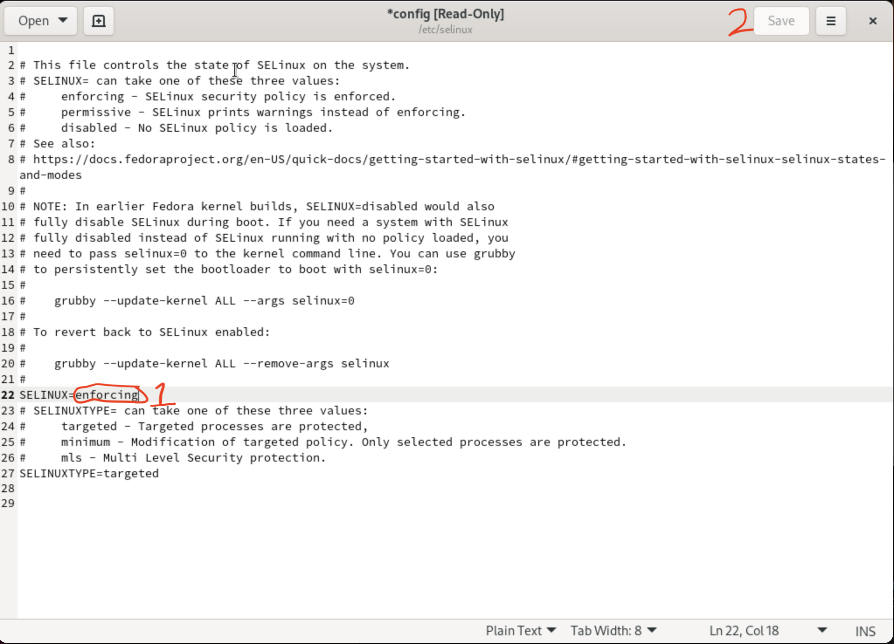

## **Step 2**
- From picture above change `enforcing` to `disabled`
- Save and exit

## **Step 3**
- Key in `getenforce` in terminal, if reply `Disabled` then done!

# **Closing Firewall**
## **Step 1**
- `systemctl status firewalld`
    - To check the status of firewall
## **Step 2**
- `systemctl stop firewalld`
    - To inactive/stop firewall

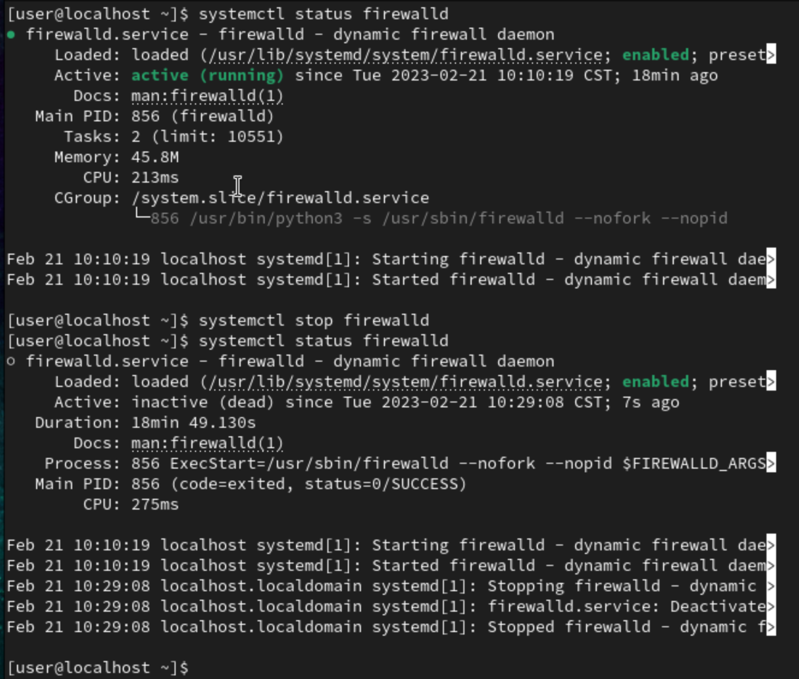
- **enabled** means will auto start/active when machine start

## **Step 3**
- `systemctl disable firewalld`
    - To **disable** firewall, will not open/active firewall _automatically_

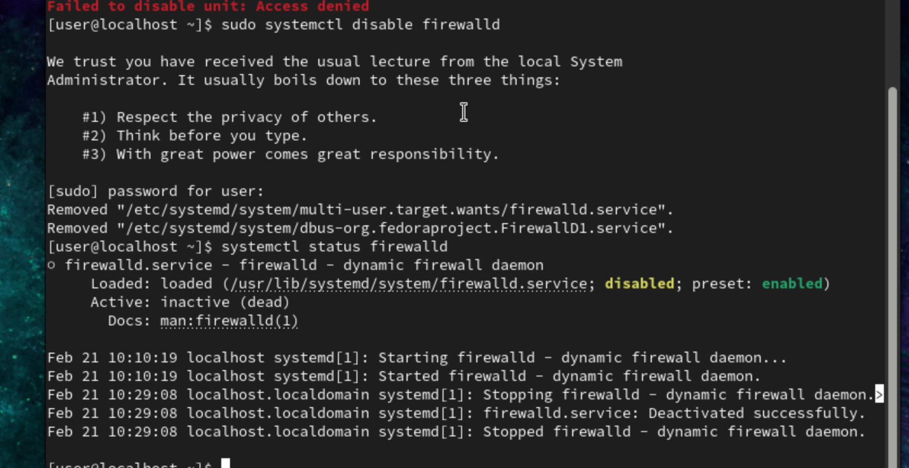

# **SSH server**
## **Step 1**
- `sudo yum install -y openssh-server`
    - To install **ssh server**,`-y` set yes/y to all response
- `ifconfig`
    - To check ip address of the VM
    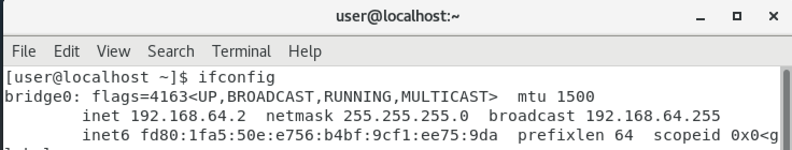
    - `192.168.64.2` is the ip address that we need

## **Step 2**
- `ping 192.168.64.2`
    - Open terminal at host machine and ping the ip address of VM
    - 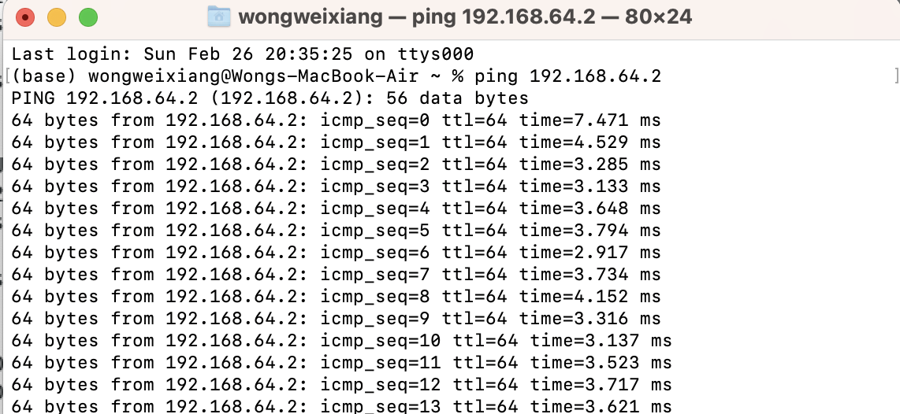

## **Step 3**
- `systemctl status sshd`
    - To check the status of ssh server, if it is inactive then use command below to start ssh server
    - 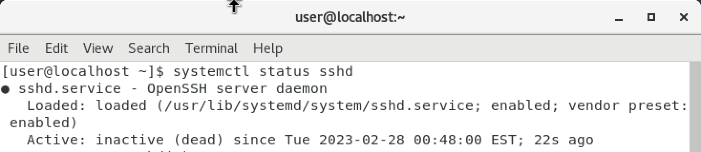
- `systemctl start sshd`
    - To start ssh server, if success then move to the last step
    - 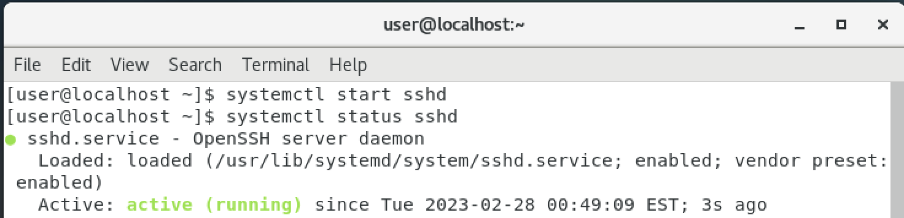

## **Step 4**
### **Mac version**
- `ssh user@192.168.64.2`
    - Open terminal at host machine and connect with the command above.
    - `user` is the username of the VM
    - `192.168.64.2` is the ip address of the VM at **Step 1**
    - 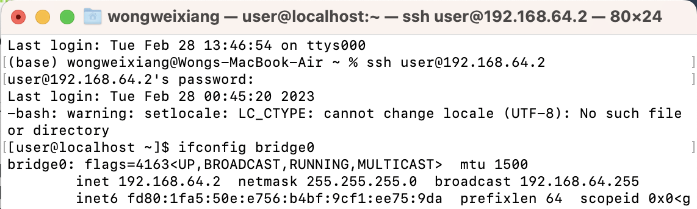
    - And done!!!
### **Windows version**
- Use APP like **Putty** and connect with ssh server which is **22 port**

## **Extra**
- Now you can also use SFTP software/server to transfer file into the VM!

# **Web server**
## **Step 1**
- `sudo yum install httpd -y`
    - To install http server
    - 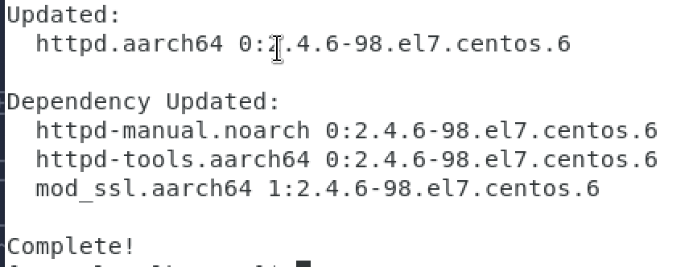
- `systemctl status httpd`
    - 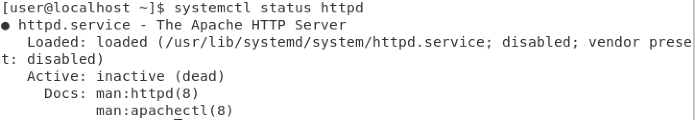
- `ifconfig`
    - To check ip address, `192.168.64.2` is mine VM ip address

## **Step 2**
- `cd /var/www/html`
    - Change directory into httpd server directory
- `echo "Hello test Http server" > test.htm`
    - _Need super user permission_ , add `sudo` infront or user `su` to become root user
    - Creating a htm file call `test.htm` and content is `Hello test Http server`
    - 

## **Step 3**
- `systemctl start httpd`
    - 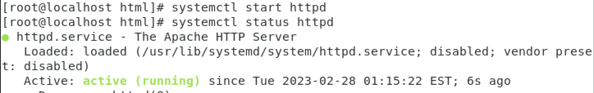

## **Step 4**
- `192.168.64.2/test.htm`
    - Open browser in host machine and type in the command above
    - `192.168.64.2` is the ip address of VM
    - `test.htm` is the file name under `/var/www/html` directory
    - 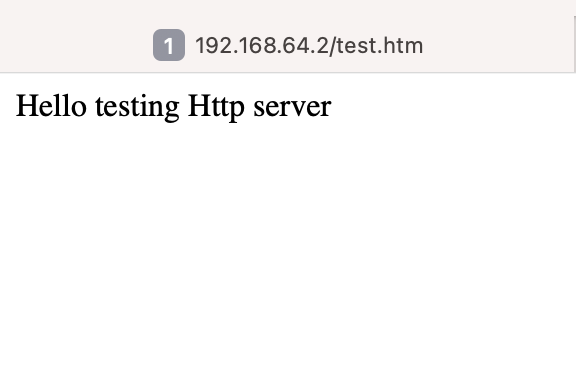