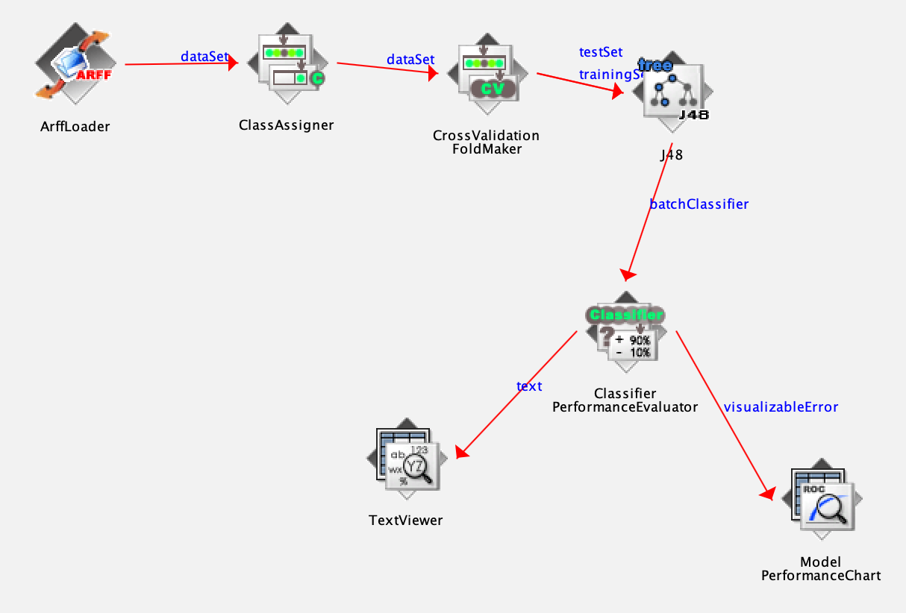
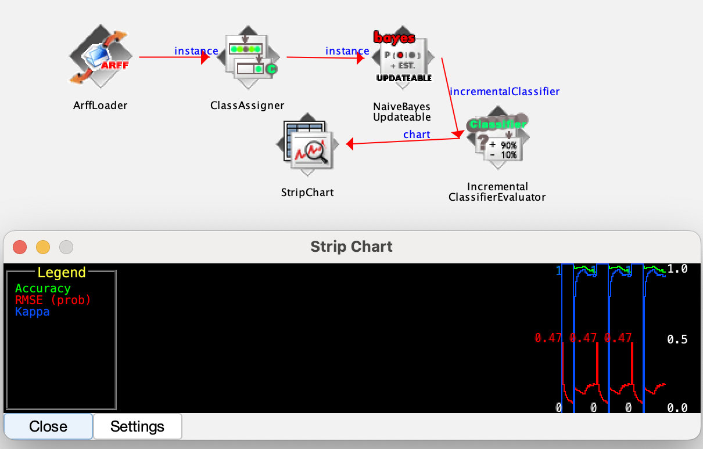

KnowledgeFlow
- To visualize the dataflow 
- Example : 
    1. Go to `DataSources` -> `ArffLoader` and use Configure to set data set
    2. Go to `Evaluatioin` -> `ClassAssigner` 
        - Link `ArffLoader` to `ClassAssigner` with **dataSet**
    3. Go to `Evaluatioin` -> `CrossValidationFoldMaker`
        - Link `ClassAssigner` to `CrossValidationFoldMaker` with **dataSet**
    4. Go to `Classifiers` -> `tree` -> `J48`
        -  Link `CrossValidationFoldMaker` to `J48` with **testSet** and **trainingSet**
    5. Go to `Evaluatioin` -> `ClassifierPerformanceEvauator`
        - Link `J48` to `ClassifierPerformanceEvauator` with **batchClassifier**
    6. Go to `Visuaization` -> `TextViewer`
        - Link `ClassifierPerformanceEvauator` to `TextViewer` with **text**
    7. Go to `Visuaization` -> `ModelPerformanceChart`
        - Link `ClassifierPerformanceEvauator` to `ModelPerformanceChart` with **visualizableError**
    8. Click play and now you can right_click `TextViewer` and `ModelPerformanceChart` to show the result
    - 
- StripChart example:
    - 

SimpleCLI
- Can use to run big data set, use less memory than others
- `java weka.classifiers.trees.J48 -C 0.25 -M 2 -t "/Users/wongweixiang/Desktop/Weka/weka_data/iris.arff"`
    - `java weka.classifiers.trees.J48 -C 0.25 -M 2` : Go to Explorer -> Classify -> Classifier and choose J48 and right_click and choose **Copy configuration to clipboard**
    - `-t` : specify data set path
    - `"/Users/wongweixiang/Desktop/Weka/weka_data/iris.arff"` : data set
 
