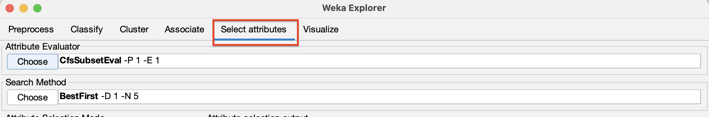
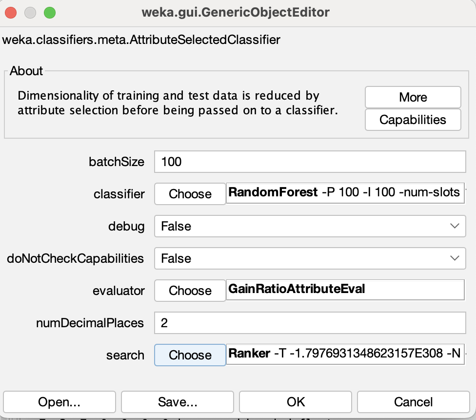

Select attributes 面板
- 
- WrapperSubsetEval
    - 窮舉搜尋 : If 9 attributes => $2^9$ subset
    - searchTermination > 1 : May get better local optimization at search range/scope
    - Help to get better attributes for model

Classify 面板
- AttributeSelectedClassifier
    - Combined select attributes and classifier into 1 step
    - WrapperSubsetEval
        - Scheme-dependent: slower, may get better result
        - need to select classifier 
    - CfsSubsetEval
        - Scheme-independent: faster
        - no need to select classifier

    - Ranking
        - GainRatioAttributeEval
            - Choose **Ranker**
            - 
    - Cost
        - More options... -> Cost-sensitive evaluation
            - To calculate the cost
        - Classifier -> meta -> CostSensitiveClassifier
            - Help to minimise the cost
            - Resize costMatrix

簡介
- 為什麼要做
- 有什麼影響

資料集介紹

文獻探討
- 資料相關
- 方法相關
- 別人的結果

圖表/摘要

結果

結論

參考文獻