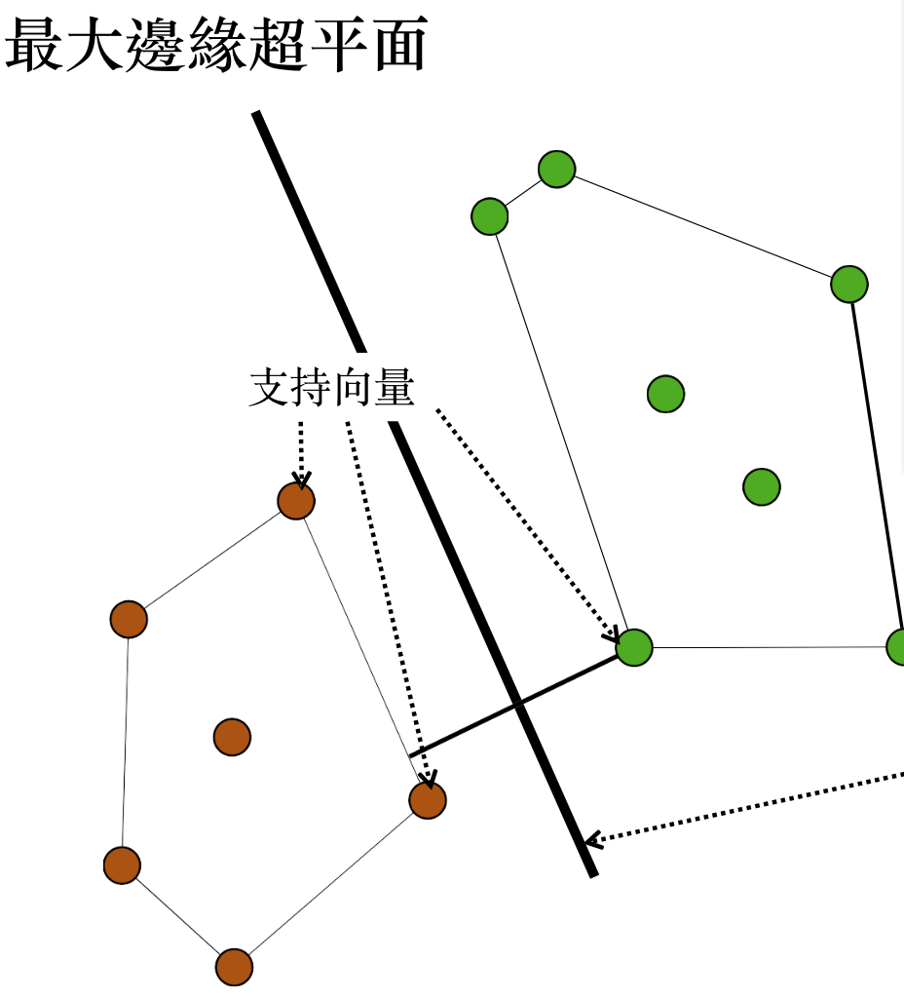

羅吉斯回歸
- Predict the posibility of class directly
- Output predictions : PlainText, Cross-validation 10 folds
```
=== Predictions on test data ===

    inst#     actual        predicted         error prediction
        1 1:tested_negative 1:tested_negative       0.754 
        2 1:tested_negative 1:tested_negative       0.584 
        3 1:tested_negative 1:tested_negative       0.862 
        4 1:tested_negative 1:tested_negative       0.998 
        5 1:tested_negative 2:tested_positive   +   0.584 
        6 1:tested_negative 1:tested_negative       0.83 
        7 1:tested_negative 2:tested_positive   +   0.518 
        8 1:tested_negative 2:tested_positive   +   0.763 
        9 1:tested_negative 1:tested_negative       0.947 
       10 1:tested_negative 1:tested_negative       0.862 
```
- **+** means predict wrongly, for 5 case : 58.4% positive 41.6% negative, we predicted as positive but actually is negative

支持向量機
- 
- SMO , LibSVM

集成學習法（ensembles）
- 集合多個“專家”的意見來產生預測結果
- Bagging
    - 使用幾個相同大小的訓練集, 從原始的訓練集取樣(使用取代的方式)
    - 為每個實例建立模型, 使用相同的機器學習法
    - 通過投票決定預測結果, Linear regression will take average of all result value
    - 非常適用於不穩定(unstable)的學習法
        - 不穩定的學習法：訓練集中的小改變可能為模型帶來巨大差異
- Boosting
    - 一直反覆計算(新的模型被之前建立的模型表現所影響)
    - 對於分類錯誤的實例增加額外權重(不好分類的實例)
    - 針對被早期模型分類錯誤的實例，鼓勵新的模型成為分類專家
    - 直觀的理由：“委員”們應該互補各自的專業知識
- Stacking
    - 使用一個meta學習法來結合基本學習法的預測，而非使用投票法
        - 基本學習法: level‐0 models
        - meta 學習法: level‐1 model
        - 基本學習法的預測meta學習法的輸入值
    - 基本學習法通常是不同方法
    - 在訓練集中不能使用預測來產生level‐1模型的資料！
        - 解決方法：使用類似交叉驗證（cross‐validation‐like）的方法
