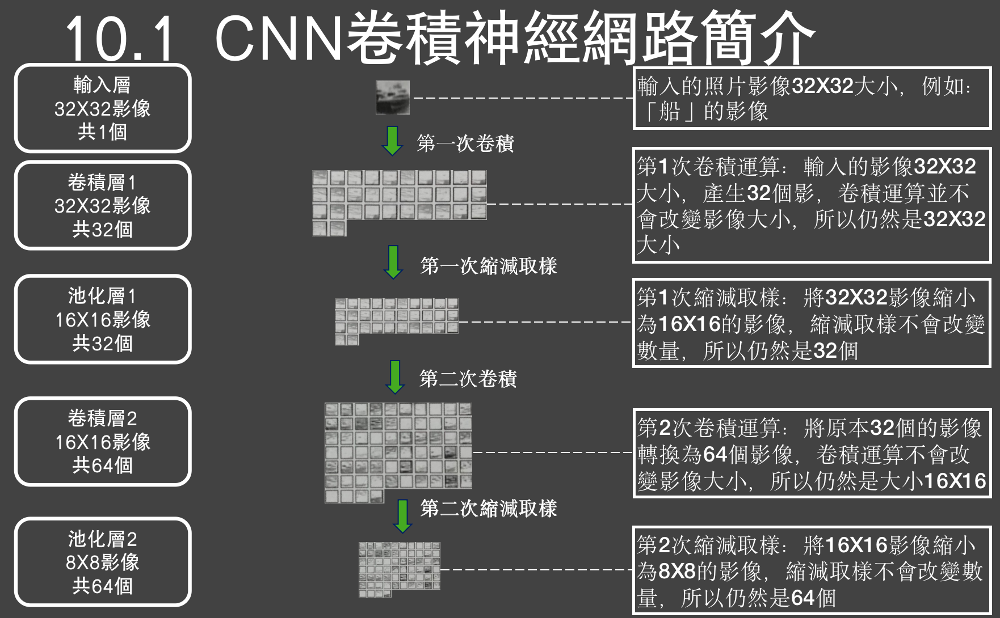

Image filters
- All image need to be in one directory
- Create your **arff** file, with 2 attribute and also all data
```
@relation img_classification

@attribute filename string
@attribute class{y1,y2}
@data
x101.jpg,y1
x102.jpg,y1
x201.jpg,y2
...
```
- Choose the type of filter you seeking and remember to select the images' directory
- Install from `Tools -> Package Manager`

Image Classification
- Collect images into 1 directory
- Create **arff** file
- Use **Image filters** to get the features of the image
- Use classifier 

CNN

- img precessing, get features
