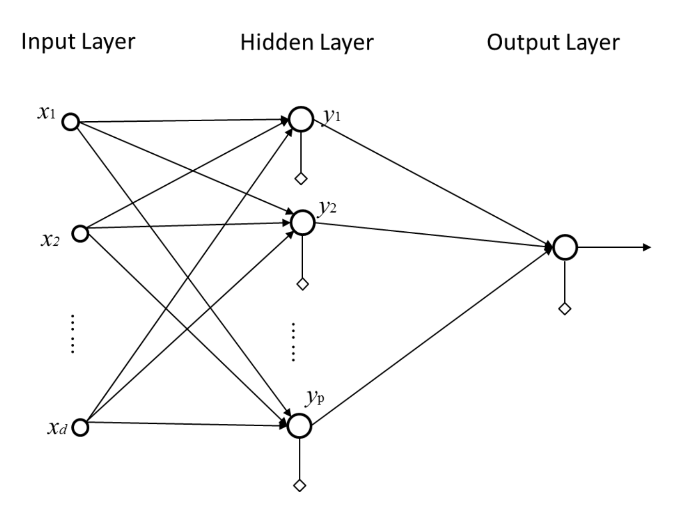
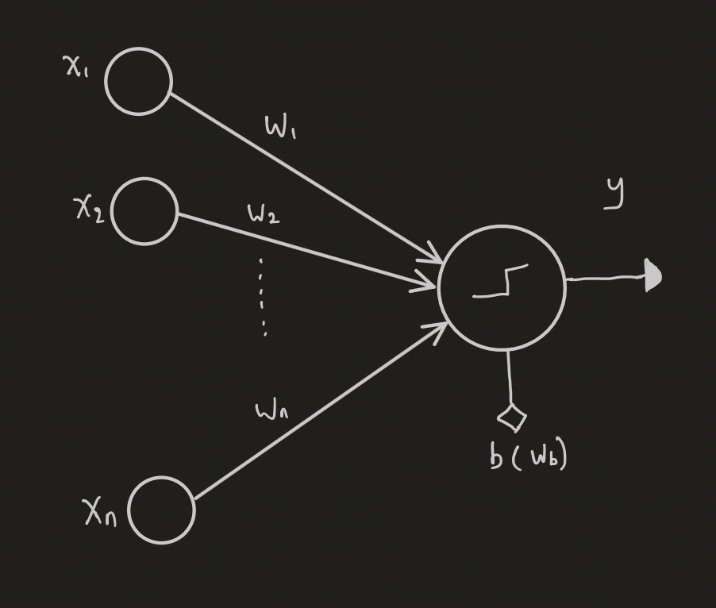
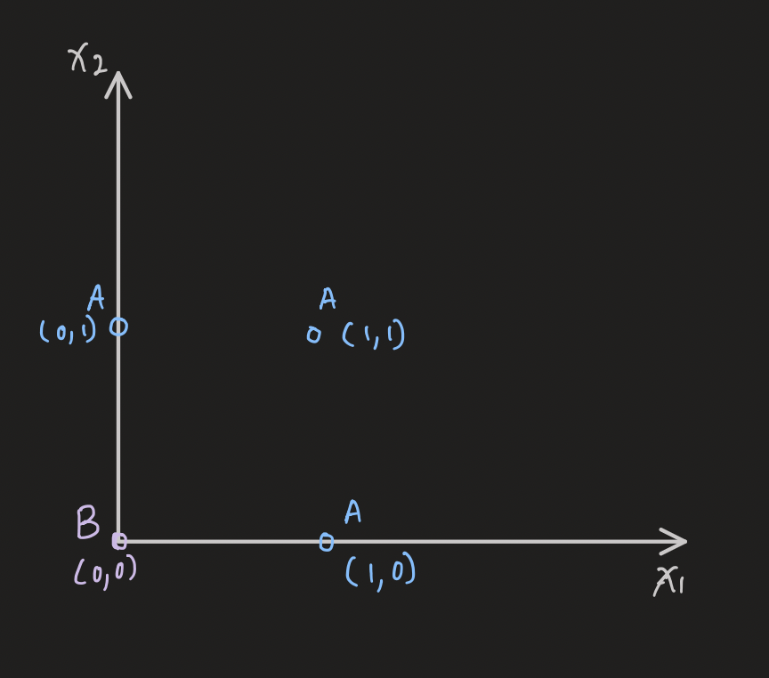
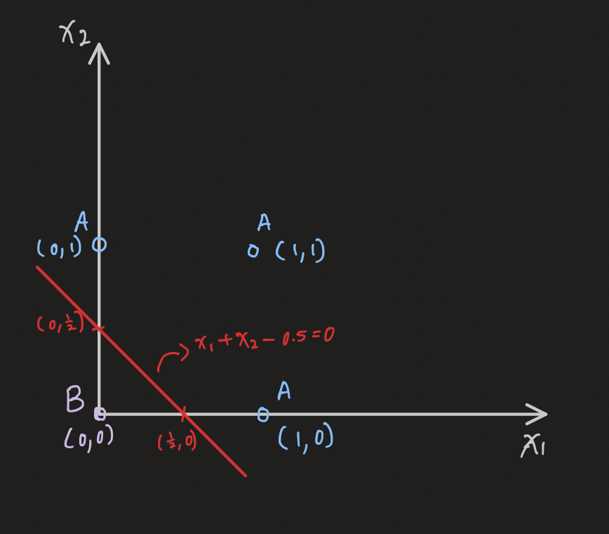
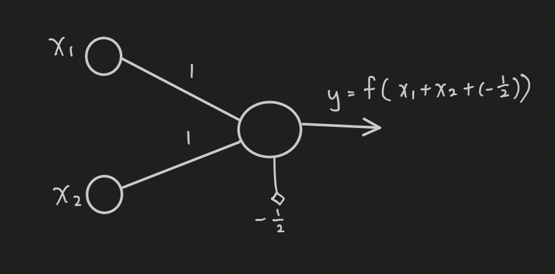
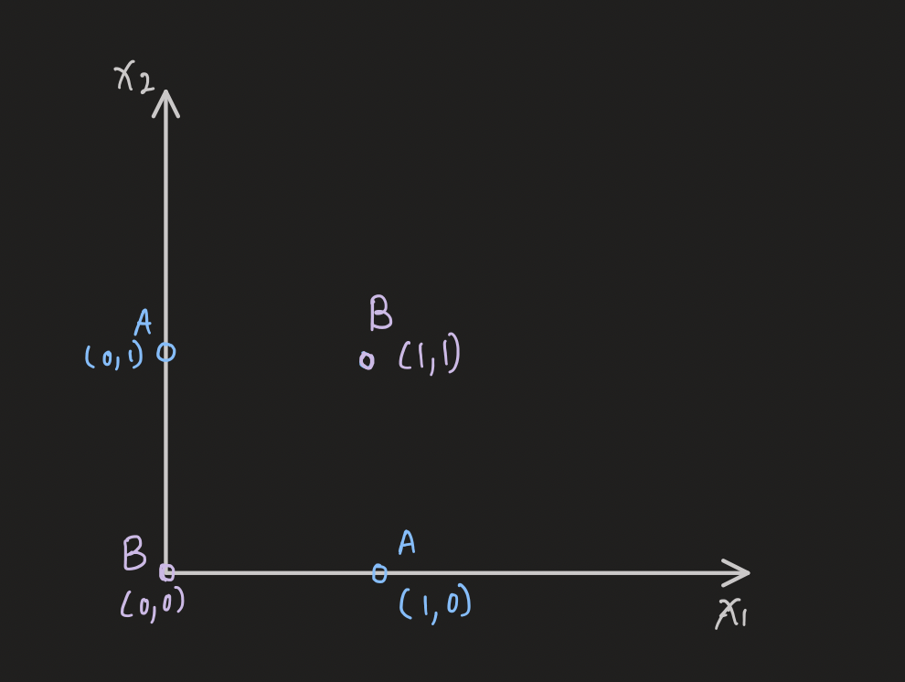
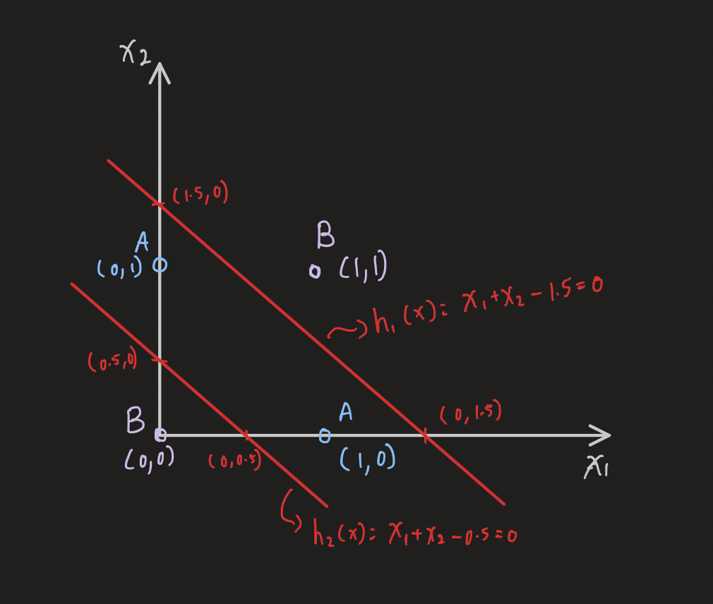
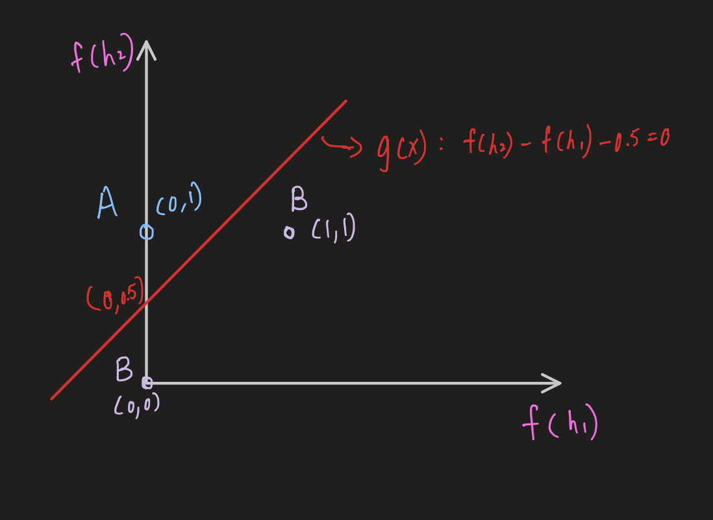
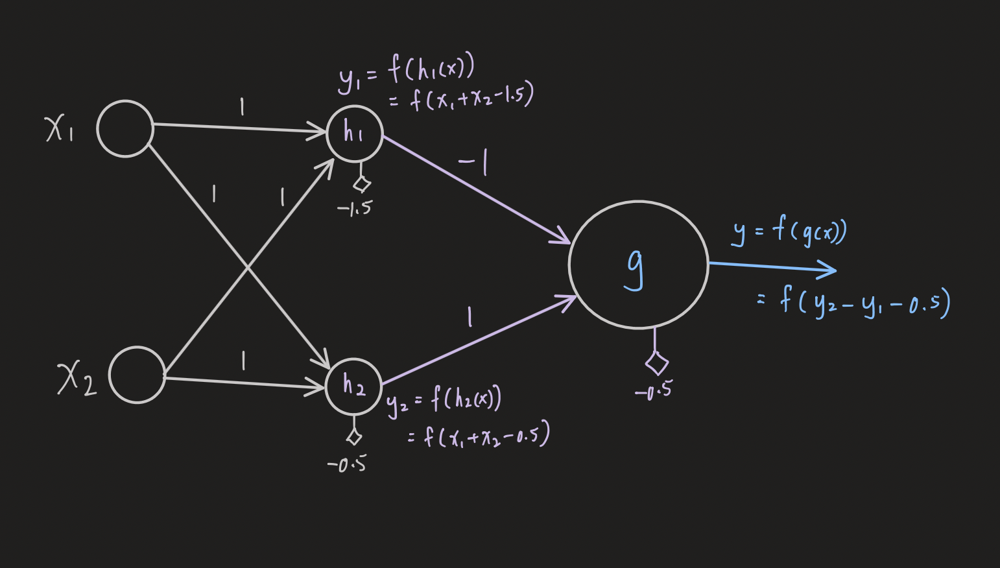

# **MLP**

## Perceptron
- Input layer
    - Input variables(features), weight 
- Output layer
    - Activation function : Use to transform input into nonlinear output, inorder to get nonlinear classification

- $y = f(w_b+ w_1x_1+w_2x_2+...+w_nx_n)$

$$ f= \begin{cases} 1, & \text {if $w_b+ w_1x_1+w_2x_2+...+w_nx_n \ge 0$} \\ 0, & \text{if $w_b+ w_1x_1+w_2x_2+...+w_nx_n \lt 0$} \end{cases} $$

## Examples
### Ex1

- We having Class A,B like the graph above, and we wish to classify them into 2 different category

- We can seperate them into 2 category with 1 line showed in the graph above
    - $x_1 + x_2 -0.5=0$
    - And this will be the function $f$

- Graph in **Perceptron**

$$ f= \begin{cases} 1, & \text {if $w_b+ w_1x_1+w_2x_2+...+w_nx_n \ge 0$} \\ 0, & \text{if $w_b+ w_1x_1+w_2x_2+...+w_nx_n \lt 0$} \end{cases} $$

- We can use the function $f$ to seperate into 2 class, indicate with 1 and 0
- $A(0,1) \to f((0,1)) = f(-0.5+1*(0)+1*(1)) = f(0.5) = 1$ 
- $A(1,1) \to f((1,1)) = f(-0.5+1*(1)+1*(1)) = f(1.5) = 1$
- $A(1,0) \to f((1,0)) = f(-0.5+1*(1)+1*(0)) = f(0.5) = 1$
- $B(0,0) \to f((0,0)) = f(-0.5+1*(0)+1*(0)) = f(-0.5) = 0$
    - Now we seperate A and B into different category

### Ex2

- We want to seperate them into 2 category, but using a single line we're not able to do that

- We can first seperate them using 2 line
    - $h_1(x) = x_1 + x_2 - 1.5=0$
    - $h_1(x) = x_1 + x_2 - 0.5=0$

$$f(h_1(x))$$
- $A(0,1) \to f(h_1((0,1))) = f(h_1(-1.5+1*(0)+1*(1))) = f(-0.5) = 0$ 
- $B(1,1) \to f(h_1((1,1))) = f(h_1(-1.5+1*(1)+1*(1))) = f(0.5) = 1$
- $A(1,0) \to f(h_1((1,0))) = f(h_1(-1.5+1*(1)+1*(0))) = f(-0.5) = 0$
- $B(0,0) \to f(h_1((0,0))) = f(h_1(-1.5+1*(0)+1*(0))) = f(-1.5) = 0$

$$f(h_2(x))$$
- $A(0,1) \to f(h_2((0,1))) = f(h_2(-0.5+1*(0)+1*(1))) = f(0.5) = 1$ 
- $B(1,1) \to f(h_2((1,1))) = f(h_2(-0.5+1*(1)+1*(1))) = f(1.5) = 1$
- $A(1,0) \to f(h_2((1,0))) = f(h_2(-0.5+1*(1)+1*(0))) = f(0.5) = 1$
- $B(0,0) \to f(h_2((0,0))) = f(h_2(-0.5+1*(0)+1*(0))) = f(-0.5) = 0$

$$A(0,1) \to f(h_1) \& f(h_2) \to A(0,1)$$
$$B(1,1) \to f(h_1) \& f(h_2) \to B(1,1)$$
$$A(1,0) \to f(h_1) \& f(h_2) \to A(0,1)$$
$$A(0,0) \to f(h_1) \& f(h_2) \to B(0,0)$$

- Now we can use a single line to seperate A & B, using $g(x) = f(h_2) - f(h_1) - 0.5 = 0$

$$g(x) = f(h_2) - f(h_1) - 0.5$$
- $A(0,1) \to f(g((0,1))) = f(g(1-0-0.5)) = f(0.5) = 1$
- $B(1,1) \to f(g((1,1))) = f(g(1-1-0.5)) = f(-0.5) = 0$
- $A(0,0) \to f(g((0,0))) = f(g(0-0-0.5)) = f(-0.5) = 0$

_**f() is the step activate function of the perceptron**_

- Graph with multiple layer perceptron(MLP)
