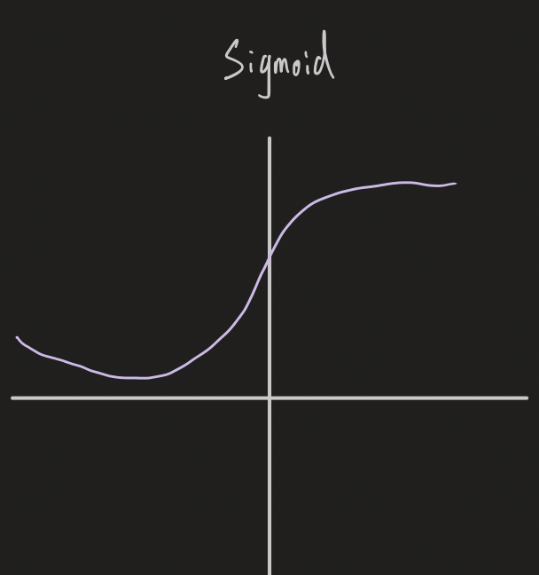

分割擊破法(Divide&Conquer)
- 分解後征服
- Traversal array (binary search)
    - 複雜度
    - 
    - 
- 遞回解矩陣相乘
    - $O(n^{log_2{8}})=O(n^3)$
    - 矩陣加法複雜度為 $n^2$
    - 複雜度
    - 
    - 
- Strassen algorithm
    - $O(n^{log_2{7}})=O(2.807)$
    - 

動態規劃法
- C(n,k)
    - 
- 最短編輯距離
    - 新增，刪除，取代 距離都是 1
    - 從 a 字串 編輯成 b字串
    - 
        - b 為空字串，刪除每個 a字串的字元
    - 
        - a 為空字串，新增每個 b字串的字元
    - 
        1. $a_i = b_j$ 編輯距離不變 $d_{ij} == d_{i-1,j-1}$
    - 

隨機法
- 隨機產生超大亂數，可用於UUID，GUID等等的唯一認證碼
- **sha256** 是有輸入且一樣的輸入會有一樣的輸出， 但隨機法是沒有輸入的
- random：可用seed，time，mod，sin 來產生

蒙地卡羅法
- 隨機模擬：亂數+模擬某個東西
- pi
    - if r=1， $A=pi*r^2 \to A=pi$ 
    - 隨機產生**點**，若距離小於等於1 （$\sqrt{x^2+y^2} \le 1$ ｜ 在圓裡面），答案+1
    - pi = 答案/所有點 * 4
- ndBall
    - 距離小於等於 **r**(半徑) => 在n維球裡面
    - n維球體的體積 = $（落在n維球的點 / 所有嘗試的點）* （2r(直徑)）^n$
- 中央極限定
    - 隨機取樣（大量）且多個最後的結果會像是常態分佈
    - 畫圖
    - talent vs lucky
- Markov
    - A 和 B 狀態
        - A : 0.3->B , 0.7->A
        - B : 0.5->B , 0.5->A
        - 最後會狀態會固定（收斂）（矩陣相乘）
        - python output : `0.06`
    - 算序列的機率，如 ： 出現`BABB`的機率為`0.06` 
- 吉布斯採樣
    - 矩陣一直乘
    - A 和 B 狀態
        - A : 0.3->B , 0.7->A
        - B : 0.5->B , 0.5->A
        - python output : `[0.625 0.375]` P(A) = 0.625 , P(B) = 0.375
    - P(A),P(B) 分別為多少時，系統會平衡（A->B && B->A 的機率一樣）
        - A->B : 0.625*0.3 == 0.1875
        - B->A : 0.375*0.5 == 0.1875
- 貝氏定理
    - $P(A|B)={{P(A)P(B|A)} \over {P(B)}}$
        - $P(A|B)$ : 已知 B 發生後， A 的條件機率 
        - 可用來做從 $A \to B$ 的機率推導到 $B \to A$ 的機率

神經網路
- ReLU

 
 
- Sigmoid 

基因演算法
- 條件 ： 好的父與母會得到好的小孩
- 選擇初始群體
- 迴圈
    - 評價群體中的個體適應度（每個解的分數）
    - 用比例原則（適應度越高被選機率越大）產生下一代群體
    - 有概率變異或交叉
- 直到迴圈停止條件滿足

拉斯維加斯算法
- 亂數只是決定快慢不會影響準確性

A-Star
- $f(n) = g(n) + h(n)$
    - g(n) : start 到 n點 的最短路徑
    - h(n) : n點 到 goal 的曼哈頓距離($ex : |x_2 - x_1 | + |y_2 - y_1|$)
- $f(n)$ 為