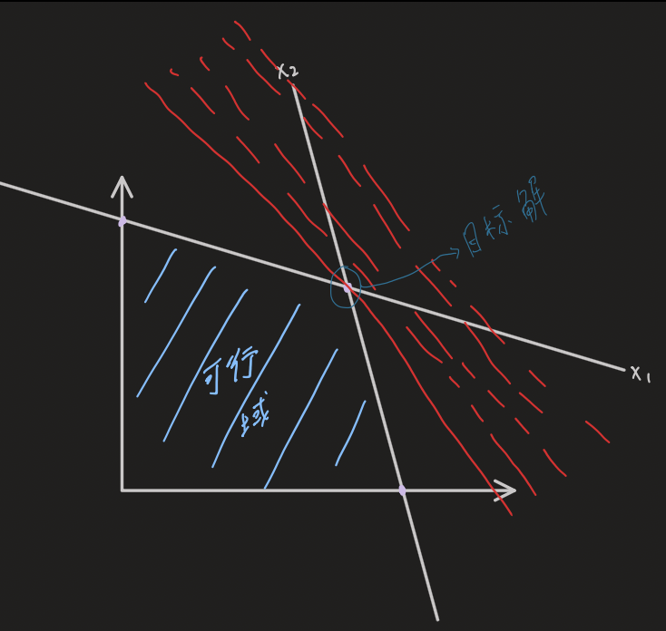
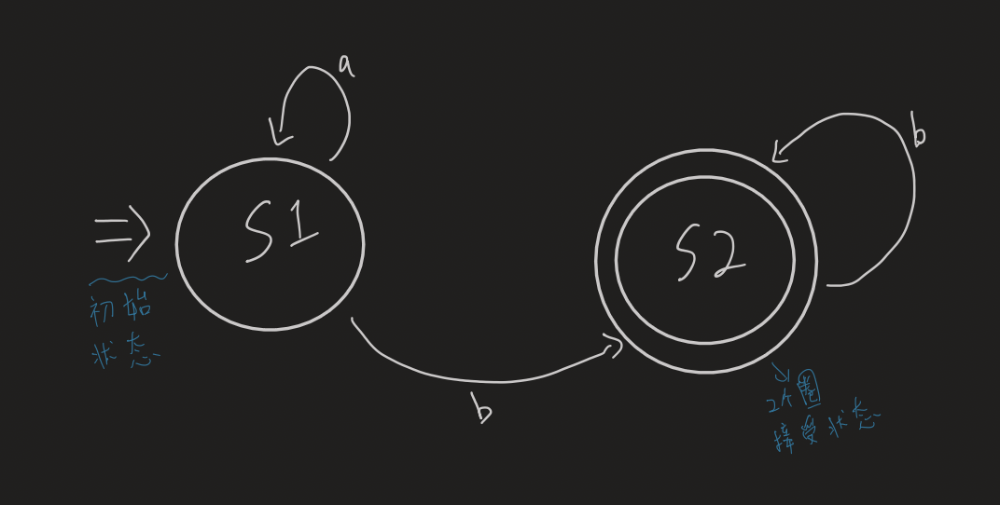

前處理法
- 雜湊表：用一個key把資料找出來

委託法
- 有個一問題不知道怎麼解決，用其他套件來幫忙解決
- [python套件](https://pypi.org)

線性規劃問題
- 在線性條件限制下尋找最大值/解
- 單形法
    - 

btree
- 用來寫在硬碟裡面，SQL後面就是這個

分層法
- TCP/IP
- EDA
- 電腦硬體
    - 記憶體，CPU
        - C語言，組合語言

化約法
- 把**A問題**轉成**B問題**然後解決**B問題**後將解影射到**A領域**來解決**A問題**
    - 若我只會做平方（B）不會做乘法（A），且${a*b} =$ ${(a+b)^2 - a^2 - b^2} \over {2}$
    - 那在解出 $a^2$ 與 $b^2$ 就能找到 $a*b$ 的解
- 用整數規劃的套件解背包問題

整數規劃
- 在某些條件限制下找到整數解
- 找出如何用最少的紙來做幾個不同大小的形狀

SAT
- x + y >= 1
    - x or y
- not x or not z
    - (1-x) + (1-z) >= 1
- x
    - x >= 1
- y
    - y >= 1

故事
- 1900年，希爾伯特 做了一個演講（23個數學問題），在未來100年數學家要解決這[23個問題](https://zh.wikipedia.org/zh-tw/希尔伯特的23个问题)
- 形式證明
    - 三段式論 : A,B,A->C,B->D,C&D->E, 問E成立嗎？
    - `->` : Modus Ponens
    - `A->B` : -A V B (not A or B)

語法生成
- 終端項目與非終端項目
    - $S()-> aS()b | \empty$ 
        - Output :  $a_n b_n$
    - [乔姆斯基谱系](https://zh.wikipedia.org/wiki/乔姆斯基谱系)
        - 第一型語法（上下文無關語言）可以產生 $a_n b_n c_n$
        - 第三型語法（正规语言）可以產生 $a_n b_m$

有限狀態機
- 
    - 尋找是否符合 $a_n b_m$ 的語法的有限狀態機
    - 接受狀態：若最終狀態不在這個狀態=不接受