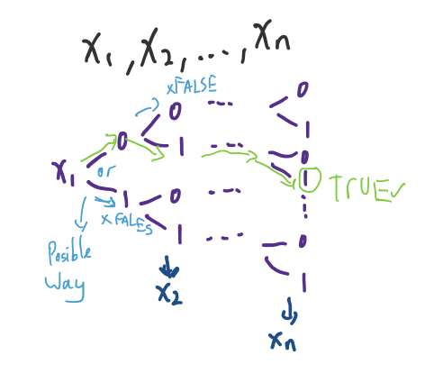
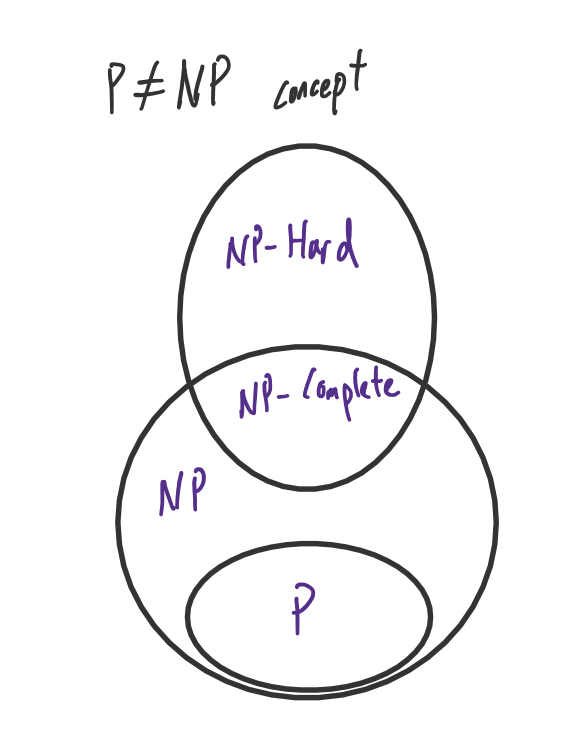
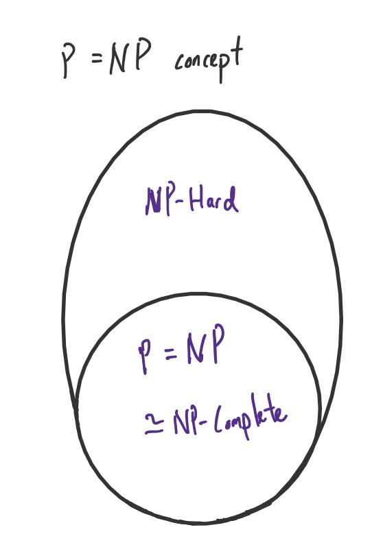

羅素的悖論
- 理髮師悖論
    - 一個城市裡唯一的理髮師立下了規定：只幫所有“不為自己理髮的人”理髮
        - 問：他該幫自己理髮嗎？
        1. 若他不幫自己理髮 -> 按照規定他並沒有幫所有“不為自己理髮的人”理髮 -> 所以他應該幫自己理髮
        2. 若他幫自己理髮 -> 他幫“為自己理髮的人”理髮了 -> 按照規定他不該幫自己理髮

若以下函數結果為何？
1. `a=f(_)`
2. `b=g(_)`
3. if a==b return True 
    - else return 0
- 若f(_) 或 g(_) 永遠不會停那麼就不知道它們的回傳值，a=? 或 b=?

丘奇的函數
1. $(\lambda x.M )$
2. $(M \ N)$
- lambda calculus

確定型圖靈機
- 在每个阶段，“人”要决定下一步的动作
    - 依赖于（a）此“人”当前所关注的纸上某个位置的符号和（b）此“人”当前思维的状态。

非確定型圖靈機
- 
- 在计算的每一时刻，根据当前状态和读写头所读的符号，机器存在多种状态转移方案，机器将任意地选择其中一种方案继续运作，直到最后停机为止。
    - 存在很多條路，只會走對的那一條（接受狀態），錯的路就不走了（拒絕狀態）

SAT
- Boolean satisfiability problem
- 一組給定的布林函數，是否可以找到一組變數賦值能使其為真
- SAT(exp:)
    - 若 `exp:` 的真值表有一個 1 那麼 SAT(exp:) == 1 (可滿足)
    - `exp1` = (X AND Y) OR (X AND (NOT Y))
        - `SAT(exp1)` == 1 , when x=1,y=0 or 1 都可滿足

P
- Polynomial time
- **確定型圖靈機** 可以在**多項式時間**($x^n$)內解決的問題

NP
- Nondeterministic Polynomial time
- **非確定型圖靈機** 可以在**多項式時間**($x^n$)內解決的問題

NP-Complete
- 一群問題的集合
    - 若 **SAT** 問題可以 reduce 成 **x** 問題，那麼這些 **x** 問題的集合就是 **NP-Complete** 問題
- 
- 

SAT = NP-Complete?
- 庫克
    1. $T_{i,j,k}$ 代表磁帶第 i 格在第 k 步時是否為符號 j
    2. $H_{i,k}$ 代表讀寫頭在第 k 步時是否在第 i 格上
    3. $Q_{q,k}$ 代表第 k 步時狀態是否為 q

