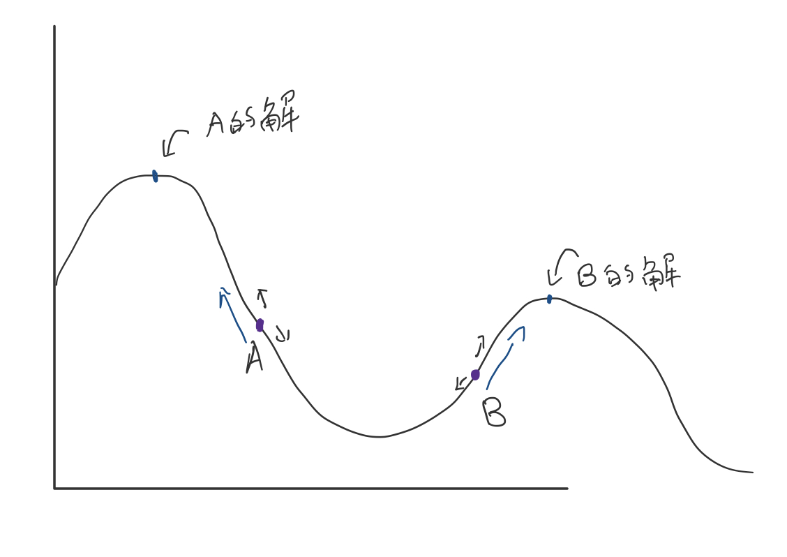

單變數微分
- $dy \over dx$

多變數微分
- ${ \partial f(x,y,z) \over \partial x } = {f(x + \bigtriangleup x, y, z) - f(x,y,z) \over \bigtriangleup x}$

偏微分方程
- $({\partial f \over \partial x},{\partial f \over \partial y}, {\partial f \over \partial z})$  => $\nabla f$
    - 代表三維空間中最斜的方向，**梯度**
    - 可以用來找最低錯誤率

AI (by ccc)
- 優化
    - 算分數 + 搜尋
- 重點算法
    - 梯度下降
    - 反傳遞

梯度
- 多方向（x，y，z）斜率合起來的向量
- 往梯度的方向一定向"上"

評分法
- 小排到大
    - 1 3 5 2 4 6 
    - 6 5 4 3 2 1 
    - 兩個一組的話， 第一組較高分, 只有5 2是錯的，而第二組則是每一組都是錯的 => 第一組錯誤率較低

改良法
- 還有改良的空間那就改進，若無就停止
    - 不斷地評分直到最高分

爬山演算法
- 
- 左右各取的一點，往較大的點走，最終就會爬到山頂
    - 但不一定會走到最高峰，第一個點取哪座山的山腳就會到哪一座山 (局部最佳解)
```
Algorithm HillClimbing(f,x):
    x = 隨意設定一點
    while ( f(x) 有鄰居 f(x') 比 f(x) 更高(分)):
        x = x';
    end
    return x;
end
```
