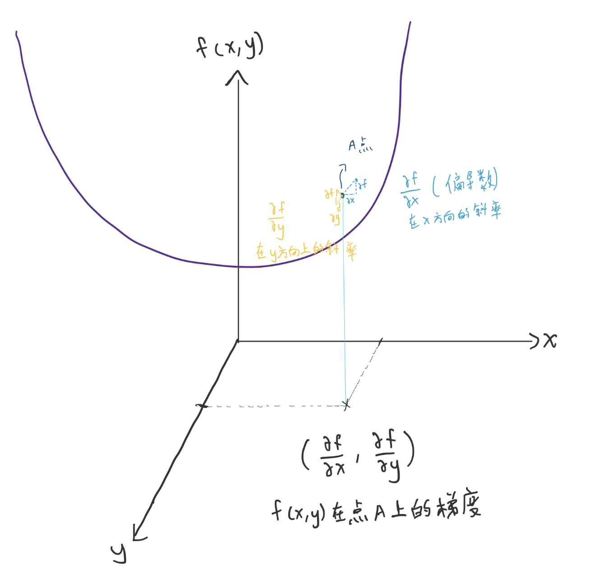
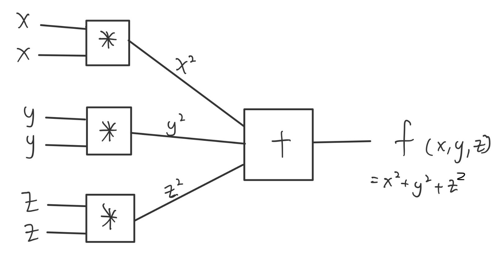
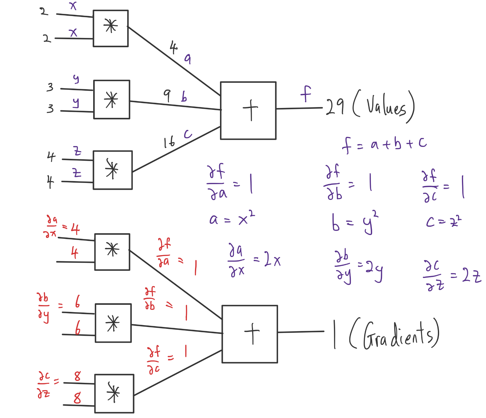

梯度
- 找最小值
    - 往梯度走就會越來越大， 所以往反方向走就會找到最小值
- 點上的偏導數（偏微分），偏微分比較像是微分後的函數
- 
    - 點上不同方向的斜率之和稱為梯度, ex : A點在 x軸的斜率為 **$\partial f \over \partial x$**, 在y軸的斜率為 **$\partial f \over \partial y$**, 他們的合為 **$( {\partial f \over \partial x} , {\partial f \over \partial y})$**
    - $\lim \limits_{\Delta x \to 0} {\Delta f \over \Delta x}$ : 但電腦不可能用0所以是取一個很小的值來做所以用$ \partial 符號$
- 梯度下降法 : 用來找最小值如**錯誤率**
    1. 用向量的長度來判斷， ex : p 點在偏導數（偏微分）後得到梯度 grad = (2,6) ，長度 norm = $\sqrt{2^2 + 6^2}$ ， 當長度 norm 太小則停止
    2. 用 f(x,y) 的大小來判斷（還能不能再下降）， ex : p 點在 f(x,y) 上的值 與 p_new 點在 f(x,y) 上的值進行比較 差異太小則停止

反傳遞
- 197X 最開始但不叫反傳遞 $\to$ 1986 Hiton 重新定義反傳遞演算法 $\to$ 2015 Lecun 模型的發展 $\to$ Google 模型發展
- 輸入 $\to$ 輸出 = 正傳遞
    - 反過來算 = 反傳遞（算偏微分）
- 
- 
    - Input x=2,y=3,z=4 $\to$ Output f=29 (正傳遞)
    - Default set ${\partial f \over \partial f} = 1$
        1. From $f = a + b + c$ get ${\partial f \over \partial a} = 1 , {\partial f \over \partial b} = 1 , {\partial f \over \partial c} = 1$
        2. $a=x^2 , b=y^2 , c=z^2 \to {\partial a \over \partial x} = 2x , {\partial b \over \partial y} = 2y , {\partial c \over \partial z} = 2z$
        3. ${\partial f \over \partial x} = {\partial f \over \partial a} . {\partial a \over \partial x} = 1 * 2(2) = 4$
        4. ${\partial f \over \partial y} = {\partial f \over \partial b} . {\partial b \over \partial y} = 1 * 2(3) = 6$
        5. ${\partial f \over \partial z} = {\partial f \over \partial c} . {\partial c \over \partial z} = 1 * 2(4) = 8$ 