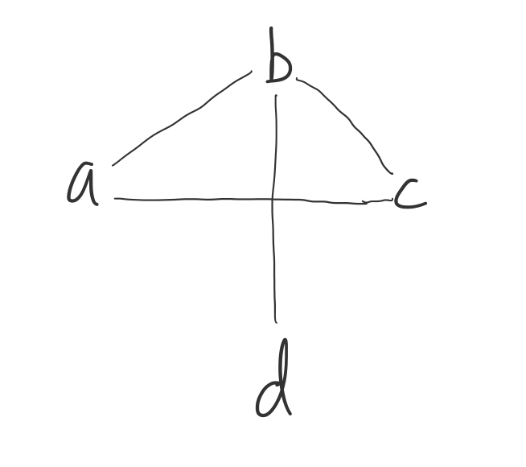
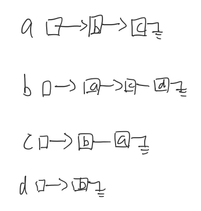
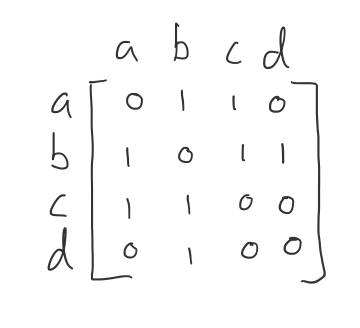

貪婪法
- 找零錢，零錢有（100，10，5，1），若要找918元，要讓程式輸出9113(9*100，1*10，1*5，3*1)，要讓找的零錢越少越好
    - 先看最大的零錢100先找9個，剩18元
    - 10元找1個，剩8元
    - 5元找1個，剩3元
    - 3元找3個，剩0

Graph
- 
- 表示法：相鄰矩陣，相鄰串列
- 相鄰串列表示法
    - 
- 相鄰矩陣表示法
    - 
- Minimal Spanning Tree
    - Prims
        - 設定起始點，然後逐步擴張,從最小的開始加入
    - Kruskal
        - 將所有的邊按權值從小到大排序，然後從最小的邊開始加入，但若形成迴圈就看下一個直到結束