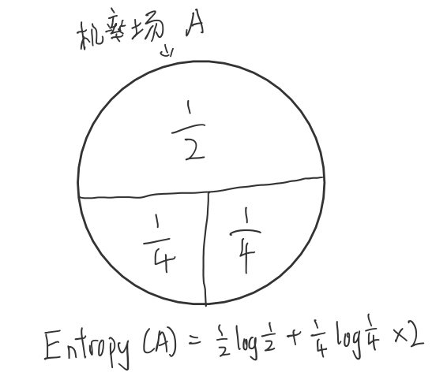
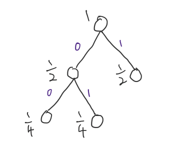
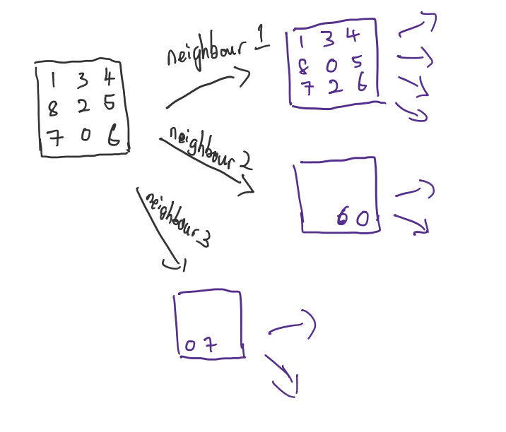

資訊理論中的Entropy
- $$ \sum_{i} P_i log_b P_i $$
    - $P_i$ is Posibility 
    - 
- 接受的每條消息中包含的資訊的平均量（平均編碼資訊量）
- 畫圖
- 編碼，$log$取2為低
- 機率場中越平均的分配，編碼越長，意外性較高（不好掌控）
    - EX：在 $A({{1} \over {2}},{{1} \over {2}}) 與 B({{1} \over {4}},{{3} \over {4}})$ 中B為意外性較低（較好掌控）

Huffman Code
- 

隨機變數
- 是一種數學概念，用來代表隨機試驗結果的變數

搜尋法
- DFS(Depth First Search)
    - 一直往更深的節點找直到沒有別的節點後回傳
    - 遞回 + stack ，遞回中包含stack結構了
- BFS(Breath First Search)
    - 從每個距離最近的節點找
    - 遞回 + queue
- 拼圖問題
    - 
    - 