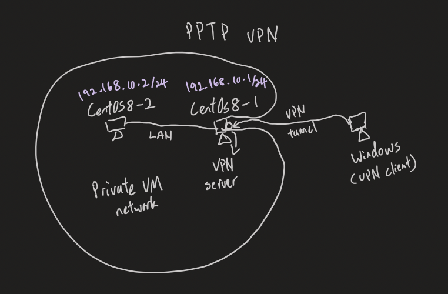

# **VPN server**
- Virtual Private Network
1. Site to site vpn
    - 
    - EX：企業級在使用， 台北總公司（192.168.0.0/24），台中分公司（192.168.1.0/24），高雄分公司（192.168.2.0/24）
2. Point to site vpn
    - 
    - EX：個人（回家要連進公司，玩遊戲需要在同一個區域網路）
- type of vpn
    - pptp, ipsec, l2...

# **PPTP VPN**
- 
## **Setting**
1. 新增NAT網卡
    - 
    - 
    - 
    - 第一個 Bridged Networking 用來連結Internet， 第二個Custom 用來做VM之間的local network
## **Step 1 : Installation**
1. `yum install -y ppp pptpd` : 在server機就好
    - `yum install -y epel-release` : 若上一步失敗就先安裝這個再回去安裝
## **Step 2 : Configuration**
1. `vim /etc/pptpd.conf` : 配置pptpd文件
    - `localip 192.168.10.1`
    - `remoteip 192.168.10.100-150`
    - 將上面兩行指令輸入pptpd配置檔
2. `vim /etc/ppp/chap-secrets`
    - `test pptpd 123456 *`
        - `test` : username
        - `pptpd` : vpn
        - `123456` : password
        - `*` : 哪些ip可以連結，*代表都可以
    - `mary pptpd 654321 *`
3. `vim /etc/ppp/ip-up` :设置最大传输单元MTU
    - 
    - `ifconfig ppp0 mtu 1472`
4. `vim /etc/sysctl.conf` 
    - 
    - `net.ipv4.ip_forward = 1`
    - `sysctl -p` : 配置完成後執行這個指令才會生效

## **Step 3 : Configure PPTP service**
1. `systemctl restart pptpd`
2. `systemctl enable pptpd.service`

## **Step 4 : Connect to VPN**
1. Go to Windows and go **Network & internet** -> **VPN**
2. Add VPN
    - Server name or address put the server's ip address
    - Username and password use inside `/etc/ppp/chap-secrets` (Check Step 2-2)
    - VPN type choose PPTP
3. Connect VPN
4. 連線成功會多出一個 ppp 介面卡
    - 

# **Extra**
- NQU vpn
    - forticlient
    - ip : `60.248.63.195`
    - port : `443`
    - username : `s學號@stu.nqu.edu.tw`
    - pass : `末6碼`
