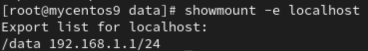
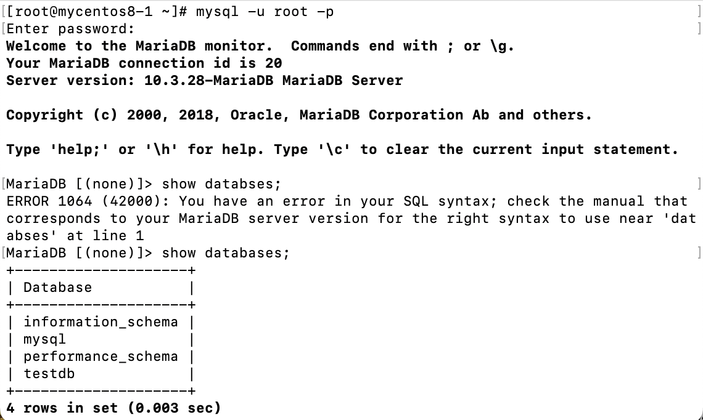
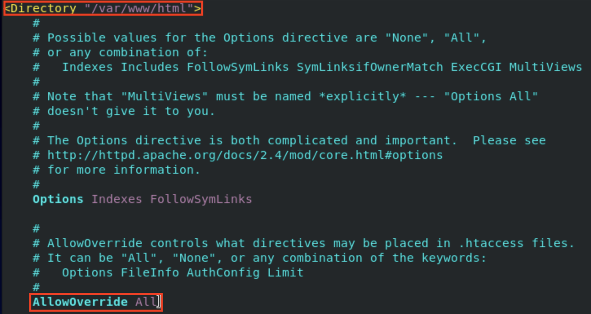

# **Midterm**
- seq 
- tr

# **Final**
1. 無密碼遠端登錄
2. `scp source destination` (遠端拷貝)
3. `rpm -qa | grep httpd`
4. nfs
5. `dd if=/dev/zero of=filename bs=1M count=100`
6. samba
7. echo-server

# **Using Network**
1. Prestep : Check device, ip address, and gateway
    - 
    - Device : **ens160**
    - Ip address : **172.20.10.3**
    - Gateway : **172.20.10.1**
2. `systemctl stop NetworkManager.service`
    - 網路標籤會不見
    - 
3. `cd /etc/sysconfig/network-scripts`
    - `vim ifcfg-ens160` : In my case is **ens160** and edit file
    - DEVICE , IPADDR , GATEWAY need to check before stop **NetworkManager**
```
TYPE=Ethernet
DEVICE=ens160
ONBOOT=yes
BOOTPROTO=static
IPADDR=172.20.10.3
NETMASK=255.255.255.0
GATEWAY=172.20.10.1
```
4. `systemctl start network.service`
    - `systemctl status network.service` : Will show active
    - `yum install -y network-scripts` : CentOs8 need to install manually
    - `yum install -y epel-release`
    - Add **HWADDR=MAC_Address** into **ifcfg-ens160** (check before stop NetworkManager) if `systemctl start network` failed

5. `systemctl restart network.service`
    - `ping 8.8.8.8` : If success will be able to ping 8.8.8.8


# **ssh no password login**s
Requirement
- 2 VM
- Set domain name for the second VM(`vim /etc/hosts`)

1. `ssh-keygen`

2. `ssh-copy-id user@mycentos8-2`

3. `ssh user@ipaddress`

# **ipv6 web server**
1. `yum install -y httpd`
2. connect to your phone
3. `ifconfig` : to get ipv6 address
4. `systemctl start httpd`
5. open safari enter `http://[ipv6_address]`

# **NFS**
Server :
1. `cd /`
2. `mkdir /data -p` : `-p` 如果資料夾已經存在那就不做
3. `sudo yum install nfs-utils -y`
4. `sudo systemctl enable rpcbind` 
5. `sudo systemctl enable nfs-server` 
    - on x86 architecture use `sudo systemctl enable nfs`
6. `sudo systemctl start rpcbind`
7. `sudo systemctl start nfs-server`
    - on x86 architecture use `sudo systemctl start nfs`
8. `vim /etc/exports`
    - `/data 192.168.1.1/24(rw,sync,no_root_squash,no_all_squash)`
        - export to which network(default gateway)
        - `rw` : permission, read, write
        - `sync` : synchronization
        - `no_root_squash` : can use root permission
        - `no_all_squash` : can use user permission
9. `systemctl restart nfs-server`
    - on x86 architecture use `systemctl restart nfs`
10. `showmount -e localhost`
    - 

Client :
1. `cd /`
2. `mkdir /nfs-data -p`
3. `sudo yum install nfs-utils`
4. `sudo systemctl enable rpcbind`
5. `sudo systemctl start rpcbind`
6. `showmount -e 192.168.1.104`
    - 
7. `sudo mount -t nfs 192.168.1.104:/data /nfs-data`
    - `-t nfs` : type of mount is nfs
    - `192.168.1.104` : server ip address
    - `:/data` : which folder on server machine
    - `/nfs-data` : mount on which folder on the client machine

- done
    - 
    - All nfs server and client now shared the same data

**_/etc/exports : 把什麼東西分享出去，給誰用_**

# **Samba**
1. `sudo yum install samba samba-client samba-common -y` : Instal samba
2. `mkdir /test_samba -p` 
3. `sudo chown nobody /test_samba` : To change owner of the file/folder
4. `sudo chmod 777 /test_samba` : To change the folder permission
    - `ls -ld /test_samba`
5. `vim /etc/samba/smb.conf` : To edit samba configuration
    - Add new tag

```
[test]
    comment = To share files with host
    path = /test-samba
    read only = no
    guest ok = yes
    browseable = yes
```
- 
    - global(全局變量) 裡的 security 可以設誰可以進來
6. `testparm` : Check samba configure setting status
7. `sudo systemctl start smb`
8. `sudo netstat -tunlp | grep smb` : To check port is open
9. `sudo smbpasswd -a user` : Add password for samba account
    - samba don't user /etc/passwd
10. 到Host 
    - Windows : Open file manager(檔案總管) then enter linux ip address
    - Mac : Open finder and **cmd + k** and then enter linux ip address


# **Ngrok**
1. Download ngrok
    - ngrok.com -> login

    - `wget https://bin.equinox.io/c/bNyj1mQVY4c/ngrok-v3-stable-linux-arm64.tgz` : for linux on arm architecture
2. `tar zxvf ngrok-v3-stable-linux-arm64.tgz` : to unzip, unpack the file

3. Go to **Your AuthToken** to copy the command with your ngrok's token
    - `./ngrok config add-authtoken your_authtoken` : `./` if ngrok not in the environment PATH

4. `./ngrok http 80` : start the http with ngrok at 80 port
    - make sure http server is on

5. Copy the link and paste in the web browser with the html file added
    - ex : `https://b857...ngrok-free.app/w3.html` , **w3.html** is my html file under **/var/www/html**

# **Web Server mysql**
## **Step 1 : Install and setting Mariadb**
- `sudo yum install mariadb-server mariadb`
- `sudo systemctl start mariadb`
- `sudo mysql_secure_installation` : Setting mariadb 
    - set new password
    - Remove anonmous user -> Y
    - Disallow root -> n
- `mysql -u root -p -h localhost` : Login into mariadb
    - `-u` : user account
    - `-p` : Enter password later
    - `-h` : Server's location
    - 
    - MariaDB Commands
        - `show databases;` 
        - `create database testdb;`
        - `use testdb;`
        - `create table addrbook(name varchar(50) not null, phone char(10));`
            - create a table named addrbook, with **name** and **phone** fields
        - `insert into addrbook(name, phone) values("tom", "0912123456");`
            - Insert into addrbook table with value **tom** and **0912123456**
        - `select name,phone from addrbook`
            - Show **name** and **phone** columns in table **addrbook**
        - `update addrbook set phone="0987654321" where name="tom"`
            - Update the column value
        - [SQL語法](https://www.fooish.com/sql/)
## **Step 2 : Install and test php**
- `sudo yum install -y php`
- `sudo yum install php-mysqlnd` : Centos8+
    - `sudo yum install php-mysql` : Centos7
- `sudo systemctl restart httpd`
- `sudo vim /var/www/html/info.php` : Enter Below into info.php
```
<?php phpinfo(); ?>
```
- `ifconfig` : To check your ipaddress, ex:172.20.10.3
- `http://172.20.10.3/info.php`
    - 
## **Step 3**
- `setsebool httpd_can_network_connect_db=1` : If can't connect to db
- `vim /var/www/html/testdb.php` : Enter code below
```
<?php
$servername="127.0.0.1";
$username="root";    
$password="user";
$dbname="testdb";

$conn = new mysqli($servername, $username, $password, $dbname);

if($conn->connect_error){
    die("connection failed: " . $conn->connect_error);
}
else{
    echo "connect OK!" . "<br>";
}

$sql="select name,phone from addrbook";
$result=$conn->query($sql);

if($result->num_rows>0){
    while($row=$result->fetch_assoc()){
        echo "name: " . $row["name"] . "\tphone: " . $row["phone"] . "<br>";
    }
} else {
    echo "0 record";
}
?>
```
- 

# **Limit ip address to connect**
## **Step 1 : Create a htm file under the target limit folder**

## **Step 2 : Edit the configuration file for httpd**
- `vim /etc/httpd/conf/httpd.conf`
- 
    - Make sure **AllowOverride** == All
```
<Directory /var/www/html/limit>
    Order deny,allow
    Deny from all
    Allow from 172.20.10.6
</Directory>
```
- 
    - Add new rule to the `/var/www/html/limit` folder
    - This rule only allow ip address `192.168.1.101` to access this folder
## **Step 3 : Restart httpd server**
- `systemctl restart httpd`
- 

# **Access Control**
- Enter target folder(**/var/www/html/files**) and set account for it
    1. `cd /var/www/html`
    2. `mkdir files`
    3. `cd files`
    4. `htpasswd -c .htpasswd user`
    5. `vim .htaccess`
```
AuthType Basic
AuthName "Private File Area"
AuthUserFile /var/www/html/files/.htpasswd
Require valid-user    
```
- `vim /etc/httpd/conf/httpd.conf`
    - Insert code into the file
```
<Directory /var/www/html/files>
Options Indexes
AllowOverride AuthConfig
</Directory>
```

# **PPTP VPN**
## **Setting**
1. 新增NAT網卡
    - 
    - 
    - 
    - 第一個 Bridged Networking 用來連結Internet， 第二個Custom 用來做VM之間的local network
## **Step 1 : Installation**
1. `yum install -y ppp pptpd` : 在server機就好
    - `yum install -y epel-release` : 若上一步失敗就先安裝這個再回去安裝
## **Step 2 : Configuration**
1. `vim /etc/pptpd.conf` : 配置pptpd文件
    - `localip 192.168.10.1`
    - `remoteip 192.168.10.100-150`
    - 將上面兩行指令輸入pptpd配置檔
2. `vim /etc/ppp/chap-secrets`
    - `test pptpd 123456 *`
        - `test` : username
        - `pptpd` : vpn
        - `123456` : password
        - `*` : 哪些ip可以連結，*代表都可以
    - `mary pptpd 654321 *`
3. `vim /etc/ppp/ip-up` :设置最大传输单元MTU
    - 
    - `ifconfig ppp0 mtu 1472`
4. `vim /etc/sysctl.conf` 
    - 
    - `net.ipv4.ip_forward = 1`
    - `sysctl -p` : 配置完成後執行這個指令才會生效

## **Step 3 : Configure PPTP service**
1. `systemctl restart pptpd`
2. `systemctl enable pptpd.service`

## **Step 4 : Connect to VPN**
1. Go to Windows and go **Network & internet** -> **VPN**
2. Add VPN
    - Server name or address put the server's ip address
    - Username and password use inside `/etc/ppp/chap-secrets` (Check Step 2-2)
    - VPN type choose PPTP
3. Connect VPN
4. 連線成功會多出一個 ppp 介面卡
    - 