Requirement
- VMware Fusion 13

Step 1
- Download Windows 11 at [Windows Insider Preview Downloads](https://www.microsoft.com/en-us/software-download/windowsinsiderpreviewARM64)
    - Need register to Windows Insider 

Step 2
- Download Homebrew with the command below run on terminal:
```
/bin/bash -c "$(curl -fsSL https://raw.githubusercontent.com/Homebrew/install/HEAD/install.sh)"
```

Step 3
- Install qemu
```
brew install qemu
```
- Convert VHDX to vmdk through `qemu-img`
    - `qemu-img convert -O vmdk input_VHDK_file output_file.vmdk -p`
    - ex : `qemu-img convert -O vmdk /Users/wongweixiang/Downloads/Windows11_InsiderPreview_Client_ARM64_en-us_22598.VHDX ~/Desktop/windows11.vmdk -p`

Step 4
- Open VMware Fusion and create new VM
- 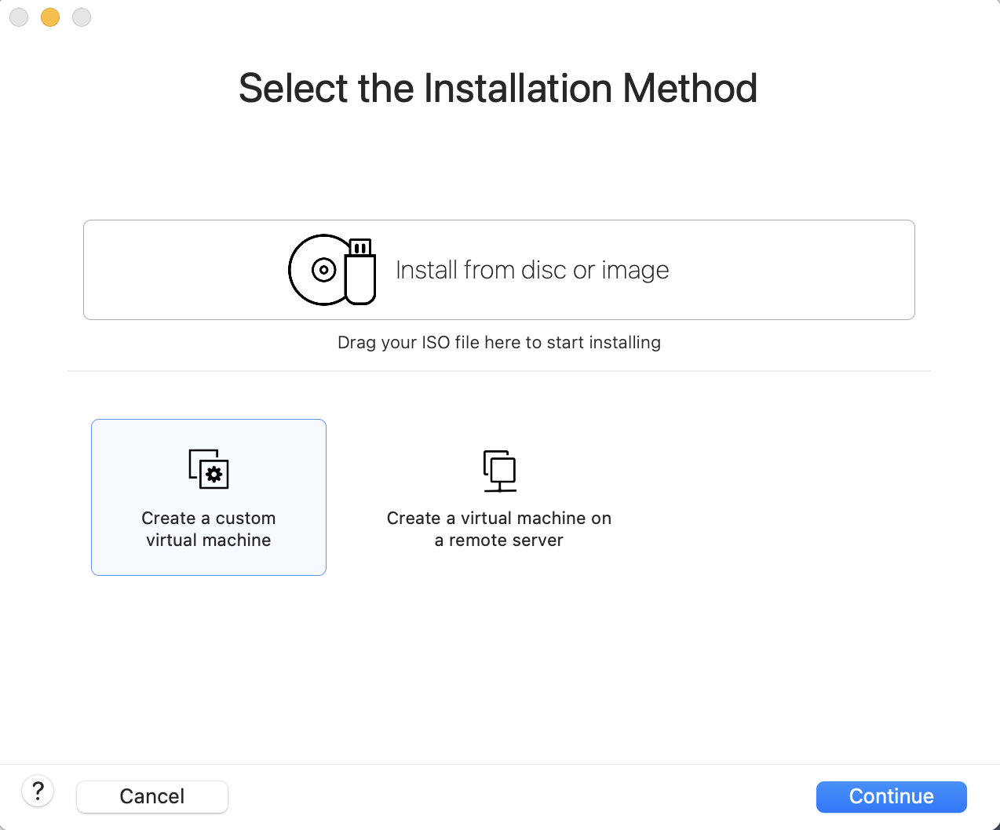
- 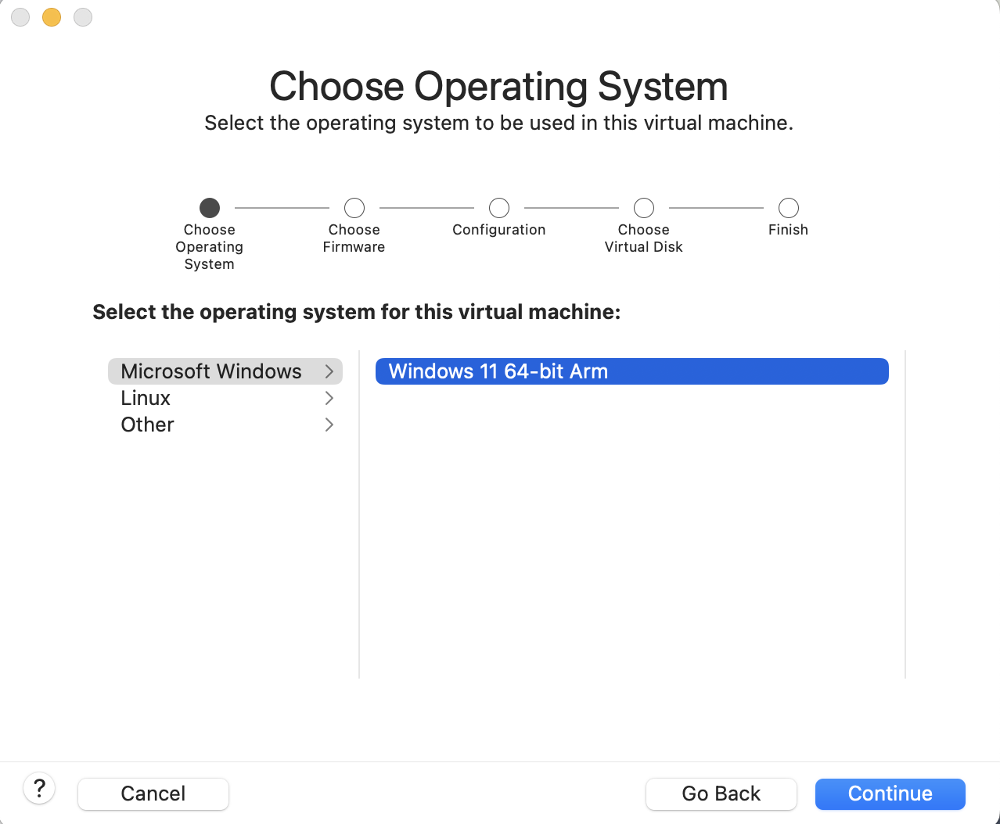
- 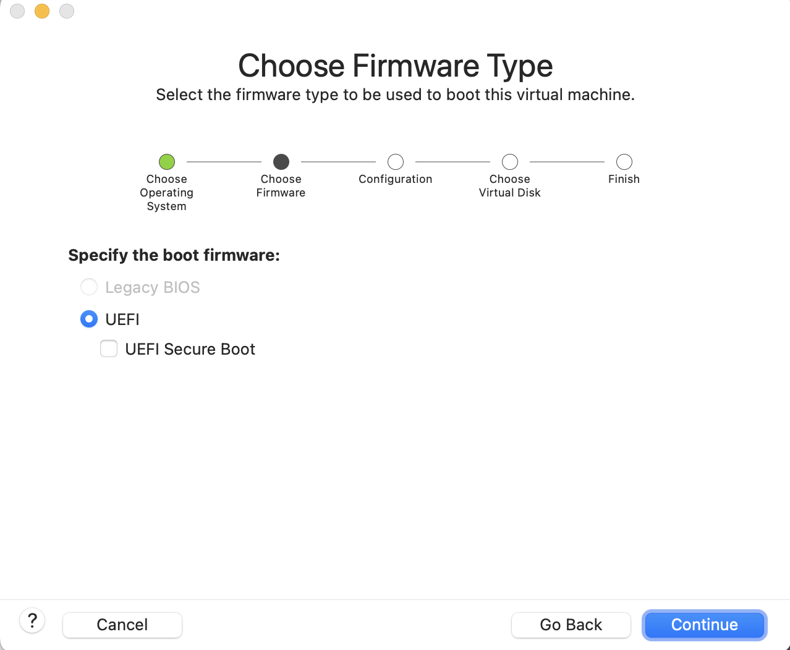
- 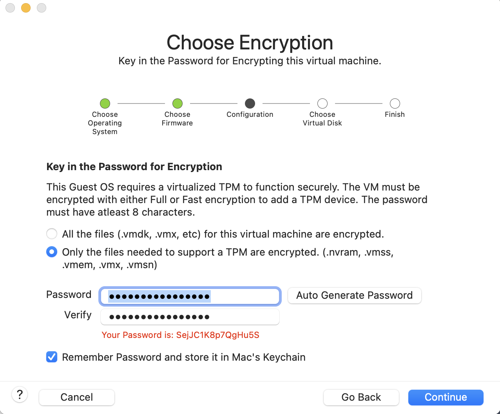
- 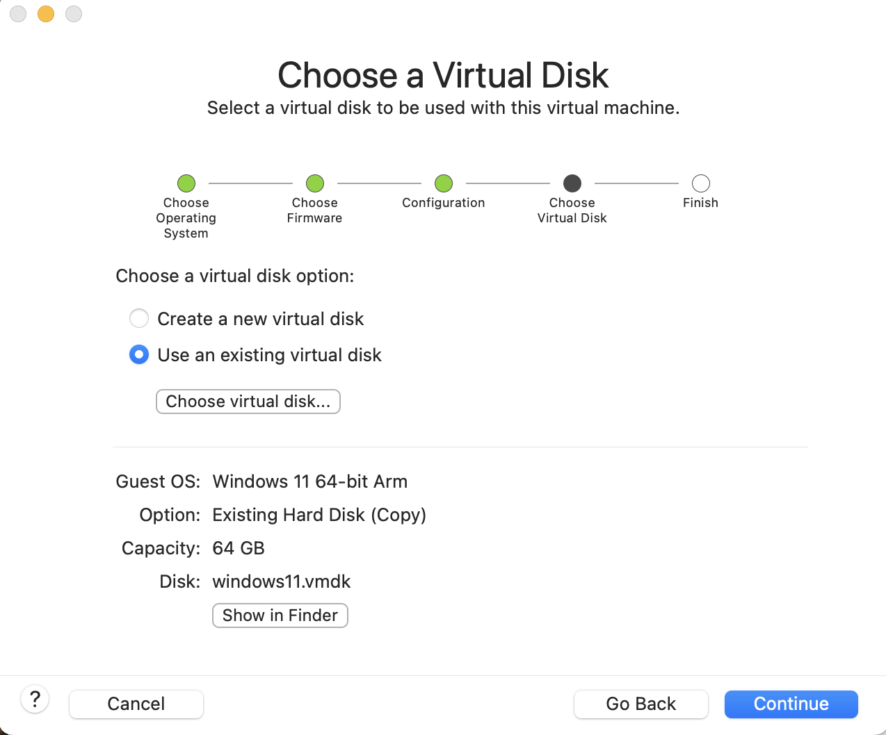

Step 5
- Start VM and when see this 
    - 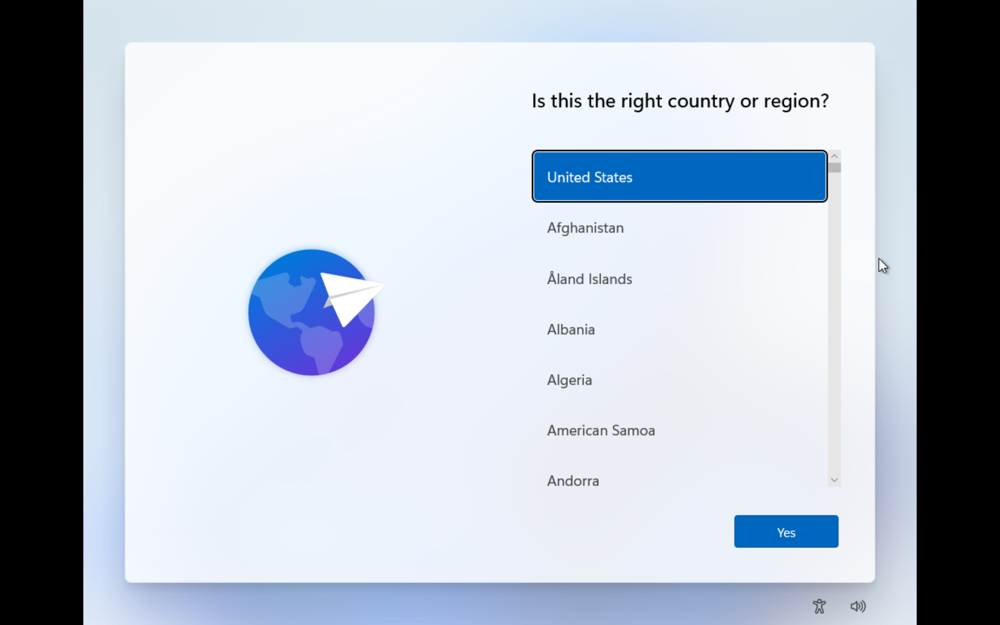
- Press `fn + Shift + f10` , will show this
    - 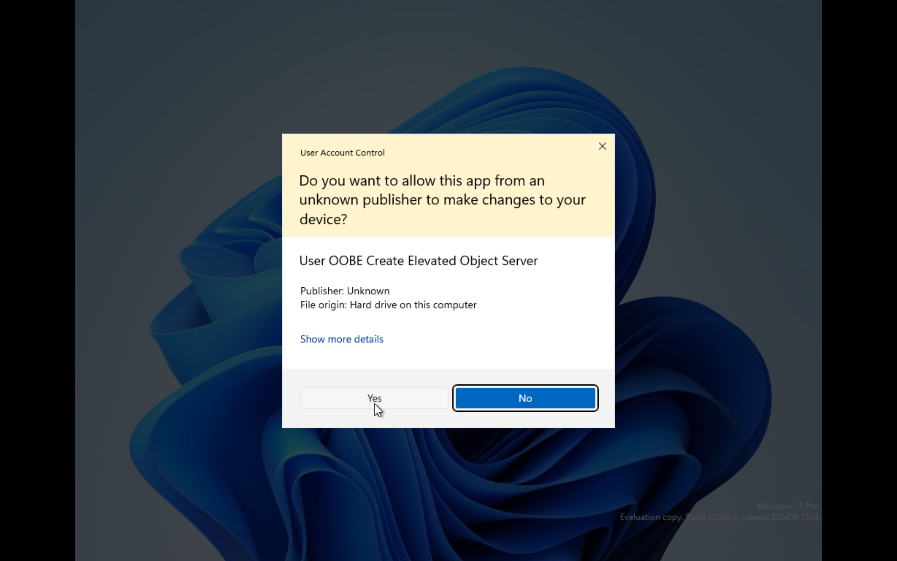
    - 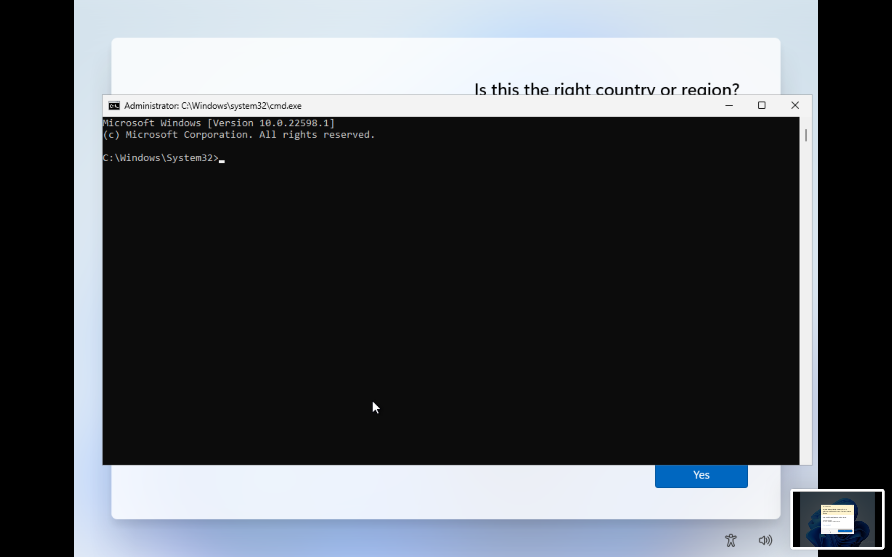

Step 6
- `oobe\bypassnro`
    - To have the choice **I don't have internet**
    - 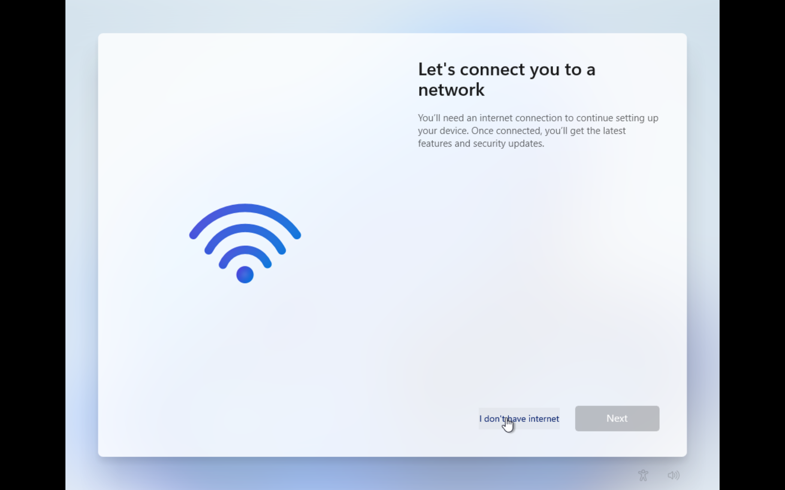
- And now just start install windows 11 normally

Step 7
- Reinstall VMware tool, to have internet and others service
1. Open powershell
    - 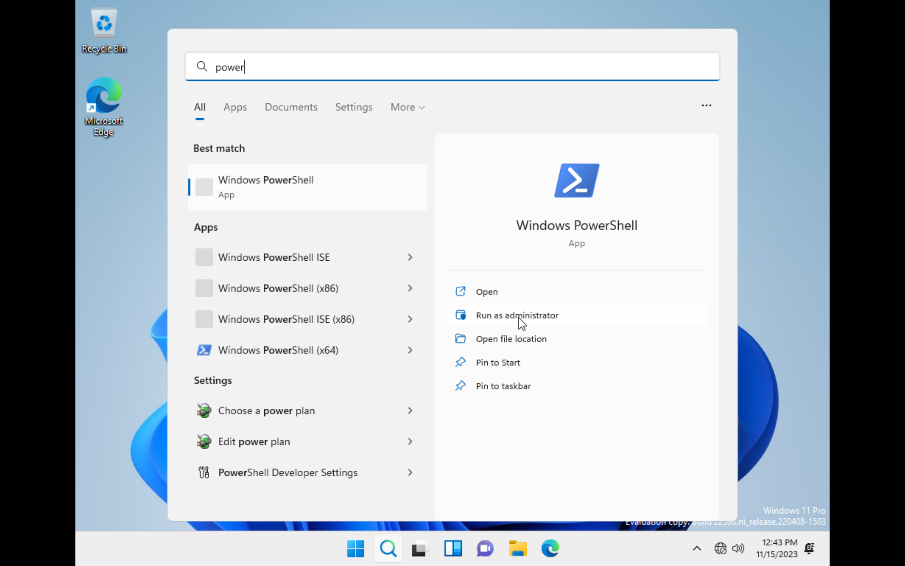
2. `Set-ExecutionPolicy RemoteSigned`
    - 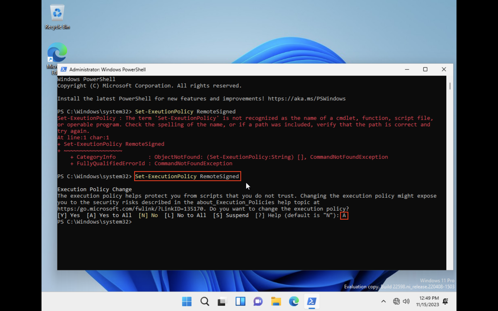
3. Reinstall VMware tools
    - 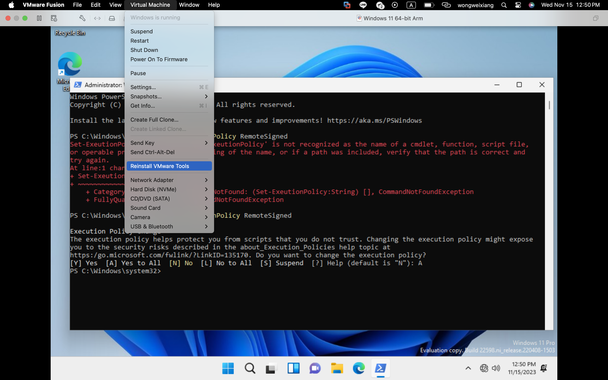
4. Run setup with powershell
    - 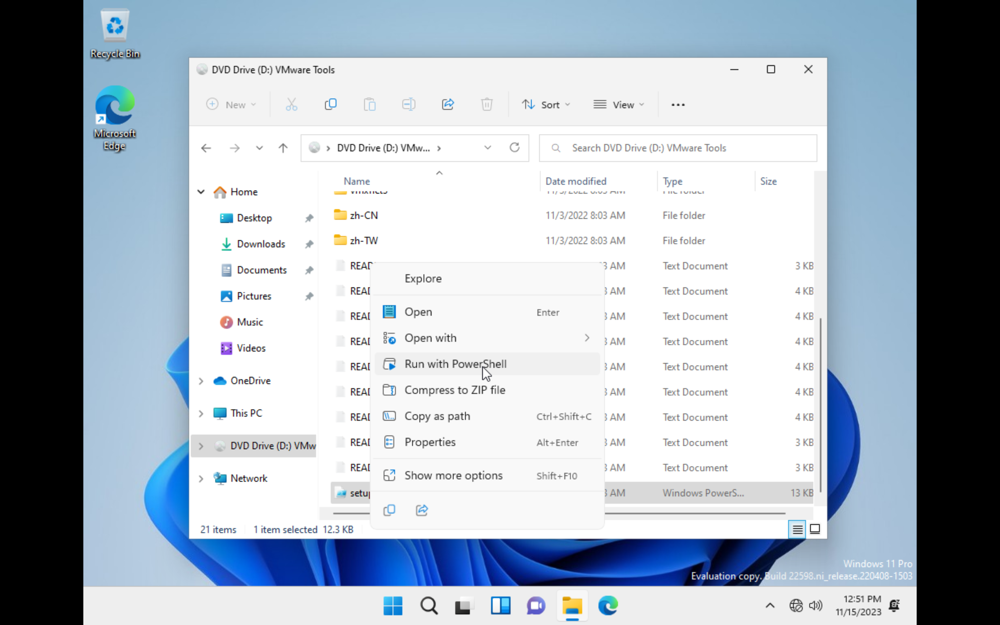
5. After that we have Internet!
    - 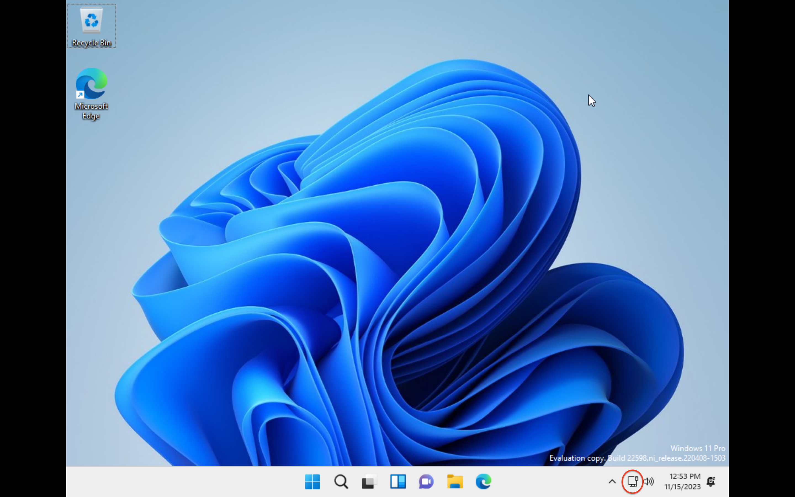
6. Resolution of Windows11, set this up we will have a full screen of windows 11
    - 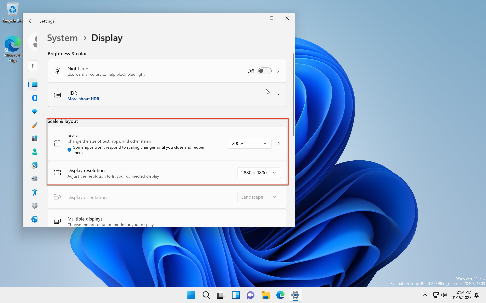


Done


_**[Reference](https://www.youtube.com/watch?v=srOty2jflF4)**_